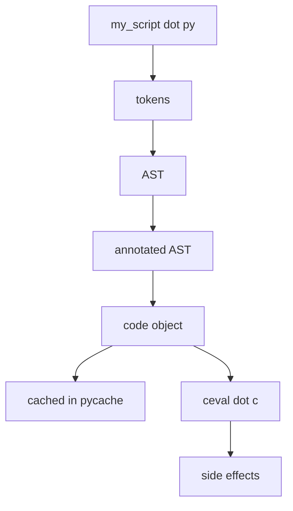
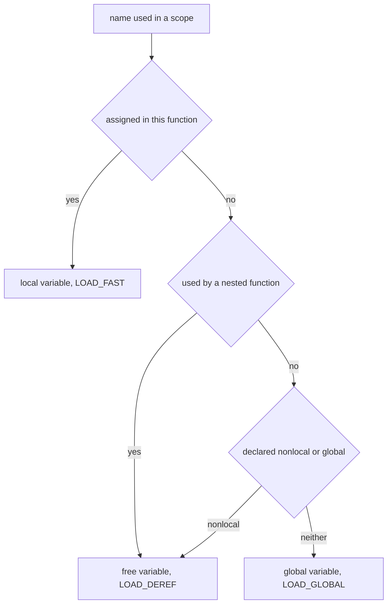

# Lecture 2 — The Compilation Pipeline

> **Outcome:** You can trace any line of Python from source → tokens → AST → bytecode, using `tokenize`, `ast`, and `dis`. You know what each pass does and what information each adds.

A common misconception: "Python is interpreted." Half-true. CPython does not directly interpret your source code. It *compiles* your source to bytecode and then *runs* that bytecode on a stack machine. That bytecode is what `dis` shows you, what `.pyc` files contain, and what `Python/ceval.c` ultimately executes.

The pipeline:

```
my_script.py
     │  (1) tokenizer
     ▼
   tokens
     │  (2) parser
     ▼
   AST
     │  (3) symbol-table pass
     ▼
   annotated AST
     │  (4) bytecode compiler
     ▼
  code object  ──►  cached in __pycache__/*.pyc
     │  (5) ceval.c
     ▼
   side effects (prints, files written, …)
```


*Source text passes through five compiler stages before ceval.c ever runs it.*

We'll walk each step.

---

## 1. Tokenizing

The tokenizer takes raw source text and produces a stream of *tokens*: keywords, identifiers, operators, literals, indents, and dedents.

Try it:

```python
>>> import tokenize, io
>>> src = "x = 1 + 2\nprint(x)\n"
>>> for tok in tokenize.tokenize(io.BytesIO(src.encode()).readline):
...     print(tok)
```

You'll see output like:

```
TokenInfo(type=ENCODING,     string='utf-8',         start=(0,0), end=(0,0))
TokenInfo(type=NAME,         string='x',             start=(1,0), end=(1,1))
TokenInfo(type=OP,           string='=',             start=(1,2), end=(1,3))
TokenInfo(type=NUMBER,       string='1',             start=(1,4), end=(1,5))
TokenInfo(type=OP,           string='+',             start=(1,6), end=(1,7))
TokenInfo(type=NUMBER,       string='2',             start=(1,8), end=(1,9))
TokenInfo(type=NEWLINE,      string='\n',            start=(1,9), end=(1,10))
TokenInfo(type=NAME,         string='print',         start=(2,0), end=(2,5))
TokenInfo(type=OP,           string='(',             start=(2,5), end=(2,6))
TokenInfo(type=NAME,         string='x',             start=(2,6), end=(2,7))
TokenInfo(type=OP,           string=')',             start=(2,7), end=(2,8))
TokenInfo(type=NEWLINE,      string='\n',            start=(2,8), end=(2,9))
TokenInfo(type=ENDMARKER,    string='',              start=(3,0), end=(3,0))
```

Notice:

- **Position info is retained** (`start`, `end`). This is how Python can underline the exact column where a syntax error happens (PEP 657).
- **`ENCODING`** is the first token — Python notes whether the source is UTF-8 or otherwise.
- **`NEWLINE`** is a semantic token, not whitespace. It separates statements.
- **`INDENT` / `DEDENT`** tokens (not shown here because no indents in this example) emerge for blocks.

The tokenizer is implemented in `Parser/tokenizer.c` for the C side, and `Lib/tokenize.py` for the pure-Python wrapper.

You will *rarely* need to look at tokens directly. But when you write a linter, a formatter, or a code generator, you start here.

---

## 2. Parsing

The token stream is fed to the parser. The parser produces an **AST** (Abstract Syntax Tree) — a hierarchical, typed representation of the program structure.

Since Python 3.9, the parser is a **PEG** (Parsing Expression Grammar) parser. Before, it was an LL(1) parser. The PEG move (PEP 617) allowed Python to grow features like the walrus operator and structural pattern matching cleanly.

The grammar lives at <https://github.com/python/cpython/blob/main/Grammar/python.gram>. It's readable. Browse it for 5 minutes.

To see the AST your code produces:

```python
>>> import ast
>>> tree = ast.parse("x = 1 + 2\nprint(x)\n")
>>> print(ast.dump(tree, indent=2))
```

Output (truncated for clarity):

```
Module(
  body=[
    Assign(
      targets=[Name(id='x', ctx=Store())],
      value=BinOp(
        left=Constant(value=1),
        op=Add(),
        right=Constant(value=2))),
    Expr(
      value=Call(
        func=Name(id='print', ctx=Load()),
        args=[Name(id='x', ctx=Load())],
        keywords=[]))],
  type_ignores=[])
```

This is the input to the bytecode compiler. Notice:

- **`Assign`** has `targets` (a *list*, because you can do `a = b = 1`) and `value`.
- **`BinOp`** has `left`, `op`, `right` — already factored out of the token stream.
- **`Name`** has a `ctx` (context) — `Store` if you're writing to it, `Load` if reading.
- **`Constant`** is the leaf for any literal: number, string, `None`, `True`, `False`.

`ast` is one of the most usefully readable parts of the stdlib. Tools like Black, Ruff, mypy, and Bandit all operate on the AST.

To get a quick AST dump from the command line:

```bash
python -m ast my_script.py
```

---

## 3. The symbol-table pass

Between the AST and the bytecode, CPython runs a **symbol-table** pass that figures out, for every name in the program:

- Is it a local variable? (`LOAD_FAST`)
- A global? (`LOAD_GLOBAL`)
- A free variable (closed-over)? (`LOAD_DEREF`)
- A nonlocal? Used in a comprehension scope? Imported?


*The symbol-table pass classifies every name before the compiler can pick which LOAD opcode to emit.*

This decision drives bytecode generation. It's why `LOAD_FAST` is faster than `LOAD_GLOBAL` — *they're chosen by this pass based on scope analysis*.

You usually don't interact with the symbol table directly. The `symtable` module exposes it if you're curious:

```python
>>> import symtable
>>> st = symtable.symtable("x = 1\ndef f():\n  return x", "<demo>", "exec")
>>> st.get_identifiers()
['x', 'f']
>>> st.lookup('x').is_local()
True
>>> st.lookup('x').is_global()
False
>>> # inside f, x is a free variable
>>> f_st = st.get_children()[0]
>>> f_st.lookup('x').is_free()
True
```

---

## 4. Compiling to bytecode

The bytecode compiler (`Python/compile.c`) walks the annotated AST and emits **bytecode instructions** into a `code` object. The code object also collects:

- `co_consts` — every literal constant used (numbers, strings, tuples).
- `co_names` — every global/attribute name.
- `co_varnames` — local variable names.
- `co_cellvars`, `co_freevars` — closure variables.
- `co_filename`, `co_firstlineno` — debug info.
- `co_lnotab` (pre-3.11) or `co_linetable` (3.11+) — bytecode-offset → source-line mapping.

To see what the compiler produced, use `dis`:

```python
>>> import dis
>>> def f():
...     x = 1
...     return x + 2
>>> dis.dis(f)
```

Output (Python 3.13):

```
  1           RESUME                   0

  2           LOAD_CONST               1 (1)
              STORE_FAST               0 (x)

  3           LOAD_FAST                0 (x)
              LOAD_CONST               2 (2)
              BINARY_OP                0 (+)
              RETURN_VALUE
```

We dive deep into reading bytecode in Lecture 3. The takeaway here:

- **The compiler is deterministic** — given the same source, same Python version, you always get the same bytecode.
- **The compiler does some optimization** — peephole optimization, constant folding, dead code elimination. (`x = 1 + 2` becomes `x = 3` at compile time.)
- **The compiler is in pure C** for speed but does relatively simple work compared to the optimization passes in a C/C++ compiler.

---

## 5. Caching: the `.pyc` file

After CPython compiles your file, it caches the bytecode to disk so it doesn't recompile next time. The cache location:

```
your_module/
├── my_lib.py
└── __pycache__/
    └── my_lib.cpython-313.pyc
```

The filename encodes the Python version (`cpython-313`). That way the same package can carry caches for multiple Python versions side-by-side without collision — see [PEP 3147](https://peps.python.org/pep-3147/).

Inside the `.pyc` file:

```
+--- 4 bytes: magic number (identifies Python version)
+--- 4 bytes: flags
+--- 4 bytes: source modification time (or hash, depending on flag)
+--- 4 bytes: source size (bytes)
+--- N bytes: marshalled code object
```

If the source hasn't changed (mtime or hash unchanged), CPython skips parsing/compiling and uses the cached bytecode directly. That's why your second import of a large module is faster.

Exercise 3 has you write a small tool to read these.

---

## 6. Execution: `ceval.c`

Finally, the code object is handed to `Python/ceval.c`'s evaluation loop. It iterates through the bytecode, instruction by instruction, updating an interpreter stack and a frame. We go deep on this in Week 3.

The loop is roughly:

```c
for (;;) {
    opcode = *next_instr++;
    switch (opcode) {
        case LOAD_FAST:    /* push frame->localsplus[oparg] */
        case LOAD_GLOBAL:  /* look up in globals dict */
        case BINARY_OP:    /* pop two, push result */
        case RETURN_VALUE: /* return top of stack */
        /* … */
    }
}
```

Modern CPython (3.12+) uses a **specializing adaptive interpreter** (PEP 659) — it rewrites bytecode at runtime based on observed types. For instance, after seeing many `BINARY_OP` of two ints, the interpreter rewrites that op into a faster `BINARY_OP_ADD_INT`. We won't dive into that until Week 3.

---

## 7. Running the whole pipeline yourself

Try this in a fresh Python REPL:

```python
import tokenize, ast, dis, io

src = "x = 1 + 2\nprint(x)\n"

# Stage 1: tokens
print("TOKENS:")
for tok in tokenize.tokenize(io.BytesIO(src.encode()).readline):
    print(" ", tok)

# Stage 2: AST
print("\nAST:")
print(ast.dump(ast.parse(src), indent=2))

# Stage 3: bytecode
print("\nBYTECODE:")
dis.dis(compile(src, "<demo>", "exec"))
```

That's the whole pipeline in 15 lines. Save this output. You'll refer to it when bytecode in Lecture 3 starts feeling unfamiliar.

---

## 8. Why this matters

A few payoffs that this knowledge unlocks:

- **You can build code analysis tools** — linters, formatters, codemods, refactoring tools. All operate on the AST or bytecode.
- **You can read CPython error messages better** — when a SyntaxError points to a column number, you now know how it was computed.
- **You can reason about performance** — when you see `LOAD_GLOBAL` in `dis` output, you know "this name lookup costs a hash-table probe in `globals()` instead of one array load."
- **You can understand metaprogramming** — `exec("x = 1")` parses, compiles, and executes that string, exactly the same as if it were in your file.

---

## 9. Self-check

- What are the four phases the CPython compiler runs your source through?
- What's the role of the symbol-table pass?
- Where on disk does CPython cache compiled bytecode? In what filename format?
- What's the difference between `co_consts` and `co_names` on a code object?
- What does `dis.dis(...)` print?

---

## Further reading

- **`Lib/dis.py`** — read the source of the disassembler:
  <https://github.com/python/cpython/blob/main/Lib/dis.py>
- **`Lib/ast.py`** — read the source of the AST helpers:
  <https://github.com/python/cpython/blob/main/Lib/ast.py>
- **PEP 617 — New PEG parser** (background on why the parser changed):
  <https://peps.python.org/pep-0617/>

Next: [Lecture 3 — Reading Bytecode](./03-reading-bytecode.md).
