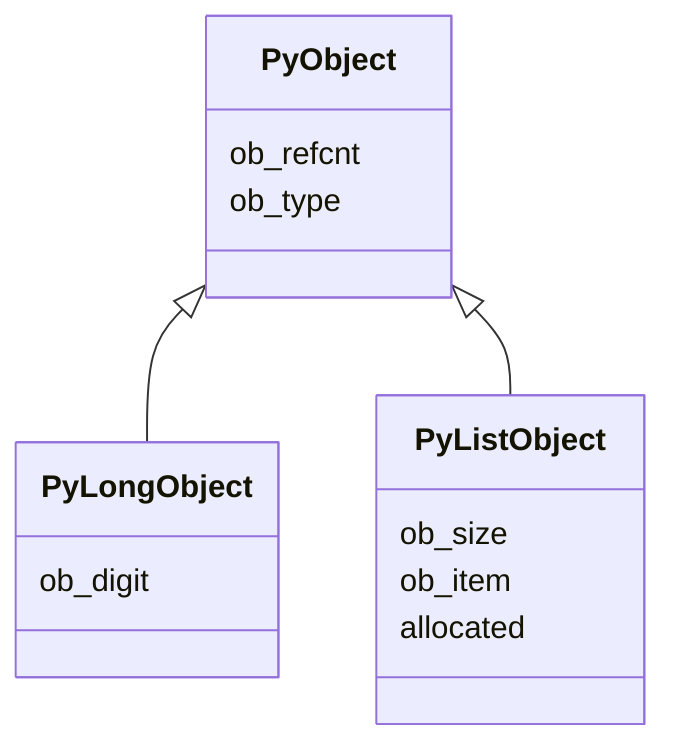
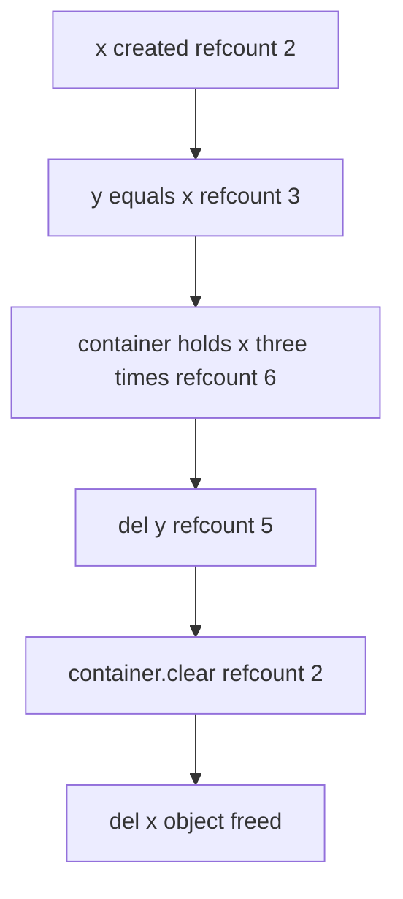

# Lecture 1 — The PyObject Struct and Reference Counts

> **Duration:** ~2 hours. **Outcome:** You can sketch the `PyObject` struct from memory, predict what `sys.getrefcount` will return on any expression, and explain where every refcount change in your Python code comes from.

## 1. Every Python object is a struct

In CPython, *every* Python object — your `int`, your `list`, your custom class instance, the `None` singleton — is a C struct. The base layout, from `Include/object.h`:

```c
typedef struct _object {
    Py_ssize_t ob_refcnt;       // the reference count
    PyTypeObject *ob_type;      // pointer to the type object
    // ... payload, varies by type
} PyObject;
```

Two fixed fields, then whatever the specific type adds. For an `int(42)`, that's:

```c
typedef struct {
    PyObject_HEAD               // expands to ob_refcnt + ob_type
    digit ob_digit[1];          // the actual integer's digits
} PyLongObject;
```

For a `list`, that's:

```c
typedef struct {
    PyObject_VAR_HEAD            // ob_refcnt + ob_type + ob_size
    PyObject **ob_item;          // pointer to an array of PyObject pointers
    Py_ssize_t allocated;
} PyListObject;
```

The pattern: every object starts with at least `ob_refcnt` + `ob_type`. Variable-length objects also have `ob_size` (the `PyObject_VAR_HEAD` macro).


*Every CPython object type extends the same two-field base header.*

**Implication:** every Python value occupies at *least* 16 bytes (on 64-bit: 8 bytes refcount + 8 bytes type pointer), even if conceptually it's a single bit. This is why `True` and `False` are not free, but cheap — they're cached singletons, so only one of each exists.

## 2. Reference counting in one paragraph

Every operation that binds an object to a name **increments** the refcount. Every operation that removes the binding **decrements** it. When the count reaches zero, the object's `tp_dealloc` function fires, the object's memory is freed, and any objects it owned have *their* refcounts decremented (possibly cascading).

This is the entire memory-management strategy of CPython, with one caveat (cycles — Lecture 2).

## 3. Where the increments and decrements come from

When you write Python, you don't see `Py_INCREF` / `Py_DECREF`. But they're there. The compiler injects them.

| Python operation | Refcount effect |
|------------------|-----------------|
| `x = obj` | `INCREF(obj)`; `DECREF(previous_x_if_any)` |
| `del x` | `DECREF(x)` |
| Function call `f(x)` | `INCREF(x)` for each argument; `DECREF` on return |
| Function return | `DECREF` on all local names |
| `list.append(x)` | `INCREF(x)` (the list now owns a reference) |
| `list.pop()` | The popped value's refcount stays the same; the list no longer owns it (so `DECREF` from the list, balanced by `INCREF` on the caller's binding) |
| Container destruction | `DECREF` on every element |
| `del container[i]` | `DECREF` on element |

This is what your bytecode opcodes from Week 1 actually do at the C level. `STORE_FAST` includes a refcount manipulation. `LOAD_FAST` does too.

## 4. `sys.getrefcount` and its lie

The simplest way to inspect refcounts:

```python
>>> import sys
>>> x = []
>>> sys.getrefcount(x)
2
```

Why 2? You'd expect 1. The reason: passing `x` as an argument to `getrefcount` itself increments the count temporarily. So **the reported count is always one higher** than the "true" count from the perspective of the caller.

Also, sometimes you'll see surprising counts:

```python
>>> sys.getrefcount(None)
1023456              # depends on your interpreter state
>>> sys.getrefcount(42)
21
>>> sys.getrefcount(257)
2
```

- `None` is a singleton; every place in your program holding `None` shares this one object. Its refcount is enormous.
- Small integers (-5 through 256) are also cached singletons. The refcount on `42` reflects every cached use across the whole interpreter.
- 257 is not cached. Each `257` literal creates a fresh int (with refcount 1 + the `getrefcount` bump = 2).

This is the "small-int caching" behavior. Don't try to use `id()` to compare integers expecting unique identity; you'll be misled by the cache.

## 5. Watching refcounts move

```python
import sys

x = ["a"]
print(sys.getrefcount(x))  # 2 (the variable + getrefcount's arg)

y = x
print(sys.getrefcount(x))  # 3 (added y)

container = [x, x, x]
print(sys.getrefcount(x))  # 6 (three more from the container, each list slot is a ref)

del y
print(sys.getrefcount(x))  # 5

container.clear()
print(sys.getrefcount(x))  # 2 (back to the variable + the getrefcount arg)

del x
# x is now freed; if we could ask for its refcount, the object is gone
```

Trace this through. Each step's count should be predictable from the rules above.


*How x's refcount rises and falls as bindings are added and removed.*

## 6. The `tp_dealloc` finalizer

When the refcount hits zero, CPython calls the type's `tp_dealloc` slot. For a `list`, that's `list_dealloc` in `Objects/listobject.c`. It:

1. Iterates the list's items.
2. For each, calls `Py_DECREF` (which may recursively trigger more deallocations).
3. Frees the item array.
4. Frees the list object's memory back to PyMalloc.

For a custom Python class, `tp_dealloc` ultimately calls `__del__` if defined. That's why "do not rely on `__del__`" is a common rule — when it runs, what it runs *during*, and whether it runs at all under all conditions, is hard to reason about. Use context managers (`with`) for resource cleanup; reserve `__del__` for last-resort cases.

## 7. Borrowed vs owned references (a C-extension concept that leaks to you)

In the C API, every reference is one of:

- **Owned** — the caller is responsible for `DECREF`ing it eventually.
- **Borrowed** — someone else is responsible; you just hold a transient view.

This matters when writing C extensions (Week 9). For pure Python, the runtime manages it for you — but knowing the concept helps you read CPython source and PEPs.

## 8. The 3.13 free-threaded refcounting wrinkle

The default CPython has a Global Interpreter Lock (GIL) — refcount mutations are protected by the GIL, so they don't need atomic operations. The free-threaded build (PEP 703, opt-in in 3.13, default in 3.14) removes the GIL. To make refcounting safe without the GIL, 3.13+ uses **biased reference counting**: each object has a "owner thread" that can use fast non-atomic ops; other threads use atomic ops or push deferred decrements onto a queue.

You almost certainly do not need to think about this. But knowing the term means you can read the 3.13 release notes without panic.

## 9. `tracemalloc` — the stdlib leak hunter

```python
import tracemalloc

tracemalloc.start()

# ... your code ...

snapshot = tracemalloc.take_snapshot()
top_stats = snapshot.statistics("lineno")
for stat in top_stats[:10]:
    print(stat)
```

This tells you: which source lines have allocated the most memory still alive at the snapshot point. For finding leaks, you take TWO snapshots, then `.compare_to()` them, which shows the differences. Exercise 1 walks through this.

`tracemalloc` is **slow** (it tracks every allocation). Don't run it in production. Use it locally during leak hunts.

## 10. Self-check

- Sketch the `PyObject` struct from memory. Two fields minimum.
- Write a 4-line Python snippet whose refcount goes 2 → 3 → 5 → 2 across the lines.
- Why does `sys.getrefcount(None)` report a huge number?
- What does CPython call when an object's refcount hits zero?
- Why is `__del__` considered unreliable?

## Further reading

- **`Include/object.h`** in CPython source: <https://github.com/python/cpython/blob/main/Include/object.h>
- **"Memory management in Python" — Real Python (free)**: <https://realpython.com/python-memory-management/>
- **PEP 703 — Free-threaded CPython**: <https://peps.python.org/pep-0703/>
