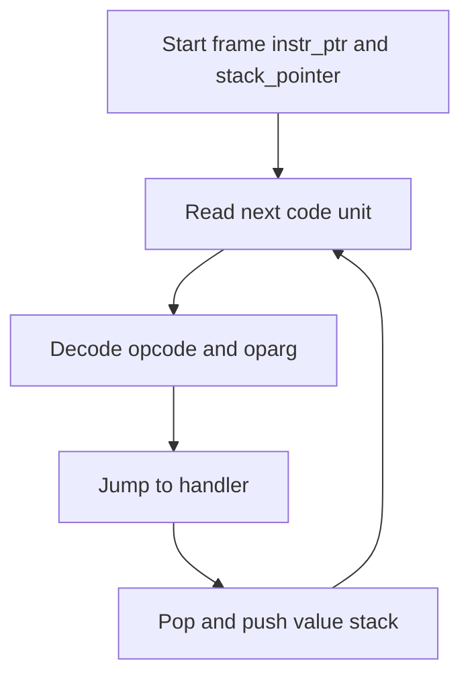
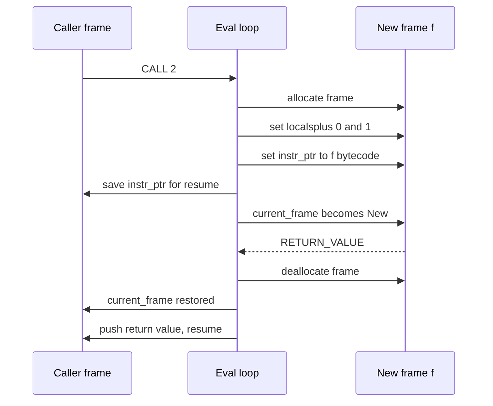

# Lecture 1 — The Evaluation Loop, Deep Dive

> **Duration:** ~2 hours. **Outcome:** You can name every component of a running Python frame from memory (value stack, locals array, instruction pointer, previous-frame link), trace one bytecode instruction from `Python/bytecodes.c` through codegen to `Python/generated_cases.c.h`, and explain why CPython is described as a "stack machine."

## 1. CPython is a stack machine, in three sentences

CPython compiles your source to **bytecode**: a flat array of 16-bit code units (`_Py_CODEUNIT`), each one an opcode (8 bits) plus an oparg (8 bits). A function call creates a **frame** (`_PyInterpreterFrame`) holding that function's local variables and a **value stack**. The **evaluation loop** (`_PyEval_EvalFrameDefault` in `Python/ceval.c`) walks the bytecode array, decoding each instruction and dispatching to its handler, which manipulates the value stack: pop operands, push results.

That is the whole VM. Everything else — adaptive specialization, the GIL, monitoring — is layered on top of that loop. Hold the picture: **one array of opcodes, one stack of `PyObject*`, one cursor moving through them.**

## 2. The four moving parts of a running frame

Open `Include/internal/pycore_frame.h` (<https://github.com/python/cpython/blob/main/Include/internal/pycore_frame.h>) and find `struct _PyInterpreterFrame`. The fields that matter for this lecture (3.13 layout; field order shifts between releases but the meaning is stable):

```c
typedef struct _PyInterpreterFrame {
    PyObject *f_executable;            // the code object (or whatever's running)
    struct _PyInterpreterFrame *previous;  // the caller's frame
    PyObject *f_funcobj;               // the function being called
    PyObject *f_globals;               // module globals dict
    PyObject *f_builtins;              // module builtins dict
    PyObject *f_locals;                // locals dict (only for class bodies / exec)
    PyFrameObject *frame_obj;          // lazily allocated PyFrameObject wrapper
    _Py_CODEUNIT *instr_ptr;           // the program counter (cursor)
    int stacktop;                      // index of the top of the value stack
    uint16_t return_offset;
    char owner;                        // who allocated this frame
    PyObject *localsplus[1];           // flexible array: locals + cells + stack
} _PyInterpreterFrame;
```

The four moving parts:

1. **`localsplus`** — a single flexible C array that holds, in order: the function's local variables (one slot per `co_varnames`), then any closure cells, then the value stack. The compiler statically computes how big this array needs to be (`co_framesize`).
2. **The value stack** — the tail end of `localsplus`, growing upward. `stacktop` indexes the **next** free slot.
3. **`instr_ptr`** — the cursor into the bytecode array. Bytecode lives in `f_executable`'s `co_code_adaptive`. Advancing this is the loop's only forward motion.
4. **`previous`** — the chain back through the call stack. Python frames form a singly linked list. `frame->previous` is the caller. Walking back gives you the traceback.

Since 3.11 (Faster CPython, PEP 659 era), frames are **not** heap-allocated `PyFrameObject`s. They're allocated on a thread-local C stack pool (`tstate->datastack`). The user-facing `PyFrameObject` is created lazily on demand (e.g., when `sys._getframe()` is called or an exception forces a traceback). This is a substantial win: a function call no longer requires a `malloc` for the frame.

## 3. The loop, structurally

`_PyEval_EvalFrameDefault` in `Python/ceval.c` is several thousand lines, but its skeleton is small. Stripped of error handling and tracing, it looks like this (simplified):

```c
PyObject *
_PyEval_EvalFrameDefault(PyThreadState *tstate,
                         _PyInterpreterFrame *frame,
                         int throwflag)
{
    _Py_CODEUNIT *next_instr;
    PyObject **stack_pointer;

start_frame:
    next_instr = frame->instr_ptr;
    stack_pointer = _PyFrame_GetStackPointer(frame);

dispatch_opcode:
    {
        uint8_t opcode = next_instr->op.code;
        uint8_t oparg = next_instr->op.arg;
        next_instr++;
        switch (opcode) {
            // ... thousands of generated cases live here ...
            #include "generated_cases.c.h"
        }
    }
    goto dispatch_opcode;
}
```

The real source is more elaborate — it has labels for exception unwinding, frame-entry, frame-exit, tracing hooks, and the computed-goto version of `DISPATCH()` — but the **shape** is exactly this: read a code unit, jump to the handler, fall through to the next code unit.


*One pass through the evaluation loop: decode, dispatch, manipulate the stack, repeat.*

### 3.1 Computed gotos vs. switch

A `switch(opcode)` statement is slow on a tight interpreter: every iteration does the bounds-check on the case index, then takes one of N branches. The branch predictor sees a single dispatch point and learns very little about the actual sequence of opcodes.

CPython uses **computed gotos** where the compiler supports them (GCC, Clang via `&&label` syntax). The trick: each opcode handler ends not with `break` but with a `DISPATCH()` macro that reads the next opcode and **directly jumps** to its handler. There are now N dispatch sites, one per handler, and the branch predictor learns the probable next-opcode given the current one. This is worth roughly 15–25% on the interpreter's overall throughput (measurements vary by workload).

From `Python/ceval_macros.h` (paraphrased; check the file for the live definitions):

```c
#if USE_COMPUTED_GOTOS
#  define TARGET(op)   TARGET_##op
#  define DISPATCH()                              \
       do {                                       \
           NEXTOPARG();                           \
           goto *opcode_targets[opcode];          \
       } while (0)
#else
#  define TARGET(op)   case op
#  define DISPATCH()   goto dispatch_opcode
#endif
```

`opcode_targets` is a static array of `&&TARGET_LOAD_FAST`, `&&TARGET_LOAD_CONST`, etc. — addresses of code labels. The runtime cost of dispatching one instruction reduces to: one memory load (`next_instr`), one mask to extract the opcode byte, one array index, one indirect jump.

## 4. One opcode end to end: `LOAD_FAST`

`LOAD_FAST oparg` means: push `frame->localsplus[oparg]` onto the value stack. This is the **fastest** instruction in the VM. Let us follow it from source-of-truth through codegen to assembly.

### 4.1 The DSL definition

Open `Python/bytecodes.c` and search for `inst(LOAD_FAST,`. You will find a block like this (3.13):

```c
inst(LOAD_FAST, (-- value)) {
    value = GETLOCAL(oparg);
    assert(value != NULL);
    Py_INCREF(value);
}
```

This is the **single source of truth** for `LOAD_FAST`. The DSL is C-like, with one wart: the stack-effect declaration `(-- value)` in the signature. The `--` separates inputs from outputs; the left is empty, the right is a single output named `value`. The body assigns to that output; the codegen translates the assignment into `PUSH(value)`.

`GETLOCAL(oparg)` is a macro from `Python/ceval_macros.h`:

```c
#define GETLOCAL(i) (frame->localsplus[i])
```

So the entire instruction is: read an entry from the locals array, refcount-bump it, push it onto the value stack. Three C operations, no allocation, no hash lookup.

### 4.2 The generated handler

`Tools/cases_generator/` reads `bytecodes.c` and emits `Python/generated_cases.c.h`. The generated case for `LOAD_FAST` looks like (paraphrased):

```c
TARGET(LOAD_FAST) {
    frame->instr_ptr = next_instr;
    next_instr += 1;
    INSTRUCTION_STATS(LOAD_FAST);
    PyObject *value;
    value = GETLOCAL(oparg);
    assert(value != NULL);
    Py_INCREF(value);
    stack_pointer[0] = value;
    stack_pointer += 1;
    DISPATCH();
}
```

The codegen has inserted the bookkeeping (`instr_ptr` update, stats hook, stack pointer advance) and the dispatch call. The hand-written DSL stays compact; the generated form is what the compiler sees.

### 4.3 What the C compiler emits

On x86-64 with optimization, `LOAD_FAST` compiles to roughly five instructions:

```asm
movzx   eax, byte ptr [next_instr + 1]    ; load oparg
mov     rdi, [rbp + frame_offset]         ; load frame*
mov     rsi, [rdi + localsplus + rax*8]   ; load localsplus[oparg]
inc     qword ptr [rsi]                   ; Py_INCREF
mov     [stack_pointer], rsi              ; push
add     stack_pointer, 8
add     next_instr, 2
jmp     [opcode_targets + rax2]           ; dispatch
```

(Exact codegen depends on compiler and surrounding context. The point is the order of magnitude: five-to-ten host instructions per `LOAD_FAST`.)

Hold this in mind for Lecture 2, when we compare it to `LOAD_GLOBAL`: two hash-table probes plus all of the above.

## 5. The value stack discipline

Every opcode has a **stack effect**: a static, compile-time count of how many slots it pops and how many it pushes. The stack effect is declared in the DSL signature: `(-- value)` is +1; `(a, b -- c)` is -2 +1 = net -1.

Why "static"? Because the compiler — Python's bytecode compiler in `Python/compile.c` — pre-computes the **maximum stack depth** the function will ever need, stores it as `co_stacksize`, and the frame is allocated with exactly that much value-stack space. If the static effect were unknown, the compiler could not pre-allocate.

This has a useful corollary: **there are no stack-overflow runtime checks inside the loop**. The compiler proved at codegen time that the stack stays within `co_stacksize`. Saved checks; faster loop.

`PUSH`, `POP`, `STACK_GROW`, `STACK_SHRINK`, `TOP`, `SECOND` are all macros from `Python/ceval_macros.h` that manipulate `stack_pointer`. In the DSL, you don't write them — you write the input/output names in the signature, and codegen emits the pops and pushes. This is a major part of why the 3.12 DSL switch made the interpreter much more readable than the macro soup that preceded it.

## 6. Worked example: `a + b`

Consider the source:

```python
def f(a, b):
    return a + b
```

The bytecode (3.13, `dis.dis(f)`):

```
  2           RESUME                   0
  3           LOAD_FAST                0 (a)
              LOAD_FAST                1 (b)
              BINARY_OP                0 (+)
              RETURN_VALUE
```

Reading this is exactly reading a stack machine:

1. **`RESUME 0`** — administrative; entry point for coroutines/tracing. Skip.
2. **`LOAD_FAST 0`** — push `localsplus[0]`, which is `a`. Stack: `[a]`.
3. **`LOAD_FAST 1`** — push `localsplus[1]`, which is `b`. Stack: `[a, b]`.
4. **`BINARY_OP 0`** — pop two values, compute `a + b`, push the result. Stack: `[a+b]`.
5. **`RETURN_VALUE`** — pop top, return it. Stack: `[]`.

The bytecode is a **linear sequence of stack manipulations.** No registers. No SSA. No basic blocks. Just push, push, op, return.

Now look at the `BINARY_OP` DSL in `Python/bytecodes.c`:

```c
family(BINARY_OP, INLINE_CACHE_ENTRIES_BINARY_OP) = {
    BINARY_OP_ADD_INT,
    BINARY_OP_ADD_FLOAT,
    BINARY_OP_ADD_UNICODE,
    BINARY_OP_MULTIPLY_INT,
    // ...
};

inst(BINARY_OP, (lhs, rhs -- res)) {
    _PyBinaryOpCache *cache = (_PyBinaryOpCache *)next_instr;
    if (ADAPTIVE_COUNTER_TRIGGERS(cache->counter)) {
        next_instr--;
        _Py_Specialize_BinaryOp(lhs, rhs, next_instr, oparg, ...);
        DISPATCH_SAME_OPARG();
    }
    DECREMENT_ADAPTIVE_COUNTER(cache->counter);
    assert(_PyEval_BinaryOps[oparg]);
    res = _PyEval_BinaryOps[oparg](lhs, rhs);
    if (res == NULL) goto pop_2_error;
}
```

Three things to notice:

1. The stack effect `(lhs, rhs -- res)` — two pops, one push.
2. The **inline cache** — `cache->counter` lives in the `_Py_CODEUNIT` slots immediately following the opcode. The counter ticks down on every execution; when it hits zero, `_Py_Specialize_BinaryOp` rewrites the opcode in place to a specialized variant (Lecture 2 in detail).
3. The slow path: `_PyEval_BinaryOps[oparg]` is a function pointer table; `oparg=0` is `PyNumber_Add`, which does the full Python addition protocol (`__add__`, fallback `__radd__`, fallback `TypeError`).

The instruction-level cost difference between the generic and the specialized paths is roughly **5×** for a hot integer addition. We will measure it in Exercise 2.

## 7. The bytecode array layout

A `code object`'s bytecode is stored in `co_code_adaptive` — a writable buffer of `_Py_CODEUNIT`s. (The read-only `co_code` you may have seen from Python is a snapshot.) Writable matters because adaptive specialization mutates the array in place.

A `_Py_CODEUNIT` is exactly 2 bytes: 1 byte opcode + 1 byte oparg. Larger arguments use `EXTENDED_ARG`, a prefix opcode that supplies high bits.

Each opcode may be followed by zero or more **inline-cache slots**, each one full `_Py_CODEUNIT` wide. The cache count per opcode is fixed at compile time and stored in `_PyOpcode_Caches` (generated from `bytecodes.c` into `Include/internal/pycore_opcode_metadata.h`). For example, `BINARY_OP` has `INLINE_CACHE_ENTRIES_BINARY_OP` = 5 (in 3.13) — five 16-bit slots immediately after the `BINARY_OP` instruction itself.

When the dispatcher executes `BINARY_OP`, it does `next_instr++` to advance past the opcode, then the handler does `next_instr += INLINE_CACHE_ENTRIES_BINARY_OP` to skip the cache slots when entering the next instruction. This is why disassembly with `show_caches=True` looks like:

```
              BINARY_OP                0 (+)
              CACHE                    0 (counter: 0)
              CACHE                    0 (lhs_type_version: 0)
              CACHE                    0 (lhs_type_version: 0)
              CACHE                    0 (rhs_type_version: 0)
              CACHE                    0 (rhs_type_version: 0)
```

The "CACHE" entries are not instructions — they are payload that the `BINARY_OP` handler reads. To the dispatcher they are invisible.

## 8. The frame chain and `sys._getframe`

Every running Python function has a corresponding `_PyInterpreterFrame`. The current frame is `tstate->current_frame`. The chain back is `frame->previous`. Tracebacks, `sys._getframe(N)`, and `inspect.currentframe()` walk this chain.

When does CPython materialize a `PyFrameObject` (the Python-visible wrapper)? Lazily:

- When user code calls `sys._getframe()`.
- When an exception is raised — the traceback construction needs `PyFrameObject`s.
- When a `sys.settrace` hook is active — the trace API hands `PyFrameObject`s to the callback.
- When `sys.monitoring` events fire that need a frame argument.

This lazy materialization is one of the largest 3.11 perf wins. Function calls that never need to expose a frame to Python code never pay the allocation cost.

## 9. Putting it together: a function call, step by step

What happens when you call `f(1, 2)` from the REPL?

1. The REPL's bytecode contains `LOAD_NAME 'f'`, `LOAD_CONST 1`, `LOAD_CONST 2`, `CALL 2`.
2. `CALL 2` pops the function and its two args, then invokes `_PyEvalFramePushAndInit` (in `Python/ceval.c`) to allocate a new frame on the thread's frame pool.
3. The new frame's `localsplus[0]` is set to `1`, `localsplus[1]` is `2`, the rest is zeroed.
4. `frame->instr_ptr` is set to the first code unit of `f`'s bytecode.
5. The caller's `next_instr` is saved into `caller_frame->instr_ptr` so we can resume.
6. `tstate->current_frame` is updated to the new frame.
7. Control falls through `dispatch_opcode` and starts executing `f`'s bytecode.

When `f` hits `RETURN_VALUE`:

1. Top of value stack is the return value.
2. `_PyEval_FrameClearAndPop` (or inline equivalent) deallocates the frame.
3. `tstate->current_frame` is set back to `frame->previous`.
4. `next_instr` is reloaded from the (now-current) caller's `instr_ptr`.
5. The return value is pushed onto the caller's value stack.
6. Execution continues at the caller's next instruction.

Notice the symmetry: the loop's state (`next_instr`, `stack_pointer`) is **swapped in and out** at every call/return. The C-level recursion is implemented as a software stack of frames, with the loop variables saved into the frame struct. This is what makes Python's recursion limit configurable, and what gives us tracebacks.


*State handoff between caller and callee frames across a call and return.*

## 10. What you should be able to do now

- Open `Python/bytecodes.c` in a browser tab, find `inst(LOAD_FAST,`, read the body, and articulate every line.
- Run `python -c "import dis; dis.dis('a = b + 1', show_caches=True)"` and identify each `_Py_CODEUNIT` (opcode, oparg, cache slots).
- Sketch on paper the value-stack contents after each opcode in a small function.
- Explain to a colleague: "Why is the Python interpreter described as a stack machine?" in two minutes.

Move on to Lecture 2: where we discover that not all loads are equal, and that the interpreter rewrites your bytecode while it runs.
