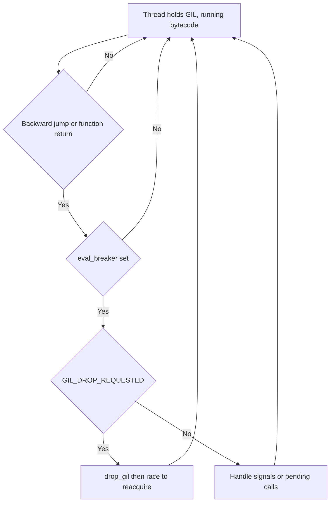
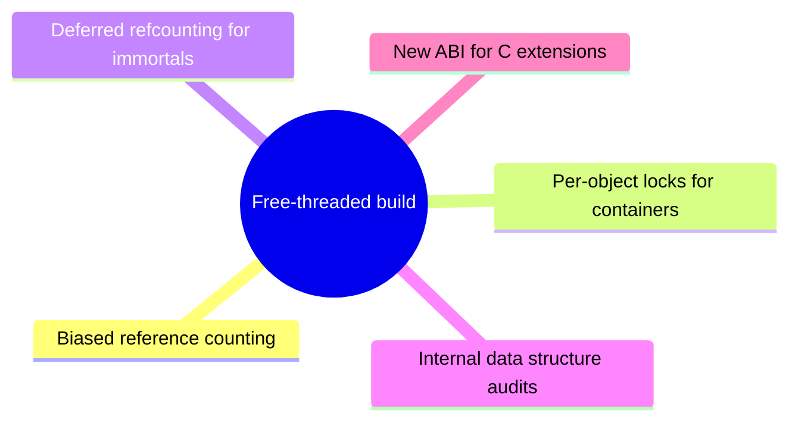

# Lecture 3 — The GIL, the Free-Threaded Build, and Subinterpreters

> **Duration:** ~2 hours. **Outcome:** You can state precisely what the GIL protects, what it does not, why it exists, and how three distinct CPython execution modes — stock GIL, **PEP 703** free-threaded, **PEP 684/734** per-interpreter GIL — differ in concurrency semantics. You can write a program that demonstrates GIL contention and another that demonstrates the free-threaded build's parallel scaling.

## 1. What the GIL actually is

The **Global Interpreter Lock** is one C-level mutex in `_PyRuntimeState`. Its declaration is in `Python/ceval_gil.c` (<https://github.com/python/cpython/blob/main/Python/ceval_gil.c>). The mutex protects the **state of the CPython interpreter**: which thread owns the right to execute Python bytecode in `_PyEval_EvalFrameDefault` at this instant.

A thread holding the GIL may execute opcodes, mutate `PyObject` refcounts, and call into the C API. A thread **not** holding the GIL may run pure C/assembly without touching `PyObject` data, but must reacquire the GIL before calling any `Py*` function (with rare exceptions in the free-threaded build).

The GIL is **not**:

- A lock on any particular Python object (it does not protect your `list` from concurrent `.append`).
- A guarantee that any sequence of Python statements is atomic (it isn't; the loop can release between any two opcodes).
- A lock on user data structures (your dicts can absolutely be corrupted by your own logic, even with the GIL).

The GIL **is**:

- A guarantee that no two threads execute bytecode concurrently in the same interpreter.
- The implicit protection that lets CPython use non-atomic refcount operations (just plain `ob_refcnt++` and `ob_refcnt--` — no `lock; xadd`).
- The implicit protection on CPython's free-list head pointers, type-cache lookups, the internal GC state, and all the other shared interpreter data structures.

## 2. Why the GIL exists (the engineering rationale)

Refcounts are touched on **every** name binding, every function call, every container operation. If every refcount mutation needed an atomic instruction (e.g., `lock incq` on x86), single-threaded Python would slow down significantly — measurements in the early PEP 703 design days suggested 5–25% on macrobenchmarks, depending on the workload's allocation rate.

Beyond refcounts, CPython has many small, internally non-thread-safe structures: the small-int free list, the `frame_alloc` thread-local frame pool, the `_PyType_LookupRef` cache, the small-tuple free list, the global allocator's mempools, the GC's tracked-object list. Making all of those thread-safe individually (with fine-grained locks, atomics, or hazard pointers) is a years-long engineering project. PEP 703 finally accepted that scope.

The GIL was, for two decades, the path of least resistance: one big lock around the whole interpreter, everything inside it is single-threaded, no fine-grained locking required, single-thread performance preserved. The cost is real but bounded: **threads cannot parallelize CPU-bound Python code.**

## 3. How the GIL is acquired and released

From `Python/ceval_gil.c`, the two key functions are `take_gil` and `drop_gil`. The control flow:

- **Frame entry / re-entry** — when a thread starts executing Python bytecode, it must hold the GIL. The C API enforces this via `PyEval_AcquireThread`, `PyEval_RestoreThread`, etc.
- **Around blocking C calls** — when a thread is about to make a long-running C call that does not touch `PyObject` data (`read()`, `select()`, `compress()`, a NumPy matrix multiply), the C extension wraps the call in `Py_BEGIN_ALLOW_THREADS / Py_END_ALLOW_THREADS`. The first drops the GIL; the second reacquires it. This is how IO-bound Python multithreading works.
- **Voluntarily, on a schedule** — the `eval_breaker` mechanism (next section) periodically asks the running thread to drop the GIL so other Python threads get a turn.

The simplified shape of `take_gil`:

```c
static void
take_gil(PyThreadState *tstate)
{
    while (the_gil_is_held) {
        wait_on_a_condition_variable();   // park this thread
        if (we_were_signaled_to_drop) {
            // some other thread asked us to release; loop back
        }
    }
    mark_the_gil_as_held_by(tstate);
}
```

And `drop_gil`:

```c
static void
drop_gil(PyThreadState *tstate)
{
    mark_the_gil_as_free();
    notify_waiting_threads();
    // (other threads' take_gil calls now race to acquire)
}
```

The real code is significantly more elaborate (it handles signals, the OS-level scheduling latency, the case where the dropping thread immediately tries to re-take, etc.) but the structure is exactly this.

## 4. The `eval_breaker` and `sys.setswitchinterval`

The interpreter loop polls a small bitmask called `eval_breaker` at every **backward jump** (loop iteration, exception unwind, function return into a calling loop). The bitmask flags include:

- `GIL_DROP_REQUESTED` — another thread is waiting to take the GIL.
- `PENDING_SIGNALS` — a Unix signal arrived; need to run signal handlers in the main thread.
- `PENDING_CALLS` — there are scheduled callbacks (`Py_AddPendingCall`) waiting to run.
- `ASYNC_EXCEPTION` — `PyThreadState_SetAsyncExc` was used to raise an exception in this thread.

When `GIL_DROP_REQUESTED` is set, the eval loop calls `_Py_HandlePending`, which drops the GIL, waits briefly, and reacquires it. The waiting thread typically wins the race during that gap.

How does the bit get set? **`sys.setswitchinterval`**. The default since Python 3.2 is **5 milliseconds**. A separate timer thread (implemented via a condition variable wait) sets `GIL_DROP_REQUESTED` after the interval elapses. So:

- A pure Python loop with no IO will run for ~5 ms, then yield to another Python thread, run another ~5 ms, then yield, and so on.
- A loop that calls into a blocking C extension (with `Py_BEGIN_ALLOW_THREADS`) drops the GIL immediately; other Python threads run during the wait.
- A tight loop in C without `Py_BEGIN_ALLOW_THREADS` will **never** voluntarily drop the GIL — which is why `time.sleep` is implemented with `Py_BEGIN_ALLOW_THREADS` and a busy `while True: pass` is not.


*The eval_breaker is polled only at backward jumps and function entry or exit, which is when a GIL handoff can happen.*

You can shorten the switch interval:

```python
import sys
sys.setswitchinterval(0.001)  # 1 ms
```

Why might you? Lower-latency thread switching for an interactive UI thread, for example. The cost is more time spent in `take_gil`/`drop_gil` overhead. The default 5 ms was empirically tuned against macrobenchmarks; rarely should you change it in production code.

## 5. The classic GIL demonstration

The CPU-bound demonstration that every Python tutorial includes (and which you should run for yourself in Exercise 3):

```python
import threading, time

def burn(n):
    x = 0
    for _ in range(n):
        x += 1

# Serial: one call
start = time.perf_counter()
burn(50_000_000)
burn(50_000_000)
serial_time = time.perf_counter() - start

# Threaded: two calls in parallel threads
start = time.perf_counter()
t1 = threading.Thread(target=burn, args=(50_000_000,))
t2 = threading.Thread(target=burn, args=(50_000_000,))
t1.start(); t2.start(); t1.join(); t2.join()
threaded_time = time.perf_counter() - start

print(f"serial: {serial_time:.2f}s, threaded: {threaded_time:.2f}s")
```

On a stock-GIL CPython 3.13, `threaded_time` is approximately equal to `serial_time` — sometimes slightly **worse** because of GIL-contention overhead. Both threads execute Python bytecode, both need the GIL, both spend half their time waiting for the other. No parallel speedup.

Compare to IO-bound work:

```python
import threading, time, urllib.request

def fetch(url):
    urllib.request.urlopen(url, timeout=5).read()

urls = ["https://example.com"] * 20

# Serial
start = time.perf_counter()
for u in urls: fetch(u)
print(f"serial: {time.perf_counter() - start:.2f}s")

# Threaded
threads = [threading.Thread(target=fetch, args=(u,)) for u in urls]
start = time.perf_counter()
for t in threads: t.start()
for t in threads: t.join()
print(f"threaded: {time.perf_counter() - start:.2f}s")
```

Here the threaded version is roughly **N× faster** (N = thread count, up to network/connection limits). The reason: `urlopen` calls `recv()` (or equivalent) under `Py_BEGIN_ALLOW_THREADS`. While one thread is parked in a kernel `recv` waiting for bytes, the GIL is free; other Python threads execute. **Threads parallelize waiting, not computing.**

## 6. PEP 703 — the free-threaded build

**PEP 703 — Making the Global Interpreter Lock Optional in CPython** (Sam Gross, 2023; accepted by the Steering Council in 2024) is the formal plan to remove the GIL. As of CPython 3.13, the free-threaded build is **experimental** but functional: configure with `./configure --disable-gil` and you get a separate binary named `python3.13t` (the `t` is "threaded").

PEP 703's design rests on five technical pillars:


*The five engineering pillars PEP 703 stands on to make the GIL optional.*

### 6.1 Biased reference counting

Most objects spend their lives owned by a single thread. PEP 703 exploits this with **biased reference counting**: each `PyObject` has a "local" refcount (touched only by the owner thread, non-atomic, fast) and a "shared" refcount (touched by other threads, atomic). When a non-owner thread takes a reference, it bumps the shared refcount with `atomic_fetch_add`. The owner thread bumps the local count with a plain `++`. The object is freed when local + shared == 0 (with careful merge semantics at thread transfer points).

This gets the single-threaded speed back to within ~10% of the GIL build for most workloads. The exact numbers move release-to-release; track them in the `pyperformance` benchmarks.

### 6.2 Per-object locks for mutable containers

`list`, `dict`, and `set` need internal locks because they have multi-step mutation operations (resize a hash table, growth a backing array). PEP 703 adds a single `ob_mutex` field (or equivalent) to those types and acquires it briefly around critical sections. The lock is per-object, so contention is workload-shaped.

### 6.3 Deferred reference counting for immortal objects

`None`, `True`, `False`, the small ints, all type objects, and most module-level functions are **immortal**: they never get deallocated during the interpreter's lifetime. PEP 703 makes their refcount a magic sentinel (`_Py_IMMORTAL_REFCNT`) that all refcount operations short-circuit on. No atomics, no local count, just a no-op. This removes the largest source of inter-thread refcount contention.

### 6.4 Internal data structure thread-safety

Every internal cache, free list, and shared table in CPython needed an audit and (usually) a per-thread or per-structure lock. The fixed lists for free `int`, `float`, `tuple`, `list`, `dict`, `frame`, `method` objects are now per-thread. The type-method cache uses RCU-style versioning. The cyclic GC has its own coordination.

### 6.5 ABI implications

C extensions need to be rebuilt for the free-threaded ABI; they get a different file extension (`.cpython-313t-...so` instead of `.cpython-313-...so`). Extensions that assumed "only one thread runs Python code at a time" are now wrong and must be audited. NumPy, Cython, and other major projects have free-threaded-compatible builds available; the ecosystem is catching up.

## 7. What the free-threaded build buys you

Re-run the CPU-bound demo from §5 under `python3.13t`:

```
$ python3.13 burn.py
serial: 4.85s, threaded: 4.91s     # no parallelism

$ python3.13t burn.py
serial: 5.32s, threaded: 2.71s     # ~2x speedup on 2 threads
```

(Numbers approximate; depends on hardware.) The free-threaded build gives you **real parallelism** for CPU-bound Python code, with a single-thread overhead of ~10% (the `5.32s` vs `4.85s` gap above).

This is the headline result. The cost — that 10% — is paid by every program, whether or not it has threads. For single-threaded workloads, the stock-GIL build is still faster. The decision is workload-driven.

## 8. PEP 684 — per-interpreter GIL

**PEP 684 — A Per-Interpreter GIL** (Eric Snow; landed in 3.12) is a different solution to a different problem.

A **subinterpreter** is a `PyInterpreterState` — a separate runtime environment with its own modules, its own builtins, its own singletons, its own GIL. Subinterpreters have existed in CPython for two decades (via the C API only — `Py_NewInterpreter`), but until 3.12 they all **shared one GIL**. Useless for parallelism.

PEP 684 gave each subinterpreter its own GIL. Now N subinterpreters in the same process run truly in parallel — each one is single-threaded internally, but the process has N cores active. Crucially, **subinterpreters are isolated**: a `PyObject` in subinterpreter A cannot be referenced from subinterpreter B. Communication is by message-passing, not shared state.

PEP 734 — **Multiple Interpreters in the Stdlib** (Eric Snow; expected 3.14) — adds the `concurrent.interpreters` module, which exposes subinterpreters to Python code:

```python
from concurrent import interpreters

interp = interpreters.create()
interp.exec("x = sum(range(10**7))")
result = interp.run_string("print(x)")    # prints in the subinterpreter
```

Communication happens through **channels** — typed queues with copy semantics across interpreter boundaries. The model is closer to Erlang's mailboxes than to shared-memory threads.

## 9. The three concurrency models, compared

In CPython 3.14 you can choose among:

| Model | Mechanism | Cost | Best for |
|-------|-----------|------|----------|
| **Threads + GIL (default build)** | `threading` / `concurrent.futures.ThreadPoolExecutor` | 0% single-thread overhead. CPU-bound code does not parallelize. | IO-bound work, single-threaded code, mature ecosystem. |
| **Threads + free-threaded build** | Same `threading` API, run on `python3.13t` or `python3.14t` | ~10% single-thread overhead. CPU-bound code parallelizes. Some C extensions may not be ready. | CPU-bound parallel work, mixed workloads, when you control the dependency stack. |
| **Subinterpreters (PEP 684/734)** | `concurrent.interpreters` (3.14+) | Per-subinterpreter memory cost (own modules); message-passing serialization. Truly isolated. | Plugin systems, sandboxes, "actors with state" patterns. |
| **Multiprocessing** | `multiprocessing.Pool`, `subprocess` | OS-process overhead; pickled IPC. No shared mutable state. | Heavy CPU work, fault isolation, scaling to many cores. |
| **asyncio** | Cooperative scheduling, single thread | Coroutine bookkeeping. No parallelism within one event loop. | High-concurrency IO with low per-task cost. |

A senior Python decision is **picking the right model for the workload**. We'll spend Weeks 4–6 on that decision. This week the takeaway is: **the GIL is not the only model anymore.** As of 2026, you have real alternatives that were not in the language two years ago.

## 10. Practical guidance for 2026 Python

- **Default build (`python3.13` or `python3.14`)** is what you should ship to production for most projects, in 2026. The free-threaded build is stable but the C extension ecosystem is still catching up. If your dependency tree is small and well-known, the free-threaded build is a credible choice for new CPU-bound work.
- **For CPU-bound parallel work today**, use `multiprocessing` or the free-threaded build. The former is portable and reliable; the latter is faster (no IPC overhead) but newer.
- **For IO-bound work**, use threads (under either build) or asyncio. Threads parallelize blocking IO calls; asyncio parallelizes non-blocking IO calls. Choose by ecosystem fit.
- **For plugin / sandbox use cases**, watch `concurrent.interpreters`. Once 3.14 ships and the API stabilizes, this is the cleanest way to run multiple isolated Python contexts in one process.

## 11. Reading the GIL code

The exercise of reading `Python/ceval_gil.c` is recommended. You will find:

- `gil_created()`, `_PyEval_InitGIL()` — initialization.
- `take_gil()`, `drop_gil()` — the acquire/release pair.
- `_PyEval_AcquireLock()`, `_PyEval_ReleaseLock()` — public API used by `PyEval_AcquireThread` etc.
- The condition variable plumbing (Mac/Linux: pthread; Windows: `CONDITION_VARIABLE`).

The file is roughly 1000 lines and is the second-most readable VM-internals file in CPython after `Python/bytecodes.c`. Spend an hour with it before the homework's "trace one acquire" problem.

## 12. The `eval_breaker` checks

Search `Python/ceval.c` for `_Py_HandlePending`. That function is what runs when `eval_breaker` is non-zero — it dispatches to:

- GIL drop (if requested).
- Signal handlers (if a signal arrived).
- Pending C calls (scheduled with `Py_AddPendingCall`).
- Async exceptions (`PyThreadState_SetAsyncExc`).
- The `gc` collector tick (if needed).

The crucial property: **`eval_breaker` is checked only at backward jumps and function entry/exit.** A long-running C extension that never returns to the eval loop will never observe the breaker, will never release the GIL, will block all other Python threads. This is the bug pattern behind "my threading code locks up": some C function held the GIL too long. The fix is `Py_BEGIN_ALLOW_THREADS` around the C call.

## 13. What you should be able to do now

- Explain in one minute, to a non-Python colleague, what the GIL is and why it exists.
- Demonstrate, with measurements, that the GIL blocks CPU-bound thread scaling.
- Demonstrate, with measurements, that the GIL releases for IO-bound work.
- Build and run the free-threaded `python3.13t` (or use a prebuilt binary) and verify the CPU-bound benchmark now scales.
- Articulate the difference between "thread-safe" (no data races at the C level) and "thread-safe at your application level" (your invariants hold under any opcode interleaving) — and explain why the GIL gives you only the former.
- Sketch on paper the lifecycle of one `eval_breaker` check from `sys.setswitchinterval` timer to `drop_gil` to a context switch.

This concludes the three lectures. Move on to the exercises: a bytecode tracer, a specialization observer, and a GIL-vs-threads measurement.
