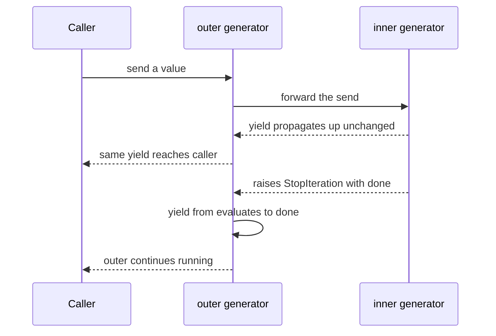
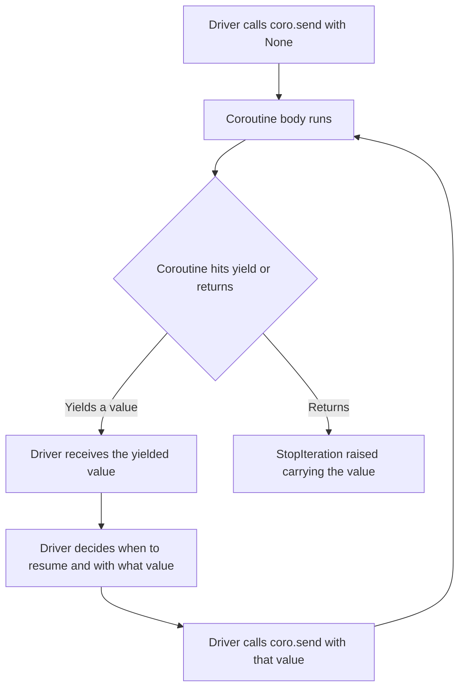

# Lecture 1 — Coroutines vs. Generators, and the Awaitable Protocol

> **Duration:** ~2 hours. **Outcome:** You can read the bytecode of a native coroutine and explain every opcode; you can build a custom awaitable in five lines that the asyncio event loop accepts; you can sketch the lineage PEP 342 → PEP 380 → PEP 492 → PEP 525 without notes; and you can answer the question "is `await` just `yield from` with a different name?" with a precise yes-and-no.

## 1. The lineage in one paragraph

Python's coroutine story is twenty years of bolting suspendability onto generators. **PEP 255** (2001, Python 2.2) introduced generators: a function with `yield` returns an iterator that can be advanced with `next()`, suspending at `yield` and resuming on the next call. **PEP 342** (2005, Python 2.5) extended this with `generator.send(value)` and `generator.throw(exc)`, turning generators into two-way pipes — values can flow *into* the suspension as well as out of it. The community spent the next decade abusing this for asynchronous I/O (`tornado.gen`, `gevent`'s patched stdlib, the earliest forms of what would become `asyncio`). **PEP 380** (2009, Python 3.3) added `yield from`, which made suspendable functions *compose* — a function can delegate to another suspendable function and bubble up the result. By Python 3.4, all of this was working under the `@asyncio.coroutine` decorator and `yield from coro` was the way you wrote what we would now write as `await coro`.

**PEP 492** (2015, Python 3.5) was the decision to give all of this its own syntax: `async def` for the declaration, `await` for the suspension point. Internally, native coroutines (Python's official name for `async def`-defined functions) are still generators in all but type — they compile to nearly the same bytecode, support the same `.send()` / `.throw()` / `.close()` operations, suspend the same way. They differ in two visible respects: their type is `types.CoroutineType`, not `types.GeneratorType`, and they refuse to be iterated with `next()` or `iter()`. **PEP 525** (2016, Python 3.6) added asynchronous generators (`async def` + `yield`, driven by `async for`). **PEP 530** (2016) added asynchronous comprehensions. **PEP 654** (2021, Python 3.11) introduced `ExceptionGroup` and `except*`, the missing piece for structured concurrency.

Everything else — `Task`, `Future`, the event loop, `gather`, `TaskGroup` — is **Python code** on top of these language primitives. There is no magic. Knowing this is the difference between memorizing asyncio's API and being able to rebuild it.

## 2. Generators, refreshed

A generator function compiles to a code object whose `co_flags` include `CO_GENERATOR`. Calling it does **not** run the body; it returns a generator object whose first `next()` will run the body up to the first `yield`.

```python
def gen():
    print("a")
    yield 1
    print("b")
    yield 2
    print("c")

g = gen()
print(type(g))         # <class 'generator'>
print(next(g))         # prints "a", then 1
print(next(g))         # prints "b", then 2
print(next(g))         # prints "c", raises StopIteration
```

PEP 342's `send()` / `throw()` make this a two-way pipe:

```python
def echo():
    while True:
        received = yield
        print(f"got {received}")

e = echo()
next(e)            # advance to the first yield
e.send("hello")    # "got hello"
e.send("world")    # "got world"
e.throw(ValueError("stop"))   # raises ValueError *inside* the generator
```

The model: the generator is **suspended at the `yield`**. `send(v)` resumes it; the value of the `yield` expression on the inside is `v`. `throw(exc)` resumes it by raising `exc` at the `yield` point. `close()` raises `GeneratorExit` at the `yield` point.

A generator that runs to completion (or executes a `return value` statement) signals this by raising `StopIteration(value)`. The `.value` attribute carries the return value. **This is the channel for "return a result from a coroutine."**

## 3. `yield from` (PEP 380): delegation

`yield from iterable` is, on the surface, equivalent to `for v in iterable: yield v`. But PEP 380's full semantics are subtler and the subtlety is exactly what makes it work as a coroutine primitive:

```python
def inner():
    yield 1
    yield 2
    return "done"

def outer():
    result = yield from inner()
    print(f"inner returned: {result}")
    yield 99
```

Five things happen here:

1. `outer`'s `yield from inner()` is **transparent**: each `yield` inside `inner` propagates *unchanged* up through `outer` to whoever is driving the outer generator.
2. `send(v)` to the outer generator is forwarded to the inner one.
3. `throw(exc)` to the outer generator is forwarded to the inner one.
4. When `inner` raises `StopIteration(value)`, the `yield from` expression evaluates to `value` (here, `"done"`).
5. `inner`'s `StopIteration` is *not* propagated; it is consumed by the `yield from` and the outer generator continues.


*How `yield from` transparently forwards sends and unwraps the inner `StopIteration`.*

This is the protocol that made it possible to write `result = yield from some_coroutine()` and have the result come back. Before PEP 380, the asyncio precursor had to encode this by hand: every wrapper called `next()` in a loop, caught `StopIteration`, manually unwrapped the value.

You can read the bytecode of `yield from` in `dis.dis(outer)` on Python 3.10 and earlier — `GET_YIELD_FROM_ITER` then `YIELD_FROM`. On 3.11+ the bytecode was refactored: `yield from` and `await` share a common implementation called `SEND` + `YIELD_VALUE` + `END_SEND`. We will see that below.

## 4. `async def` (PEP 492): native coroutines

`async def f(): ...` declares a native coroutine function. Its code object has `co_flags & CO_COROUTINE`. Calling it returns a `coroutine` object (`type(coro)` is `types.CoroutineType`).

```python
async def square(x):
    return x * x

c = square(5)
print(type(c))           # <class 'coroutine'>
print(c)                 # <coroutine object square at 0x...>
try:
    c.send(None)
except StopIteration as stop:
    print(stop.value)    # 25
```

Things to notice:

1. Calling `square(5)` did **not** compute 25. It returned a coroutine.
2. To run the coroutine, you `send(None)` (the first send to a fresh coroutine, by PEP 492 rule, must be `None`).
3. The return value comes back as `StopIteration.value`, exactly like a generator.
4. `square` had no `await` in it, so it ran to completion in a single step. The `c.send(None)` raised `StopIteration` immediately.

**A coroutine with no `await` is just a function that costs you one `StopIteration` to call.** This is worth remembering: it explains why "make everything async just in case" carries a real (though tiny) runtime cost.

Now add a suspension point:

```python
import types

@types.coroutine
def _suspend():
    """A primitive awaitable: yields one marker, then returns."""
    return (yield "I am suspending")

async def f():
    print("before")
    received = await _suspend()
    print(f"resumed with {received}")
    return "ok"

c = f()
marker = c.send(None)        # "before"; marker == "I am suspending"
print(f"marker: {marker}")
try:
    c.send("resume value")    # "resumed with resume value"
except StopIteration as stop:
    print(stop.value)         # "ok"
```

This is the entire mechanism. The driver of the coroutine (in our toy: the four lines above; in production: the asyncio event loop) does:

1. `coro.send(None)` to start it.
2. Receive whatever it yields.
3. Decide when to resume it, and with what value.
4. `coro.send(value)` to resume.
5. Repeat until `StopIteration`. Read `.value` for the return.


*The coroutine driver loop: send, receive, decide, resume, until StopIteration.*

`@types.coroutine` is the bridge: it tags a generator function so that `await`-ing the resulting generator is permitted. Without that decoration, `await generator_object` raises `TypeError: object is not iterable` (Python refuses to `await` a plain generator).

## 5. The awaitable protocol, precisely

An object is **awaitable** if any of the following is true:

| Case | Example | Mechanism |
|------|---------|-----------|
| It is a native coroutine | `c = async_def_fn()` | `await c` is desugared to `yield from c.__await__()` (in effect) |
| It is a generator-based coroutine | `g = generator_decorated_with_types_coroutine()` | Same |
| It has a method `__await__()` returning an iterator | `class Awaitable: def __await__(self): yield ...` | `await obj` is `yield from obj.__await__()` |

The full implementation of this resolution is `_PyCoro_GetAwaitableIter` in `Objects/genobject.c`. On 3.13, the function is around 60 lines; if you can read it, you understand awaitables completely.

The compiler emits, for `await x`:

| Bytecode | Effect |
|----------|--------|
| `GET_AWAITABLE` | Replace TOS with its `__await__` iterator (or `TypeError` if not awaitable). Cite `Python/bytecodes.c`, search `inst(GET_AWAITABLE,`. |
| `LOAD_CONST None` | The value to send on entry (always `None` for a fresh send). |
| `SEND` | Send the value; if the awaitable yielded, push that on the stack and jump to `YIELD_VALUE`; if it raised `StopIteration`, push `.value` and skip the yield. |
| `YIELD_VALUE` | Yield whatever the awaitable yielded — to *our* caller (the event loop). |
| `RESUME` | When we come back, this is where we re-enter. |
| `END_SEND` | Cleanup. |

The key insight: `await` is **transparent**. Whatever the awaitable yields, our enclosing coroutine yields to *its* driver. Whatever the driver sends back, we forward into the awaitable. The whole chain is one long pipe. This is identical to PEP 380's `yield from` and *that is not a coincidence*: PEP 492 explicitly chose to reuse PEP 380's mechanism.

## 6. The smallest awaitable: a custom one in five lines

```python
class Sleep:
    """An awaitable. The event loop reads what we yield."""

    def __init__(self, seconds):
        self.seconds = seconds

    def __await__(self):
        # Yield ourselves to the loop. The loop, recognizing this type,
        # schedules a resume in `self.seconds` seconds.
        yield self
```

If the event loop knew about the `Sleep` type, it would see `Sleep(2.0)` come out of `coro.send(None)`, register a timer for 2 seconds from now, return control elsewhere, and resume the coroutine when the timer fires. **This is how `asyncio.sleep` works.** The real implementation goes through `Future`, not a custom marker class, but the shape is identical.

We will build this loop in Lecture 2.

## 7. The bytecode of a native coroutine

Compare these two:

```python
def gen():
    yield 1
    return 2

async def coro():
    return 2
```

Run `dis.dis(gen)`:

```
  2           RESUME                   0
              LOAD_CONST               1 (1)
              YIELD_VALUE              0
              POP_TOP

  3           LOAD_CONST               2 (2)
              RETURN_VALUE
```

Run `dis.dis(coro)`:

```
  1           RETURN_GENERATOR
              POP_TOP
              RESUME                   0

  2           LOAD_CONST               1 (2)
              RETURN_VALUE
```

Three observations:

1. The coroutine has a `RETURN_GENERATOR` opcode at offset 0. This is the magic: calling the function *returns* a coroutine object built from the code object, without executing the body. The body only runs on the first `.send(None)`. (`RETURN_GENERATOR` is defined in `Python/bytecodes.c`, search `inst(RETURN_GENERATOR,`.)
2. After `RETURN_GENERATOR`, `POP_TOP`, `RESUME 0`: this is where the first `.send(None)` will land. `RESUME` is also where every `await` resumption lands — `oparg=2` means "after `yield`", `oparg=3` means "after `await`", `oparg=0` means "frame start".
3. Both functions then load 2 and `RETURN_VALUE`. The return value comes back as `StopIteration.value` for the generator/coroutine driver.

Now `dis.dis` a function with one `await`:

```python
async def with_await():
    x = await some_awaitable()
    return x + 1
```

The bytecode (simplified, 3.13):

```
  RETURN_GENERATOR
  POP_TOP
  RESUME                   0

  LOAD_GLOBAL              'some_awaitable'
  CALL                     0
  GET_AWAITABLE            0
  LOAD_CONST               None
  SEND                     <skip-over>      ; if StopIteration, skip ahead
  YIELD_VALUE              ...               ; otherwise yield it onward
  RESUME                   3                ; resume here when sent back
  JUMP_BACKWARD            <to SEND>         ; loop until StopIteration
  END_SEND                                  ; cleanup
  STORE_FAST               'x'

  LOAD_FAST                'x'
  LOAD_CONST               1
  BINARY_OP                0 (+)
  RETURN_VALUE
```

The structure `SEND` / `YIELD_VALUE` / `RESUME 3` / `JUMP_BACKWARD` is the **`await` desugaring**. It is a loop: send `None` (first time) or whatever we were sent (subsequent times) into the awaitable; if the awaitable yielded, yield it onward and wait to be resumed; if the awaitable raised `StopIteration`, take its `.value` and continue. Read `SEND` in `Python/bytecodes.c` — `inst(SEND,` — for the precise specification.

Cite (3.13): the `SEND` opcode is roughly 25 lines of DSL. `END_SEND` is 3 lines: it pops the awaitable iterator off the stack now that we are done with it.

## 8. Generator-based coroutine bytecode (the old way)

For historical context. Pre-PEP 492:

```python
import asyncio

@asyncio.coroutine        # removed in 3.12
def old_style():
    x = yield from inner_coro()
    return x + 1
```

This produced essentially the same bytecode, except the `await` desugaring used `YIELD_FROM` (pre-3.11) or the same `SEND`/`YIELD_VALUE` pattern (3.11+). The behavior was identical. The point of PEP 492 was **type discipline and syntax clarity**, not new mechanism.

PEP 492 also imposed two restrictions:

- An `async def` body may not contain a bare `yield`. (PEP 525 lifted this for asynchronous generators.)
- `await` may only appear inside `async def` (or asynchronous comprehensions per PEP 530).

The latter restriction is the *compile-time* type check that gives "colored function" its name: the compiler refuses to mix sync and async at the syntax level.

## 9. Asynchronous generators (PEP 525)

An `async def` function that *also* contains `yield` is an **asynchronous generator**:

```python
async def numbers():
    yield 1
    await asyncio.sleep(0.01)
    yield 2
    await asyncio.sleep(0.01)
    yield 3

async def consume():
    async for n in numbers():
        print(n)
```

`numbers()` returns an `AsyncGenerator`. `async for` is desugared to:

```python
it = type(ag).__aiter__(ag)
while True:
    try:
        value = await type(it).__anext__(it)
    except StopAsyncIteration:
        break
    # ... loop body with `value` ...
```

`__anext__` returns an awaitable; you `await` it to get the next value, or `StopAsyncIteration` to terminate. PEP 525 added these as parallels to the synchronous `__iter__`/`__next__`/`StopIteration` protocol.

We do not implement async generators in this week's toy clone — they are an extension on top of coroutines, and the marginal payoff for re-implementing them is small. But you should be able to use them, and to read their docstrings without confusion. Week 5's mini-project (a structured async crawler) uses them.

## 10. The "colored function" framing

Bob Nystrom, 2015: *what color is your function?* The argument: in a language with two function colors (sync and async), every call site must color-match. If you have a green function (async), every function up the call stack that wants to invoke it must also be green. Adding `async` to one function tends to propagate outward through your codebase. He concludes: "the difference between red and blue functions is a kind of accidental complexity born of the need to interact with an asynchronous OS."

Python inherited this fully. `requests.get` is sync; `aiohttp.get` is async. Mixing requires `loop.run_in_executor` (sync→async bridge) or `asyncio.run` (async→sync bridge), both of which carry runtime cost.

The counter-argument is the one PEP 492 took: *the color is informative.* `async def` documents at the call site that this function can suspend. Before native coroutines, every `yield from` could be a coroutine or a generator and you could not tell at the call site. The type discipline introduced by PEP 492 is the price you pay for that documentation.

Two practical takeaways for the senior Python engineer in 2026:

1. **Do not add `async` defensively.** "Maybe we'll need to suspend later" is not a reason. The function will be tainted forever; reverting is harder than promoting.
2. **Bridge once at the boundary.** A web request handler is async; a library function it calls that turns out to need a thread is `await loop.run_in_executor(None, blocking_fn, *args)`. One bridge. Not five.

Week 6 will revisit the bridge question in detail, with measurements.

## 11. Putting it together: the entire vocabulary on one page

| Concept | Type | Defined by | Driven by | Result delivery |
|---------|------|------------|-----------|-----------------|
| Generator | `types.GeneratorType` | `def` + `yield` | `next(g)` / `g.send(v)` | `StopIteration.value` from `return v` |
| Native coroutine | `types.CoroutineType` | `async def` | `c.send(v)` (`v` must be `None` initially) or `await c` | `StopIteration.value` from `return v` |
| Async generator | `types.AsyncGeneratorType` | `async def` + `yield` | `__anext__` returns awaitable; driven by `async for` | `StopAsyncIteration` |
| Awaitable | duck-typed | any of: native coroutine, gen coroutine, has `__await__` | `await it` (compiles to `GET_AWAITABLE`, then `SEND` loop) | The right-hand value of `StopIteration` |
| Future (asyncio) | `asyncio.Future` | constructor; produced by API | `__await__` yields `self` until `done`, then returns `result()` | `Future.result()` |
| Task (asyncio) | subclass of `Future` | `loop.create_task(coro)` | `__step` drives `coro.send(...)` | `Task.result()` |

If you can re-derive this table from first principles after the lecture, you have the model. If you cannot, re-read sections 4–7.

## 12. What you should be able to do now

- Write a trivial awaitable (`Sleep` from §6) in five lines and `dis.dis` its containing coroutine.
- Read `Python/bytecodes.c`, find `inst(GET_AWAITABLE,`, and articulate every line of the body.
- Explain, in two minutes, the difference between a generator and a native coroutine — and the one thing that doesn't differ (suspension mechanism).
- Explain why `await some_coroutine()` doesn't run anything until something pulls on it.
- Sketch the four arguments for and against "infectious async" without reaching for the Nystrom essay.

Move on to Lecture 2: where we build the loop that drives all this.
