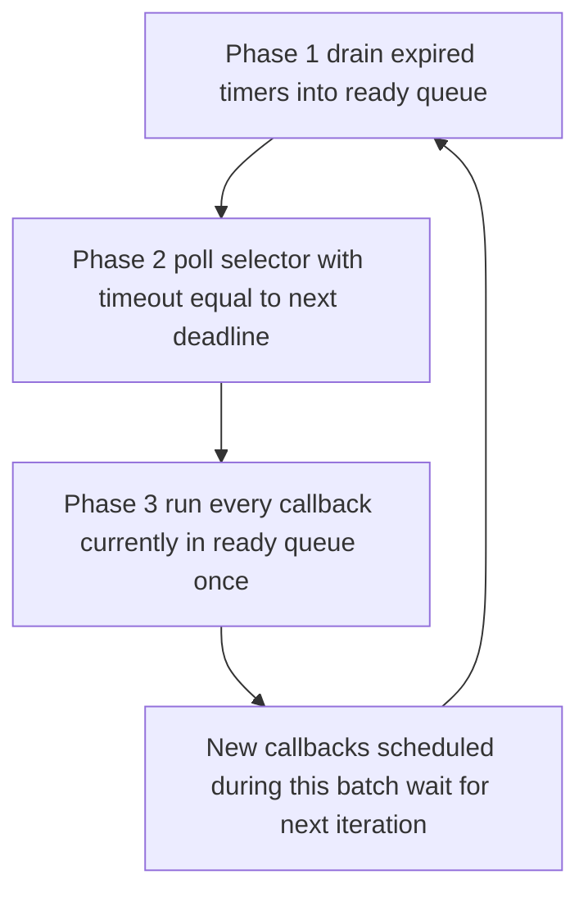
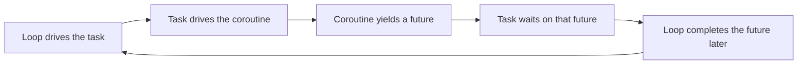

# Lecture 2 — The Event Loop, Built From Scratch

> **Duration:** ~2 hours. **Outcome:** You can write a single-threaded event loop in under 200 lines of Python from a blank file. You know the three data structures it owns (a runnable deque, a timer min-heap, an I/O selector) and the four phases of one step. You can point to `Lib/asyncio/base_events.py` and identify the equivalent of every line in your loop.

## 1. What an event loop actually is

Strip away the asyncio package. An **event loop** is this `while True`:

```python
while loop_running:
    # Phase 1 — drain expired timers into the runnable queue
    now = time.monotonic()
    while timer_heap and timer_heap[0].deadline <= now:
        ready.append(heapq.heappop(timer_heap))

    # Phase 2 — ask the OS which file descriptors are ready
    timeout = (timer_heap[0].deadline - now) if timer_heap else None
    for key, events in selector.select(timeout):
        ready.append(key.data)

    # Phase 3 — run everything in the runnable queue exactly once
    n = len(ready)
    for _ in range(n):
        handle = ready.popleft()
        handle.run()
```

That is it. Three data structures (`ready`, `timer_heap`, `selector`), three phases per step (drain timers, poll selector, run callbacks). Every other detail in `Lib/asyncio/base_events.py` is policy: error reporting, debug instrumentation, signal handling, transport coordination, scheduler fairness.

The phases matter in this order:

1. **Timers before selector**: if a timer is overdue, you don't want to also block in `select()` for I/O that might never arrive. Drain first, then poll.
2. **Selector timeout = next timer deadline**: this is what makes the loop *idle correctly*. With no I/O, no timers, and `timeout=None`, the loop would block in `select()` forever. With one timer 100ms out, it blocks for at most 100ms.
3. **Drain `ready` in one batch**: you take a snapshot of `len(ready)`, then run that many. Callbacks scheduled during this batch run *next* step, not this one. This is **scheduler fairness** — without it, a self-rescheduling callback would monopolize the loop.


*One iteration of the event loop: drain timers, poll the selector, run the ready queue, repeat.*

## 2. The `Handle` type

`asyncio.Handle` is the unit of work in the runnable queue. It is a callback object: a function plus its args, plus a "cancelled" flag.

```python
class Handle:
    __slots__ = ("_callback", "_args", "_cancelled")

    def __init__(self, callback, args):
        self._callback = callback
        self._args = args
        self._cancelled = False

    def cancel(self):
        self._cancelled = True

    def run(self):
        if not self._cancelled:
            self._callback(*self._args)
```

`asyncio` adds a few fields (a loop reference for debugging, a context, source-info for tracebacks) and method overloads. The behavior is unchanged. Cite `Lib/asyncio/events.py:Handle` (3.13).

A **`TimerHandle`** is a `Handle` plus a `deadline` (monotonic seconds) and ordering:

```python
class TimerHandle(Handle):
    __slots__ = ("_deadline",)

    def __init__(self, callback, args, deadline):
        super().__init__(callback, args)
        self._deadline = deadline

    def __lt__(self, other):
        return self._deadline < other._deadline
```

The `__lt__` is what lets `heapq` order a list of these by deadline. Cite `Lib/asyncio/events.py:TimerHandle`.

## 3. `call_soon` and `call_later`

The loop's two public scheduling primitives:

```python
class EventLoop:
    def __init__(self):
        self._ready = collections.deque()
        self._scheduled = []                 # heap
        self._selector = selectors.DefaultSelector()
        self._running = False
        self._stopping = False

    def call_soon(self, callback, *args):
        handle = Handle(callback, args)
        self._ready.append(handle)
        return handle

    def call_later(self, delay, callback, *args):
        deadline = time.monotonic() + delay
        handle = TimerHandle(callback, args, deadline)
        heapq.heappush(self._scheduled, handle)
        return handle

    def call_at(self, when, callback, *args):
        handle = TimerHandle(callback, args, when)
        heapq.heappush(self._scheduled, handle)
        return handle
```

`call_soon` is **synchronous append to `_ready`**: the callback will run on the next iteration of the loop. `call_later` is **schedule for the future**: the callback will move from `_scheduled` to `_ready` once `deadline <= now`. `call_at` is the same as `call_later` but takes an absolute monotonic time.

Cite `Lib/asyncio/base_events.py:BaseEventLoop.call_soon` (~line 800 in 3.13), `BaseEventLoop.call_later` (~line 830), `BaseEventLoop.call_at` (~line 850).

Important nuance: `call_soon_threadsafe` is the version a thread other than the loop thread should call. It uses a `weakref` and a self-pipe to wake the selector. We will not implement it in the toy — we are single-threaded by design — but you should know it exists. Cite `Lib/asyncio/base_events.py:BaseEventLoop.call_soon_threadsafe`.

## 4. The `_run_once` step in full

Production-quality version of the skeleton from §1:

```python
def _run_once(self):
    # Phase 1: move expired timers into the runnable queue.
    end_time = time.monotonic() + self._clock_resolution
    sched = self._scheduled
    while sched:
        handle = sched[0]
        if handle._cancelled:
            heapq.heappop(sched)
            continue
        if handle._deadline > end_time:
            break
        heapq.heappop(sched)
        self._ready.append(handle)

    # Phase 2: compute the selector timeout.
    if self._ready:
        timeout = 0                    # we have work; do not block in selector
    elif sched:
        timeout = max(0.0, sched[0]._deadline - time.monotonic())
    else:
        timeout = None                 # nothing to do; block until I/O or stop

    # Phase 3: poll the selector. Each readable/writable fd has a Handle in
    # its key.data.
    event_list = self._selector.select(timeout)
    for key, mask in event_list:
        handler = key.data
        if mask & selectors.EVENT_READ and handler.reader is not None:
            self._ready.append(handler.reader)
        if mask & selectors.EVENT_WRITE and handler.writer is not None:
            self._ready.append(handler.writer)

    # Phase 4: drain the runnable queue *once*. Callbacks scheduled this
    # iteration run on the *next* iteration.
    ntodo = len(self._ready)
    for _ in range(ntodo):
        handle = self._ready.popleft()
        if not handle._cancelled:
            try:
                handle.run()
            except (SystemExit, KeyboardInterrupt):
                raise
            except BaseException as exc:
                self._exception_handler(handle, exc)
```

Read this against `BaseEventLoop._run_once` in `Lib/asyncio/base_events.py` (~line 1900 in 3.13) and you will see one-to-one correspondence with extra error-reporting and debug code. The skeleton fits in 30 lines; the production version is ~150 because of the policy code.

## 5. The `run_forever` and `run_until_complete` drivers

`run_forever` is one line:

```python
def run_forever(self):
    self._running = True
    try:
        while not self._stopping:
            self._run_once()
    finally:
        self._running = False
        self._stopping = False
```

`stop()` sets `_stopping = True`; the loop exits at the next iteration. Cite `Lib/asyncio/base_events.py:BaseEventLoop.run_forever`.

`run_until_complete(future)` is a thin wrapper:

```python
def run_until_complete(self, future):
    future.add_done_callback(lambda fut: self.stop())
    self.run_forever()
    return future.result()
```

When the future completes, the callback stops the loop, and we return its result. `asyncio.run(coro)` wraps this for you: creates a fresh loop, wraps `coro` in a `Task` (which is a `Future`), calls `run_until_complete`, then closes the loop. Cite `Lib/asyncio/runners.py:Runner.run` (3.13).

## 6. The I/O side: `selectors.DefaultSelector`

The `selectors` module wraps `epoll` (Linux), `kqueue` (BSD/macOS), `IOCP`/`select` (Windows). The API is the same on every platform:

```python
import selectors

sel = selectors.DefaultSelector()
sel.register(sock, selectors.EVENT_READ, data=some_callback_or_userdata)
events = sel.select(timeout=0.5)        # list[(SelectorKey, mask)]
for key, mask in events:
    do_something(key.data)
```

`key.data` is whatever you stashed at register time. In a real loop, `data` is an object with `reader` and `writer` handles (one each). `EVENT_READ` says "this fd has data to read"; `EVENT_WRITE` says "you can write to this fd without blocking."

Three properties of `selectors`:

- **Level-triggered**, not edge-triggered. If the fd is still readable after the callback returns, the next `select()` will report it again. This matches the asyncio semantics of "fire the callback once, the callback drains as much as it wants, the loop re-polls next iteration."
- **Cross-platform.** `epoll` on Linux is much faster than `select` (O(1) vs. O(n) in the number of registered fds), but the API is identical.
- **Picks the best automatically.** `DefaultSelector` is `EpollSelector` on Linux, `KqueueSelector` on BSD/macOS, `SelectSelector` on Windows (the `ProactorSelector` is a separate beast for IOCP).

Cite `Lib/selectors.py:DefaultSelector` for the pick logic.

## 7. Wiring a coroutine to the loop

We have:

- A way to schedule callbacks (`call_soon`, `call_later`).
- A way to register I/O (`selector.register`).
- A coroutine to drive.

The missing piece: when the coroutine yields, we want to know **what it's waiting on**. asyncio's convention: coroutines yield `Future`-like objects. The driver registers itself as a callback on that future. When the future completes, the loop calls the callback, which resumes the coroutine.

The driver — `Task.__step` in asyncio's terms — looks like this (simplified):

```python
class Task:
    def __init__(self, coro, loop):
        self._coro = coro
        self._loop = loop
        self._result = _UNSET
        self._exception = None
        self._done = False
        self._callbacks = []
        self._loop.call_soon(self._step)

    def _step(self, exc=None):
        try:
            if exc is None:
                result = self._coro.send(None)
            else:
                result = self._coro.throw(exc)
        except StopIteration as stop:
            self._set_result(stop.value)
            return
        except BaseException as e:
            self._set_exception(e)
            return

        # `result` is whatever the coroutine yielded. By convention, it's a
        # Future. Register ourselves as its done-callback.
        if isinstance(result, Future):
            result.add_done_callback(self._wakeup)
        else:
            # Hand-coded awaitable yielded something we don't recognize.
            # In real asyncio this is a hard error.
            raise RuntimeError(f"Task got bad yield: {result!r}")

    def _wakeup(self, future):
        try:
            future.result()           # propagate exception if any
        except BaseException as e:
            self._step(exc=e)
        else:
            self._step()
```

This is ~30 lines, and it is exactly the shape of `Lib/asyncio/tasks.py:Task.__step` and `Task.__wakeup` (3.13). The real `__step` is longer because it also handles bare `None` yields (for `asyncio.sleep(0)`'s checkpoint trick), `__step` vs `__step_run_and_handle_result` re-entrancy guards, and contextvar propagation. The mechanism is identical.

We will write `Task` properly in Lecture 3. For now, hold the picture: **the loop drives the task, the task drives the coroutine, the coroutine yields a future, the task waits on the future, the loop schedules the future's completion, and the cycle continues.**


*The drive chain: loop to task to coroutine to future and back again.*

## 8. Implementing `sleep`

The simplest awaitable that exercises the timer path:

```python
def sleep(delay, result=None):
    """Suspend the calling coroutine for `delay` seconds."""
    if delay <= 0:
        # `sleep(0)` is the canonical "checkpoint" — yield to the loop
        # once, then resume immediately.
        return _yield_once(result)
    loop = get_running_loop()
    future = loop.create_future()
    h = loop.call_later(delay, _set_result_unless_cancelled, future, result)
    try:
        return (yield from future.__await__())
    finally:
        h.cancel()

@types.coroutine
def _yield_once(result):
    yield                              # yields None to the driver
    return result

def _set_result_unless_cancelled(future, result):
    if not future.cancelled():
        future.set_result(result)
```

(Slightly simplified from the real `Lib/asyncio/tasks.py:sleep`, which is generator-based and handles cancellation more carefully.)

The mechanism:

1. Create a `Future`. It is not done.
2. Schedule a callback for `now + delay` that will set the future's result.
3. `await` the future. `Future.__await__` yields `self` (to the loop) while not done, then returns `self.result()` when it is.
4. The coroutine suspends; the loop has a timer; the timer fires; the timer's callback completes the future; the future's done-callback (which is our task's `__step`) is scheduled; the task resumes the coroutine; the coroutine receives the result.

All of this is mechanical once the awaitable protocol is in your hands. There is no magic.

Cite `Lib/asyncio/tasks.py:sleep` (3.13). 30 lines including the docstring.

## 9. Putting it together: a 70-line toy loop

This will run two cooperating coroutines, each sleeping a different amount:

```python
import collections
import heapq
import time
import types

class Future:
    def __init__(self, loop):
        self._loop = loop
        self._result = None
        self._exception = None
        self._done = False
        self._callbacks = []

    def done(self): return self._done
    def result(self):
        if not self._done:
            raise RuntimeError("not done")
        if self._exception:
            raise self._exception
        return self._result

    def set_result(self, value):
        if self._done:
            raise RuntimeError("already done")
        self._result = value
        self._done = True
        for cb in self._callbacks:
            self._loop.call_soon(cb, self)
        self._callbacks.clear()

    def add_done_callback(self, cb):
        if self._done:
            self._loop.call_soon(cb, self)
        else:
            self._callbacks.append(cb)

    def __await__(self):
        if not self._done:
            yield self                 # the loop sees this and waits
        return self.result()


class EventLoop:
    def __init__(self):
        self._ready = collections.deque()
        self._scheduled = []
        self._running = False

    def time(self): return time.monotonic()
    def create_future(self): return Future(self)

    def call_soon(self, cb, *args):
        self._ready.append((cb, args))

    def call_later(self, delay, cb, *args):
        heapq.heappush(self._scheduled, (self.time() + delay, cb, args))

    def run_until_complete(self, coro):
        task = Task(coro, self)
        self._running = True
        while not task.done():
            now = self.time()
            while self._scheduled and self._scheduled[0][0] <= now:
                _, cb, args = heapq.heappop(self._scheduled)
                self._ready.append((cb, args))
            if not self._ready and self._scheduled:
                # Idle: sleep until the next timer.
                time.sleep(self._scheduled[0][0] - now)
                continue
            for _ in range(len(self._ready)):
                cb, args = self._ready.popleft()
                cb(*args)
        self._running = False
        return task.result()


class Task(Future):
    def __init__(self, coro, loop):
        super().__init__(loop)
        self._coro = coro
        loop.call_soon(self._step)

    def _step(self, _previous_future=None):
        try:
            result = self._coro.send(None)
        except StopIteration as stop:
            self.set_result(stop.value)
            return
        except BaseException as exc:
            self._exception = exc
            self._done = True
            for cb in self._callbacks:
                self._loop.call_soon(cb, self)
            self._callbacks.clear()
            return
        # By convention `result` is a Future. Register a done-callback that
        # re-enters _step.
        if isinstance(result, Future):
            result.add_done_callback(self._step)
        else:
            raise RuntimeError(f"Task got unexpected yield: {result!r}")


def sleep(seconds, loop):
    future = loop.create_future()
    loop.call_later(seconds, future.set_result, None)
    return future
```

And the driver:

```python
async def worker(name, seconds, loop):
    print(f"{name} starts at {loop.time():.3f}")
    await sleep(seconds, loop)
    print(f"{name} done   at {loop.time():.3f}")
    return name

async def main(loop):
    t1 = Task(worker("A", 0.10, loop), loop)
    t2 = Task(worker("B", 0.05, loop), loop)
    await t1
    await t2
    return "both done"

loop = EventLoop()
print(loop.run_until_complete(main(loop)))
```

Output:

```
A starts at 0.000
B starts at 0.000
B done   at 0.050
A done   at 0.100
both done
```

70 lines. Two coroutines run concurrently. The total wall-clock is 100ms (not 150), because the sleeps overlap. **This is asyncio in 70 lines.** Exercise 1 builds exactly this from a scaffolded skeleton; the mini-project adds I/O, `gather`, `TaskGroup`, and stricter semantics.

## 10. What the real loop adds (and we omit)

| Real asyncio | Our toy |
|--------------|--------|
| `call_soon_threadsafe` + self-pipe | omitted; single-threaded |
| Signal handling on Unix | omitted |
| Subprocess management | omitted |
| Transports/Protocols + Streams | omitted |
| DNS resolution via `loop.getaddrinfo` | omitted |
| `loop.run_in_executor` | omitted (a thread pool bridge) |
| Debug mode + slow-callback warning | omitted |
| Exception handler customization | minimal |
| `ContextVar` propagation per PEP 567 | omitted |
| C-accelerated `Task`/`Future` | we use the pure-Python version |

Each of these is a feature, not a fundamental of the model. You can add them incrementally to a working loop. The point of this lecture (and Exercise 1, and the mini-project) is that **the model is small** and the features are scaffolding.

## 11. The two questions you should be able to answer

**Q: Why does the loop block in `select()` instead of busy-looping?**

A: Two reasons. (1) Power: a busy loop pegs the CPU at 100% even with nothing to do. (2) Latency: `select(timeout=0.5)` is woken *immediately* by the kernel the moment a registered fd becomes ready. A busy loop with a `sleep(0.001)` between iterations has up to 1ms of latency between fd-ready and our callback running. The selector path is optimal on both axes.

**Q: What happens if a callback raises an exception?**

A: In the toy, it bubbles up through `_run_once` and crashes the loop. In real asyncio, `BaseEventLoop._exception_handler` is called with a context dict (`message`, `exception`, `task`, ...) and the loop continues. The default handler logs to `logging.getLogger("asyncio")`. The custom handler is the integration point for production error reporting (Sentry, etc.). Cite `Lib/asyncio/base_events.py:BaseEventLoop.default_exception_handler`.

## 12. What you should be able to do now

- Write the 70-line loop above from a blank file, with the lecture closed. (This is Exercise 1.)
- Open `Lib/asyncio/base_events.py` in a browser, find `_run_once`, and tag every block with one of: "phase 1 timers", "phase 2 selector", "phase 3 drain ready", "policy/debug code I haven't seen yet."
- Predict the wall-clock time of any small program written against your loop.
- Explain the *exact* point in the call stack where the OS kernel wakes you up after I/O readiness.

Move on to Lecture 3: where we build `Task`, `Future`, `gather`, and a structured `TaskGroup` against the loop you now own.
