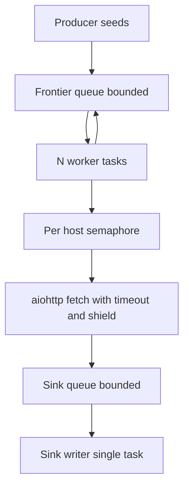
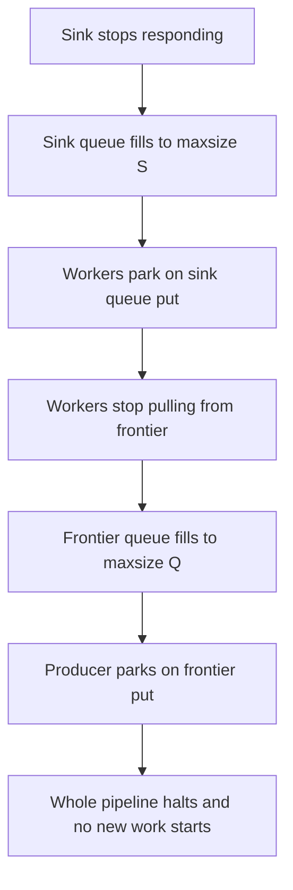

# Lecture 3 — Back-Pressure with Bounded Queues

> **Duration:** ~1.75 hours. **Outcome:** You can architect a producer/consumer pipeline with `asyncio.Queue(maxsize=N)` that correctly propagates back-pressure from slow consumers up to fast producers; you can choose between `Queue` and `Semaphore` for bounded concurrency; you can implement async iterators that are themselves natural back-pressure primitives; you can use the 3.13 `Queue.shutdown()` method to signal end-of-stream without sentinels; you can identify and fix the "unbounded fan-out" bug that kills naïve async services in production.

## 1. The bug that kills async services

You are writing a service. The job: ingest 10 million URLs from a Kafka topic, fetch each one, write the result to a sink. The naïve implementation:

```python
async def main():
    async with aiohttp.ClientSession() as session:
        async with asyncio.TaskGroup() as tg:
            async for url in kafka_stream:
                tg.create_task(fetch_and_store(session, url))   # <-- here
```

It compiles. It looks clean. It is structured. It will kill your service.

The problem: `kafka_stream` produces messages at, say, 50 000 per second. Each `tg.create_task(...)` is essentially free — a few microseconds. The fan-out is unbounded. Within seconds you have 100 000 in-flight HTTP tasks; within minutes, a million. Each holds an `aiohttp` connection, a TLS context, an event-loop callback, a `Future`, a tab on `TaskGroup._tasks`. The host runs out of file descriptors, out of memory, or out of TCP source ports. The OOM killer arrives.

This is the **unbounded fan-out bug**. The producer is fast; the consumer side (HTTP + sink) is slow; nothing connects them. Tasks pile up in the middle. The TaskGroup is structured but the *internal* concurrency is not.

The fix is **back-pressure**: a mechanism that slows the producer to match the consumer. Two primitives in asyncio:

- **`asyncio.Queue(maxsize=N)`** — a bounded queue. `put()` parks when full; `get()` parks when empty. The producer fills the queue; N consumers drain it. The queue is the pressure regulator.
- **`asyncio.Semaphore(N)`** — a bounded concurrency gate. `async with sem:` blocks if N permits are already taken. Used to cap the *active* count of a single class of operation (e.g., "at most 16 concurrent HTTP requests").

Most real systems use both. The crawler in this week's mini-project uses both. Let us build them up.

## 2. `asyncio.Queue`: a bounded FIFO

`asyncio.Queue` is `Lib/asyncio/queues.py` (~270 lines). The public surface:

```python
q = asyncio.Queue(maxsize=100)   # at most 100 items in flight

await q.put(item)                # parks if full; raises QueueShutDown if shut down
await q.get()                    # parks if empty; raises QueueShutDown if shut down and empty
q.put_nowait(item)               # raises QueueFull if full
q.get_nowait()                   # raises QueueEmpty if empty
q.qsize()                        # current size (approximate; may race)
q.full() / q.empty()             # snapshot
q.shutdown(immediate=False)      # 3.13+: refuse further puts; wake parked consumers
await q.join()                   # wait until every item has been .task_done()
q.task_done()                    # consumer ack
```

The two `await`-able methods (`put`, `get`) are how back-pressure is expressed. The implementation, paraphrased:

```python
class Queue:
    def __init__(self, maxsize=0):
        self._maxsize = maxsize
        self._getters = collections.deque()    # parked .get() callers
        self._putters = collections.deque()    # parked .put() callers
        self._queue = collections.deque()      # the actual storage
        self._unfinished_tasks = 0
        self._finished = locks.Event()
        self._finished.set()
        self._is_shutdown = False

    async def put(self, item):
        while self.full() and not self._is_shutdown:
            putter = self._loop.create_future()
            self._putters.append(putter)
            try:
                await putter
            except:
                # cancellation: remove ourselves and re-raise.
                putter.cancel()
                try:
                    self._putters.remove(putter)
                except ValueError:
                    pass
                if not self.full() and not putter.cancelled():
                    self._wakeup_next(self._putters)
                raise
        if self._is_shutdown:
            raise QueueShutDown
        self._put_internal(item)

    async def get(self):
        while self.empty() and not self._is_shutdown:
            getter = self._loop.create_future()
            self._getters.append(getter)
            try:
                await getter
            except:
                getter.cancel()
                try:
                    self._getters.remove(getter)
                except ValueError:
                    pass
                if not self.empty() and not getter.cancelled():
                    self._wakeup_next(self._getters)
                raise
        if self._is_shutdown and self.empty():
            raise QueueShutDown
        return self._get_internal()

    def _wakeup_next(self, waiters):
        while waiters:
            waiter = waiters.popleft()
            if not waiter.done():
                waiter.set_result(None)
                break
```

Two parked-waiter deques (`_getters`, `_putters`), one storage deque (`_queue`). The pattern is: if you cannot do the operation right now (queue full / empty), park on a `Future`; when *the other side* makes progress, wake one waiter via `_wakeup_next`. Read `Lib/asyncio/queues.py:Queue.put` and `:Queue.get` for the source.

Cancellation safety is encoded in those `try/except: ... raise` blocks. If a parked `put` is cancelled while waiting, it has to (a) remove itself from `self._putters` and (b) wake the next waiter to ensure liveness — without this, a cancellation could leave a queue in a state where there is space but no one is woken.

Cite `Lib/asyncio/queues.py:Queue.put` and `:Queue.get`.

## 3. The producer/consumer pattern

The canonical shape:

```python
async def producer(queue: asyncio.Queue, items: AsyncIterable):
    async for item in items:
        await queue.put(item)
    queue.shutdown()                   # 3.13+. Pre-3.13: put a sentinel.

async def consumer(queue: asyncio.Queue, sink):
    while True:
        try:
            item = await queue.get()
        except asyncio.QueueShutDown:
            return
        try:
            result = await process(item)
            await sink.write(result)
        finally:
            queue.task_done()

async def main():
    queue: asyncio.Queue = asyncio.Queue(maxsize=100)
    sink = open_sink()
    async with asyncio.TaskGroup() as tg:
        tg.create_task(producer(queue, source_stream()))
        for _ in range(16):              # 16 concurrent consumers
            tg.create_task(consumer(queue, sink))
```

Read it carefully. Four properties to verify:

1. **Bounded memory.** At any instant, the queue holds at most 100 items. The producer is *parked* on `queue.put()` when full. Even if `source_stream` produces a million items per second, at most 100 sit in the pipeline.

2. **Bounded concurrency.** Exactly 16 consumer tasks. Each processes one item at a time. The "active processing" set is at most 16.

3. **Structured.** All 17 tasks live in one `TaskGroup`. If any consumer raises, every other consumer and the producer are cancelled. The group exits cleanly.

4. **Clean shutdown.** When `source_stream` ends, the producer calls `queue.shutdown()`. Consumers blocked on `queue.get()` raise `QueueShutDown` and return normally. The `TaskGroup` `__aexit__` waits for all of them; the block exits.

Pre-3.13 versions of this pattern use a sentinel:

```python
async def producer_pre_3_13(queue, items):
    async for item in items:
        await queue.put(item)
    for _ in range(N_CONSUMERS):
        await queue.put(None)           # one None per consumer

async def consumer_pre_3_13(queue, sink):
    while True:
        item = await queue.get()
        if item is None:
            queue.task_done()
            return
        try:
            await process(item)
        finally:
            queue.task_done()
```

The sentinel works but has a quirk: the producer must know `N_CONSUMERS` to know how many sentinels to send. The 3.13 `shutdown` removes that coupling. If you can target 3.13+, use `shutdown`.

Cite `Lib/asyncio/queues.py:Queue.shutdown` (3.13). Cite [Python 3.13 What's New](https://docs.python.org/3/whatsnew/3.13.html#asyncio).

## 4. `asyncio.Semaphore`: bounded concurrency

A `Semaphore` is simpler. It has a counter; `acquire` decrements (waits if zero); `release` increments. Use as an `async with`:

```python
sem = asyncio.Semaphore(16)

async def fetch_throttled(url):
    async with sem:
        return await http.get(url)
```

At most 16 concurrent `fetch_throttled` calls can be past the `async with`. The 17th parks until one finishes. The implementation in `Lib/asyncio/locks.py:Semaphore` is small (~80 lines): a counter `_value`, a FIFO of parked waiters.

When to use `Semaphore` vs. `Queue`:

| Property | `Queue` | `Semaphore` |
|----------|---------|-------------|
| Bounds | Items in flight | Concurrent operations |
| Topology | Producer + N consumers | Caller per operation |
| Storage | Yes, holds items | No, just a counter |
| Use case | Pipeline (fan-out + buffer) | Throttle a single class of operation |
| Cleanup | `shutdown` or sentinel | `release` (typically via `async with`) |

A common combined shape: a `Queue` for the pipeline + a `Semaphore` for an external resource limit. E.g., the crawler has a queue of URLs, 32 consumer tasks, *and* a `Semaphore(8)` around the actual HTTP call to cap concurrent connections to any one host. Two different bounds, two different primitives.

Cite `Lib/asyncio/locks.py:Semaphore`.

## 5. Async iterators as a natural back-pressure primitive

An *async iterator* is an object with `__aiter__()` returning self and `__anext__()` returning an awaitable. PEP 525 added them; they are consumed by `async for`. The interesting property: an async generator is a *pull-based* producer. The producer code runs only when the consumer pulls. This is back-pressure built into the type.

```python
async def url_stream() -> AsyncIterator[str]:
    async with aiohttp.ClientSession() as s:
        cursor = None
        while True:
            r = await s.get("https://api.example.com/urls", params={"cursor": cursor})
            page = await r.json()
            for url in page["urls"]:
                yield url
            cursor = page.get("next")
            if cursor is None:
                return

async def consumer():
    async for url in url_stream():
        await process(url)               # the upstream pager only advances
                                         # when we pull. natural back-pressure.
```

The `await process(url)` line is what regulates the producer. If `process` is slow, the next iteration of the `async for` is slow, the next pull from `url_stream` is delayed, the next `await s.get(...)` is delayed. The pager does not get ahead of the consumer.

This is elegant when the topology is one-to-one (one consumer per producer). It breaks as soon as you want one producer feeding many consumers — then you need a queue between them to fan out the work, and the queue's `maxsize` becomes the back-pressure mechanism.

Async generators have one important gotcha: they hold an event-loop reference and need explicit cleanup. The pattern:

```python
gen = url_stream()
try:
    async for url in gen:
        ...
finally:
    await gen.aclose()
```

The implicit `async for` does *not* call `aclose` on early exit. If your consumer breaks out of the loop, the generator's `try/finally` blocks may not run. This is one of the most subtle async-Python footguns. Read PEP 525 §6 ("Asynchronous Generator's `aclose` Method") for the full story. In practice: prefer `async with contextlib.aclosing(url_stream()) as gen: async for url in gen: ...`.

Cite PEP 525; cite `contextlib.aclosing`.

## 6. The "two-sided shutdown" problem

When a pipeline shuts down, you have to coordinate:

- The producer stops producing.
- The consumers drain the remaining items.
- After draining, the consumers stop.
- The `TaskGroup` `__aexit__` returns.

The 3.13 `Queue.shutdown(immediate=False)` flow handles this cleanly:

- The producer calls `queue.shutdown()`.
- Subsequent `put` calls raise `QueueShutDown`.
- `get` calls that find the queue *empty* raise `QueueShutDown`.
- `get` calls that find an item return the item; the consumer keeps draining.
- When the queue is empty *and* shut down, all consumers exit normally.

If the producer wants *immediate* shutdown (drop pending items, abort consumers), use `shutdown(immediate=True)`:

- Pending items in the queue are discarded.
- All `get` calls raise `QueueShutDown` immediately.
- All `put` calls raise `QueueShutDown` immediately.

The mini-project crawler uses `immediate=False` for clean shutdown and `immediate=True` for the panic path (Ctrl-C with `--abort-on-interrupt`).

Cite `Lib/asyncio/queues.py:Queue.shutdown` for the implementation.

## 7. Combining the primitives: a worked architecture

Here is the architecture of the crawler. Internalise this; it is the spec for the mini-project.

```
            ┌──────────────────────────────────────────────────────┐
            │              asyncio.TaskGroup (the parent)          │
            │                                                       │
            │   ┌──────────┐    ┌─────────────────┐    ┌─────────┐ │
            │   │ producer │───▶│ frontier queue  │───▶│  N×     │ │
            │   │ (seeds)  │    │ Queue(maxsize=Q)│    │ worker  │ │
            │   └──────────┘    └─────────────────┘    └────┬────┘ │
            │                                               │      │
            │                            ┌──────────────────┘      │
            │                            ▼                          │
            │                  ┌──────────────────┐                 │
            │                  │ Semaphore(per-   │                 │
            │                  │ host concurrency)│                 │
            │                  └────────┬─────────┘                 │
            │                           │                            │
            │                           ▼                            │
            │                  ┌──────────────────┐                 │
            │                  │ aiohttp.fetch    │  ◀── shield     │
            │                  │ + parse + emit   │  ◀── timeout    │
            │                  └────────┬─────────┘                 │
            │                           │                            │
            │                           ▼                            │
            │                  ┌──────────────────┐                 │
            │                  │ result sink      │ (single writer) │
            │                  │ Queue(maxsize=S) │                 │
            │                  └────────┬─────────┘                 │
            │                           │                            │
            │                           ▼                            │
            │                  ┌──────────────────┐                 │
            │                  │ sink writer (1×) │                 │
            │                  └──────────────────┘                 │
            └──────────────────────────────────────────────────────┘
```


*The crawler pipeline as a graph: a frontier queue and a sink queue bound memory on both ends, with a semaphore capping per-host concurrency in between and newly discovered URLs feeding back into the frontier.*

Components:

- **Frontier queue** (`asyncio.Queue(maxsize=Q)`): URLs to crawl. Producer parks when full.
- **N workers**: each `await frontier.get()`, fetch the URL, parse for new URLs, emit results to the sink queue and new URLs back to the frontier.
- **Per-host semaphore** (`asyncio.Semaphore(P)`): caps concurrent connections to any single host (politeness).
- **Per-fetch timeout** (`asyncio.timeout(T)`): bounds the slowest fetch.
- **Per-write shield** (`asyncio.shield`): protects sink writes from worker cancellation.
- **Sink queue** (`asyncio.Queue(maxsize=S)`): decouples workers from the sink writer. Workers park if the sink is slow — back-pressure propagates *backwards* through the workers to the frontier producer.
- **Sink writer**: one task draining the sink queue, writing to disk / database / stdout.

The TaskGroup ties them all together. On any worker failure, every other worker and the writer and the producer are cancelled. The `finally` blocks flush in-flight state. The group's `__aexit__` waits for everyone, then re-raises any errors as an `ExceptionGroup`.

This is the production shape. It is not big — ~400 lines of Python. It is the spec for this week's mini-project.

## 8. The "slow sink" failure mode

A subtle bug: the sink stops responding. (Disk full. Database deadlock. Network partition.)

Without back-pressure:

- Workers keep fetching.
- Workers keep `put`-ing to the sink queue.
- The sink queue grows unbounded.
- Memory grows unbounded.
- Eventually the host dies.

With back-pressure (the architecture above):

- The sink queue fills to `maxsize=S`.
- Worker `await sink_queue.put(result)` parks.
- Workers stop pulling from the frontier (they are parked on the sink put).
- The frontier queue fills to `maxsize=Q`.
- The producer `await frontier.put(url)` parks.
- The whole pipeline is now blocked. No new work starts.
- The downstream sink eventually recovers (or a timeout fires); a single `get` from the sink queue unblocks one worker; the cascade reverses.


*Back-pressure propagates backward through the pipeline when the sink stalls, capping memory instead of letting it grow unbounded.*

This is the *correct* behavior. The system has a finite memory footprint regardless of input rate. The producer naturally slows to the slowest stage. When the slow stage recovers, the system catches up.

If you take one design lesson from this week, it is this: **every async pipeline has exactly one bottleneck, and that bottleneck should be expressed as a bounded queue, not as task count or memory.**

## 9. Diagnosing back-pressure problems

Three observability hooks worth knowing:

- **`queue.qsize()`** — current depth. Plot it. A queue that is always full means the consumer is the bottleneck. A queue that is always empty means the producer is the bottleneck. A queue that oscillates between full and empty is operating normally.
- **`len(asyncio.all_tasks())`** — number of live tasks. Should be bounded by `N_WORKERS + N_INTERNAL + small`. If it grows unboundedly, you have a leaked-task bug.
- **`sys.getsizeof(queue._queue)`** — the underlying deque's memory. Not exact but a useful sanity check.

Add periodic logging:

```python
async def monitor(queues: dict[str, asyncio.Queue]):
    while True:
        await asyncio.sleep(1.0)
        log.info("queues: %s tasks: %d",
                 {name: q.qsize() for name, q in queues.items()},
                 len(asyncio.all_tasks()))
```

Adopt this in every async service you write. The first time something goes wrong in production, you will know which queue is full.

## 10. A pre-3.11 anti-pattern to recognise

For comparison, the pre-3.11 way of expressing the same pipeline used unstructured tasks and manual cancellation:

```python
# OLD CODE. Read and recognise; do not write new code in this shape.
async def main_old():
    queue = asyncio.Queue(maxsize=100)
    producer = asyncio.create_task(producer_fn(queue))
    consumers = [asyncio.create_task(consumer_fn(queue)) for _ in range(16)]
    try:
        await producer
        await queue.join()
    finally:
        for c in consumers:
            c.cancel()
        await asyncio.gather(*consumers, return_exceptions=True)
```

The structured-concurrency version is half the size and handles errors correctly. Replace `main_old` with the `TaskGroup` shape from §3 in any codebase you inherit.

## 11. Recap: the rules

| Rule | What it means |
|------|--------------|
| 1. Unbounded fan-out is a bug. | Every fan-out needs a bound (queue maxsize, or semaphore). |
| 2. Use `Queue(maxsize=N)` for pipelines. | Producer parks on full; consumer parks on empty. Pressure propagates. |
| 3. Use `Semaphore(N)` for bounded concurrency on a class of operation. | When you do not need to store items, just to gate. |
| 4. Async iterators are natural back-pressure for 1:1 pipelines. | Producer code runs only when consumer pulls. |
| 5. Always use `async with contextlib.aclosing(gen)` for async generators. | Without it, `try/finally` in the generator can be skipped on early exit. |
| 6. Use `Queue.shutdown()` (3.13+) for end-of-stream. Pre-3.13: sentinel. | Cleaner than coordinating sentinels across N consumers. |
| 7. Compose with `TaskGroup`. | Every task in the pipeline lives in one group. One failure cancels all. |
| 8. Bounded memory is not optional. | A pipeline that can grow unboundedly *will* grow unboundedly. |

If you can defend each of these in three sentences, you have absorbed Lecture 3.

## 12. Reading queue (before the exercises)

- `Lib/asyncio/queues.py` — end to end. ~20 minutes. Notice the `_getters`/`_putters` parked-waiter deques and the cancellation-safety in `put`/`get`.
- `Lib/asyncio/locks.py:Semaphore` — ~10 minutes.
- PEP 525, §6 on `aclose` — ~10 minutes.

## 13. Exercises pointer

- **Exercise 3** (today, 45 min): `exercises/exercise-03-bounded-queue-fan-out.py`. One producer, N consumers, `Queue(maxsize=K)`. Observe the producer parking when consumers stall. Verify back-pressure propagation.

## 14. Up next: the mini-project

A production-shaped async crawler, ~500 lines, built on the architecture from §7. Three days of deep work (Thursday–Saturday). It exercises every primitive from all three lectures: `TaskGroup`, `asyncio.timeout`, `shield`, `Queue(maxsize=...)`, `Semaphore(...)`, async iterators, structured shutdown. By Sunday it is a portfolio artifact you can put in a GitHub repo and discuss in interviews.

---

*References cited in this lecture: PEP 525; Python 3.13 What's New (`Queue.shutdown`); `Lib/asyncio/queues.py:Queue.put`, `:Queue.get`, `:Queue.shutdown`; `Lib/asyncio/locks.py:Semaphore`; `contextlib.aclosing` (Python 3.10+).*
