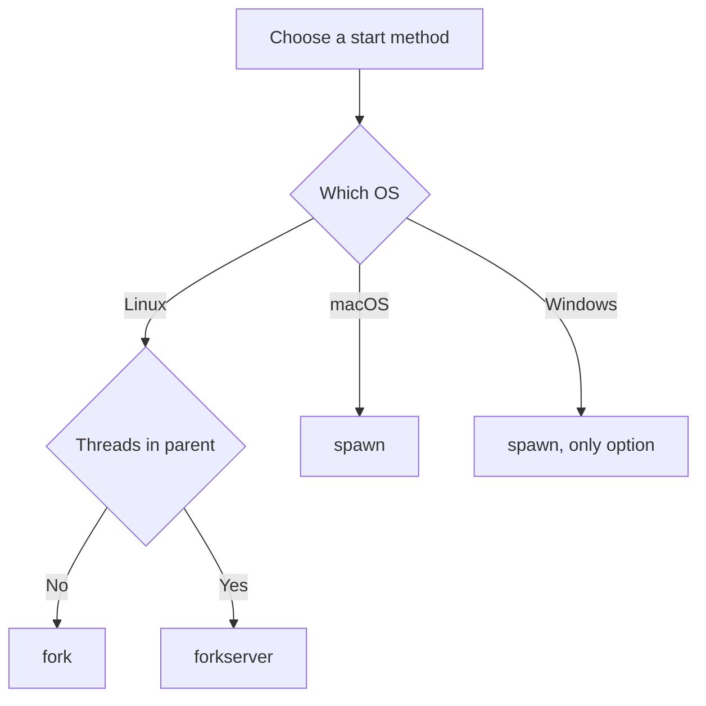
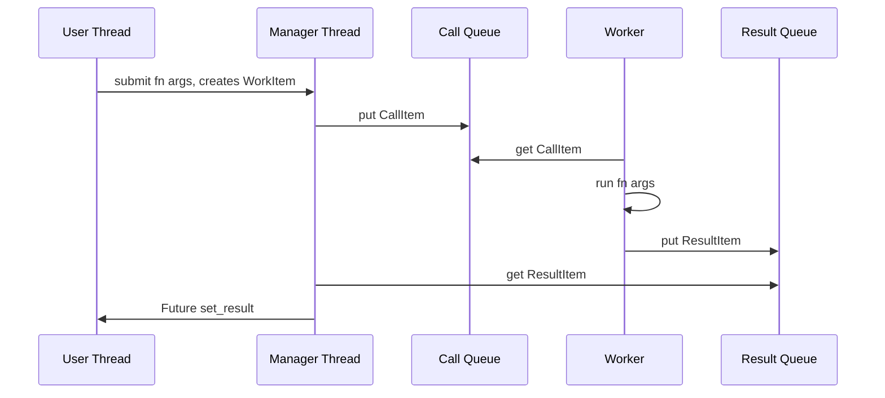

# Lecture 2 — `multiprocessing` and When It's Wrong

> **Duration:** ~2 hours. **Outcome:** You can choose between `fork`, `spawn`, and `forkserver` and defend the choice on a specific OS; you can predict the pickle cost of a workload before you measure it; you can identify the five canonical anti-patterns of `multiprocessing` from a code snippet in fifteen seconds; you know when to reach for `joblib(loky)` instead of `ProcessPoolExecutor` and why; you can read `Lib/concurrent/futures/process.py` and `Lib/multiprocessing/pool.py` and recognise every moving part.

## 1. The bargain `multiprocessing` makes

`multiprocessing` (Jesse Noller, 2008; PEP 371; landed 2.6) was Python's escape hatch from the GIL. The deal it offers:

> *Spawn N OS processes. Each has its own GIL. Each runs Python bytecode independently. Serialise (`pickle`) the work to and from them via OS pipes or queues. You pay process-spawn cost (~10–200ms per worker) and pickle cost (per task, both directions) in exchange for true parallelism on N cores.*

The bargain is good when the per-task work is large enough to amortise the overhead. It is catastrophic when the per-task work is small. Most "multiprocessing made it slower" bug reports trace to this: a 1ms task wrapped in a process pool with 10ms of pickle round-trip — fifteen wall-clock minutes for what could be a six-second loop.

This lecture will make the cost model concrete, then walk through the start methods, then identify when `multiprocessing.Pool` is the wrong primitive even when processes are the right idea (use `joblib(loky)` instead), and finally list the five canonical failure modes.

## 2. The cost model

Per-process costs (Linux, default CPython 3.13; macOS and Windows roughly double):

| Cost                                                       | Magnitude (Linux)   |
|------------------------------------------------------------|---------------------|
| `Process.start()` with `fork`                              | 1–5 ms              |
| `Process.start()` with `forkserver` (after warm-up)        | 5–20 ms             |
| `Process.start()` with `spawn`                             | 50–200 ms           |
| Per-worker memory (fresh Python interpreter, `spawn`)      | ~30–60 MB resident  |
| `pickle.dumps(args)` for typical small args                | 10–50 μs            |
| `pickle.dumps(args)` for a 1MB NumPy array                 | 1–5 ms              |
| IPC round-trip (`Pipe.send` / `recv` for small object)     | 50–200 μs           |
| IPC round-trip for 1MB object                              | 1–10 ms             |
| `pickle.loads(result)` for typical small result            | 10–50 μs            |

On macOS and Windows the default start method is `spawn` (it has been since 3.8 on macOS, always on Windows). Each worker is a fresh Python interpreter; importing your application takes whatever your `__main__` block takes, *per worker*. A scientific-Python codebase that takes 1 second to import (`import numpy, scipy, pandas`) pays ~1 second per worker at pool warm-up. Eight workers, eight seconds of warm-up before any work begins.

On Linux the default is `fork` (still, in 3.13). `fork` is fast (~1ms) and the child gets copy-on-write access to the parent's memory — so the imported modules are shared "for free" until something writes to them. But `fork` is unsafe in the presence of threads in the parent process (POSIX undefined behaviour) and incompatible with some libraries (CUDA, parts of `tk`, anything that holds an OS-level mutex at fork time). The Python community is gradually moving to `forkserver` as the default on Linux; 3.14 may flip the default.

The implication is simple: **before reaching for `multiprocessing`, estimate the overhead in absolute terms (milliseconds) and compare it to the per-task work**. If a task takes 100ms and overhead is 5ms, the pool is a win. If a task takes 0.1ms and overhead is 5ms, the pool is a 50× slowdown.

## 3. The three start methods, in depth

`multiprocessing.set_start_method('fork')` — fast, Linux-default, unsafe-with-threads, COW-friendly.

When the parent calls `Process.start()`, the kernel `fork()`s. The child gets a virtual copy of the parent's address space. Imported modules, globals, open file descriptors — all shared, all copy-on-write. The child then runs the user-supplied `target` callable.

Limitations:

- **Threads do not survive `fork`** (POSIX: only the calling thread is in the child). If the parent had a `ThreadPoolExecutor` running, those threads vanish in the child; any locks they held are held forever; any sockets they were using are now half-owned by both processes. Avoid `fork` if your parent has threads.
- **Some libraries detect `fork` and refuse**: CUDA contexts cannot survive `fork`. SQLite connections are not fork-safe. `gRPC` clients are usually not fork-safe. The signal handler stack is reset to defaults in the child.
- **macOS deprecated `fork` for Objective-C / Foundation users in 10.13**: `OBJC_DISABLE_INITIALIZE_FORK_SAFETY=YES` is required, and Apple may remove `fork`-safety entirely in future macOS. This is why 3.8 changed the macOS default to `spawn`.

`multiprocessing.set_start_method('spawn')` — slow, macOS/Windows-default, safe, no COW.

The parent starts a new Python interpreter via `subprocess`. The new interpreter imports the user's `__main__` module (which is why the `if __name__ == "__main__":` guard is mandatory: without it, the child re-runs the spawning code and forks-bombs). The parent then pickles the target callable plus its arguments and sends them to the child via a pipe. The child unpickles and runs.

This is slow (200ms first-spawn cost is typical on Linux because of `subprocess`; 50–100ms typical on macOS where `subprocess` is more optimised; 100–200ms on Windows where process creation is genuinely expensive). It is also strict: anything that crosses the boundary must be picklable. Functions defined inside other functions (closures) are not picklable by default; lambdas are not; `multiprocessing.Manager` proxies become opaque, etc. `cloudpickle` (the `cloudpipe/cloudpickle` library, used internally by `joblib(loky)`) lifts these restrictions.

`multiprocessing.set_start_method('forkserver')` — the compromise.

On the first call to `Process.start()`, the parent spawns a dedicated server process (via `spawn`-style import). Subsequent calls send a "please fork" message to the server; the server forks (cheap), and the child runs the target. Each worker is a fresh fork from the server, which was itself spawned at known minimal state.

`forkserver` gives you:
- `fork`'s cheap worker creation (after a one-time `spawn` for the server)
- `spawn`'s thread-safety (the server has known minimal state)
- A clean child that does not inherit the parent's threads, mutexes, or signal handlers

The catch: anything the worker needs must be imported by the server *before* the fork. There is `multiprocessing.set_forkserver_preload(['mymodule'])` for this. Without preloading, the worker pays the full re-import cost.

**Decision matrix:**

| OS | Threads in parent? | Recommendation |
|----|--------------------|----------------|
| Linux | No threads | `fork` (default; cheapest) |
| Linux | Has threads | `forkserver` |
| macOS | Any | `spawn` (default since 3.8; the only safe choice) |
| macOS | High setup cost, many workers | `forkserver` with preload |
| Windows | Any | `spawn` (the only available method) |


*Picking a multiprocessing start method from OS and parent thread state.*

Set it explicitly at the top of `__main__`:

```python
import multiprocessing as mp
if __name__ == "__main__":
    mp.set_start_method("forkserver", force=True)
    # ... rest of main ...
```

## 4. `ProcessPoolExecutor` vs. `multiprocessing.Pool` vs. `joblib(loky)`

Three roughly-equivalent APIs for "run N tasks across M worker processes." They differ in subtle but production-relevant ways.

**`concurrent.futures.ProcessPoolExecutor`** (PEP 3148; same interface as `ThreadPoolExecutor`):

```python
from concurrent.futures import ProcessPoolExecutor

with ProcessPoolExecutor(max_workers=8) as pool:
    results = list(pool.map(work_fn, inputs))
```

Strengths: identical surface to `ThreadPoolExecutor`. Easy to swap. Returns a `concurrent.futures.Future`. Supports `as_completed`, `wait`, `chunksize=N` to amortise pickle overhead. The implementation (`Lib/concurrent/futures/process.py`, ~600 lines) is more elaborate than the thread version: a `_CallQueue`, a `_ResultQueue`, an executor manager thread that bridges between the user's `Future`s and the worker processes' results.

Weaknesses: by default uses the platform default start method (`spawn` on macOS/Windows). The pool is *not* reusable across `with` blocks; each `with ProcessPoolExecutor()` pays a full warm-up cost. Exceptions from workers are wrapped in a way that can lose the original traceback (somewhat improved in 3.11+ but still not perfect).

**`multiprocessing.Pool`** (the older API):

```python
import multiprocessing as mp

with mp.Pool(processes=8) as pool:
    results = pool.map(work_fn, inputs)
```

Strengths: simpler API. `imap_unordered` for streaming. `Pool` has more knobs for chunksize, maxtasksperchild (recycle a worker after N tasks, for memory leaks), initializer with initargs. Older, well-trodden.

Weaknesses: not based on `Future`. Errors propagate at `pool.map` time (you cannot stream results around an error). The `Pool` does not integrate with `concurrent.futures`. Long-running stability under load on macOS/Windows is historically weaker; this is what motivated `loky`.

**`joblib.Parallel` with `loky` backend** (the modern scientific-Python default):

```python
from joblib import Parallel, delayed

results = Parallel(n_jobs=8, backend="loky")(
    delayed(work_fn)(x) for x in inputs
)
```

Strengths:

- **`loky` provides a `get_reusable_executor()`** that persists workers across multiple `Parallel` calls. The first call warms up; subsequent calls reuse. This is the production fix for `ProcessPoolExecutor`'s per-`with` warm-up cost.
- **`cloudpickle` is used by default**: lambdas, closures, locally-defined classes, partials — all work. (`ProcessPoolExecutor` requires top-level functions.)
- **Robust exception forwarding**: the original exception, original traceback, and worker process identity are preserved.
- **Worker timeouts and watchdogs**: a worker that hangs is killed and replaced. `ProcessPoolExecutor` will deadlock instead.
- **Memory-mapped numpy arrays**: large NumPy inputs are memory-mapped into the workers rather than pickled by value. This is the production win for ML workloads.
- **The `Memory` decorator**: transparent disk caching of function results, keyed by input hash. Orthogonal to parallelism but commonly used together.

Weaknesses: extra dependency. Slight API drift from stdlib. Slightly more magical (the `delayed` indirection sometimes confuses debuggers).

**Pick `joblib(loky)` for production ML / data-pipeline work**. Pick `ProcessPoolExecutor` for stdlib-only deployments, or for simple symmetry with `ThreadPoolExecutor` in a benchmark. Avoid `multiprocessing.Pool` in new code — it is the legacy primitive, not the modern one.

## 5. Reading `Lib/concurrent/futures/process.py`

Open the file: <https://github.com/python/cpython/blob/main/Lib/concurrent/futures/process.py>. The architecture, at high level:

```
User thread:                  Manager thread:           Worker process(es):

submit(fn, args)
  └─ creates Future
  └─ puts WorkItem on
       _pending_work_items     reads _pending_work_items
                                 └─ puts CallItem on
                                       _call_queue   ─────► worker reads CallItem
                                                              └─ runs fn(*args)
                                                              └─ puts ResultItem on
                                                                   _result_queue
                                 reads _result_queue ◄─────
                                 └─ finds matching
                                       Future
                                 └─ Future.set_result()
                                                            (caller can now get result)
```

Three separate mechanisms:

1. **`_pending_work_items`**: a dict, owned by the executor process. Maps work-item id → `_WorkItem(future, fn, args)`. The user thread inserts into this dict on every `submit`.
2. **`_call_queue`**: a `multiprocessing.Queue`. Manager thread writes; workers read. Carries `_CallItem(work_id, fn, args)` from main process to workers.
3. **`_result_queue`**: a `multiprocessing.Queue`. Workers write; manager thread reads. Carries `_ResultItem(work_id, exception, result)` back.


*The submit and result round trip, redrawn as a message sequence.*

The manager thread (`_queue_management_worker`, ~150 lines) is the central coordinator. It runs continuously in the main process; pumps items from `_pending_work_items` onto `_call_queue`; reads items from `_result_queue` and resolves the matching `Future`. This indirection exists because `multiprocessing.Queue` is a separate IPC mechanism from the in-process `Future` registry, and somebody has to glue them together.

The implementation is more complex than the thread version because:

- Pickling can fail (TypeError on unpicklable args). The failure must be reported via the `Future`, not propagated to the manager thread (which would crash the executor).
- Workers can die (segfault, OOM-kill). Their pending work must be re-queued or failed; their futures must not hang forever.
- Shutdown is a multi-step dance: stop accepting submits; flush pending work; wait for workers; close the queues; join the manager thread.

This is a lot of code (~600 lines). Read it on a Friday afternoon when you have time. Lecture 2 wants you to know that `submit` → `Future` → manager-thread → call-queue → worker → result-queue → manager-thread → `Future.set_result` is the round trip, and that this round trip is what costs you 50–200 microseconds per task in the steady state (not counting `pickle` itself).

## 6. The five canonical failure modes

**Failure 1: tiny tasks.**

```python
with ProcessPoolExecutor() as pool:
    results = list(pool.map(lambda x: x * 2, range(1_000_000)))
# 30+ seconds wall-clock; the serial version is 0.05 seconds
```

A million tasks at 100μs of overhead each is 100 seconds of overhead. The actual work is negligible. **Fix: increase chunksize**: `pool.map(fn, xs, chunksize=10_000)` batches 10K inputs per pickle round-trip. Or recognise that the workload should not be parallelised at all and run it serially. (The lambda also won't pickle on the default executor; `loky` or a top-level function is required.)

**Failure 2: large arguments.**

```python
huge_dict = load_corpus()  # 500 MB

def work(key):
    return process(huge_dict[key])

with ProcessPoolExecutor(max_workers=8) as pool:
    results = list(pool.map(work, keys))
# 30 seconds just to pickle huge_dict 8 times across the wire
```

Each worker is sent a pickled copy of `huge_dict` (because `work` captures it as a closure, and `cloudpickle` faithfully serialises the closure). 500 MB × 8 workers = 4 GB of IPC. **Fix:** use `fork` start method (workers inherit `huge_dict` for free via COW), or use `multiprocessing.shared_memory` to publish the data once and reference it from workers, or use `joblib`'s memory-mapping (`Parallel(n_jobs=8, max_nbytes='1M')` auto-memmaps NumPy arrays larger than 1 MB).

**Failure 3: missing `if __name__ == "__main__":` guard on `spawn` / `forkserver`.**

```python
# script.py
from multiprocessing import Pool

def square(x):
    return x * x

pool = Pool(4)               # <-- bare; will re-execute on every spawn
print(pool.map(square, range(10)))
```

On macOS/Windows (or any `spawn` / `forkserver`), each worker re-imports `__main__`. Without the guard, `Pool(4)` runs again in the worker, which spawns four more workers, which each re-import, etc. The result is a fork bomb that exhausts the system's process table. **Fix:** wrap every `multiprocessing` driver in `if __name__ == "__main__":`.

**Failure 4: unpicklable arguments.**

```python
db = sqlite3.connect("data.db")

def work(query):
    return db.execute(query).fetchall()  # captures `db` in closure

with ProcessPoolExecutor() as pool:
    results = list(pool.map(work, queries))
# TypeError: cannot pickle 'sqlite3.Connection' object
```

SQLite connections (and most database connections, sockets, open files, threading primitives, generators, `tk` widgets, etc.) are unpicklable. **Fix:** pass picklable arguments only. Open the DB connection *inside* the worker, via an `initializer`:

```python
def init_worker(db_path):
    global _conn
    _conn = sqlite3.connect(db_path)

def work(query):
    return _conn.execute(query).fetchall()

with ProcessPoolExecutor(initializer=init_worker, initargs=("data.db",)) as pool:
    results = list(pool.map(work, queries))
```

The `initializer` is called once per worker on start; the global `_conn` is per-process.

**Failure 5: `multiprocessing` on macOS with threads.**

```python
# script.py
import threading
from multiprocessing import Pool

# Some library starts a background thread at import time...
import some_internal_lib  # spawns a metrics thread

if __name__ == "__main__":
    with Pool(4) as pool:
        # on macOS with default `spawn`, this is fine
        # on Linux with default `fork`, the background thread vanishes in workers
        # and any locks it held are now held forever
        results = pool.map(work, inputs)
```

The macOS / Linux behaviour diverges depending on default start method. **Fix:** set the start method explicitly. On Linux with threads in the parent, use `forkserver` or `spawn`. On macOS, the default `spawn` is correct.

## 7. `multiprocessing.shared_memory` and `Manager` — the IPC tools

Two stdlib primitives for crossing the process boundary without pickling.

**`shared_memory.SharedMemory(create=True, size=N)`** (3.8+): a raw byte buffer, OS-shared, accessible by name. Workers attach via `SharedMemory(name=...)`. Combine with `numpy.ndarray(shape, dtype, buffer=shm.buf)` for zero-copy NumPy arrays across processes. The right primitive for the "huge_dict" case in Failure 2, when the data is array-shaped.

**`Manager`** (legacy): spawns a separate manager process that hosts shared `list`, `dict`, `Queue`, `Lock`, etc. Other processes interact via proxies that send method calls over a pipe. Convenient API; *slow* (every operation is a pipe round-trip). Useful for low-frequency state sharing; never for the hot path. The right primitive is `shared_memory` for arrays, `multiprocessing.Queue` for streams, and direct IPC for everything else.

The pattern most production code follows: keep the inputs simple (picklable scalars or small dicts), put the large state in `shared_memory` or memory-mapped files, and let the workers re-open files / re-establish connections in their own address space.

## 8. The asyncio bridge: `run_in_executor`

When you have async code and need to call into a blocking library, the `asyncio.loop.run_in_executor(executor, fn, *args)` is the bridge. It submits the call to the given `concurrent.futures.Executor` (defaults to the loop's default thread pool, which is a `ThreadPoolExecutor`) and returns an awaitable.

```python
import asyncio
from concurrent.futures import ThreadPoolExecutor

loop = asyncio.get_running_loop()
pool = ThreadPoolExecutor(max_workers=8)
result = await loop.run_in_executor(pool, blocking_fn, arg)
```

Pass a `ProcessPoolExecutor` instead, and the same code dispatches to processes. This is the seam: async-shaped code at the top, sync workers below, executor choice configurable. The `asyncio` event loop continues to run other coroutines while the executor processes the call.

This is the production pattern for "mostly async, occasionally blocking" services. The Snowflake driver call goes to a thread pool; the rest of the request handler runs on the event loop.

## 9. Memory tells the truth

A trick worth knowing: **`psutil.Process(pid).memory_info().rss`** lets you measure a worker's actual memory footprint, not just its virtual address space. Comparing the parent's RSS before and after `pool.start()` tells you what each worker really cost.

```python
import psutil
import os
parent_rss = psutil.Process(os.getpid()).memory_info().rss
with ProcessPoolExecutor(max_workers=8) as pool:
    # ... do work ...
    worker_rss_each = [psutil.Process(p.pid).memory_info().rss for p in pool._processes.values()]
    print(f"parent: {parent_rss / 1e6:.1f} MB; per-worker: {[r / 1e6 for r in worker_rss_each]} MB")
```

On a `fork`-default Linux box with a tiny script, you typically see ~30 MB per worker, almost all of it shared (COW). On a `spawn`-default macOS box with the same script, you typically see ~50 MB per worker, none of it shared (each worker has its own copy of every imported module). The mini-project will have you observe this.

## 10. The takeaway

`multiprocessing` is the right answer when:

- The task is CPU-bound and pure-Python (or uses a C extension that does *not* drop the GIL).
- The per-task work is large enough to amortise process-spawn + pickle overhead (~10 ms+ per task is the rough threshold).
- The data flow is simple enough that pickle (or `shared_memory` for large arrays) handles it.

`multiprocessing` is the wrong answer when:

- The tasks are tiny (use serial or chunked).
- The shared state is large and read-mostly (use `fork` + COW, or `shared_memory`).
- The library is async-friendly or the workload is IO-bound (use `asyncio`).
- The C extension drops the GIL (use a thread pool, no pickle cost).
- You're on macOS/Windows with a short-running script (the `spawn` cost dominates).

Within "right answer" cases, choose:

- **`joblib(loky)`** for scientific-Python production: reusable workers, cloudpickle, memmap, robust exceptions.
- **`ProcessPoolExecutor`** for stdlib-only or symmetry with the thread executor.
- **`multiprocessing.Pool`** rarely; the legacy primitive.

The free-threaded build (Lecture 3) changes one column of the decision tree: pure-Python CPU work no longer *requires* processes, because threads now parallelise. But the rest of the table is unchanged: pickle is still a tax; spawn is still slow; the bridge is still `run_in_executor`. Free-threading is a parallelism mechanism, not a panacea.

---

## Exercises tied to this lecture

- `exercises/exercise-01-CPU-bound-with-multiprocessing.py` — observe the process pool's win, and the pickle tax on small tasks.

## Source references

- `Lib/multiprocessing/process.py` — <https://github.com/python/cpython/blob/main/Lib/multiprocessing/process.py>
- `Lib/multiprocessing/context.py` (start methods) — <https://github.com/python/cpython/blob/main/Lib/multiprocessing/context.py>
- `Lib/multiprocessing/pool.py` — <https://github.com/python/cpython/blob/main/Lib/multiprocessing/pool.py>
- `Lib/multiprocessing/shared_memory.py` — <https://github.com/python/cpython/blob/main/Lib/multiprocessing/shared_memory.py>
- `Lib/concurrent/futures/process.py` — <https://github.com/python/cpython/blob/main/Lib/concurrent/futures/process.py>
- `Lib/asyncio/base_events.py:BaseEventLoop.run_in_executor` — <https://github.com/python/cpython/blob/main/Lib/asyncio/base_events.py>
- PEP 371 — <https://peps.python.org/pep-0371/>
- joblib `Parallel` — <https://joblib.readthedocs.io/en/stable/generated/joblib.Parallel.html>
- loky README — <https://github.com/joblib/loky/blob/master/README.rst>
