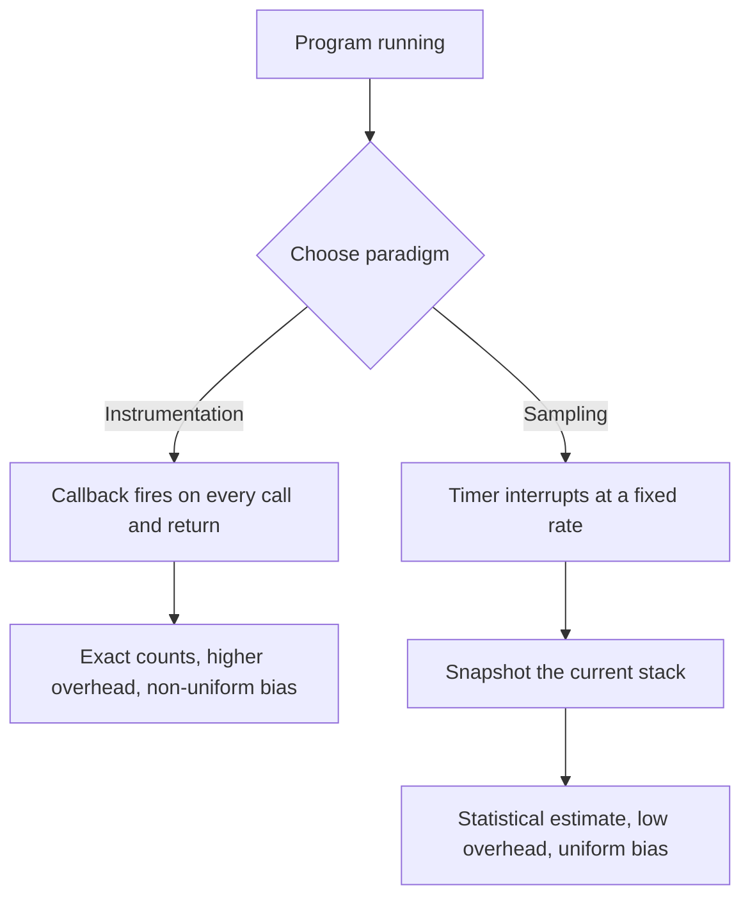
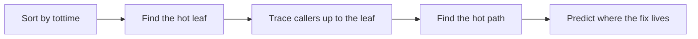

# Lecture 1 — What Profiling Actually Measures

> **Duration:** ~2 hours. **Outcome:** You can articulate the difference between sampling and instrumentation profilers in cost, bias, and use case; you can explain which clock each Python profiler uses (`perf_counter`, `process_time`, `monotonic_ns`) and why it matters; you can name the heisenberg problem in profiling and the canonical mitigations; you can pick a profiler for a given symptom in five seconds.

## 1. The thesis

The rest of the week is tools — `cProfile`, `line_profiler`, `py-spy`, `scalene`, the flamegraph viewer. This lecture is the discipline behind them. Three claims, and the entire week falls out of them:

1. **A profile is a measurement, not a fact.** It is a sample (or trace) of a particular run on particular inputs on a particular machine with a particular interpreter version. Change any of those and the profile changes. The profile is an *observation* of the program; it is not the program.

2. **Every profiler perturbs its target.** The act of measuring slows the program down. The slowdown is not uniform: function calls are typically slowed *more* than function bodies, IO calls are typically slowed *less* than CPU work (the IO wait is unchanged; only the bytecode framing the wait is instrumented). This means a profile of a profiled program is biased — and the bias is not toward zero.

3. **The profile answers one question precisely: where did the *measured time* go?** It does not answer "where will the time go in production." It does not answer "which function should I rewrite." It does not answer "is this CPU- or memory-bound." Each of those is a *separate* question that the profile *informs* — but each requires you to reason past the raw numbers.

Internalise those three and most of the week is mechanical. Skip them and you will optimise the wrong function with confidence.

## 2. What "time" means

Open a Python REPL.

```python
>>> import time
>>> time.perf_counter()
12345.678901234
>>> time.process_time()
0.123456
>>> time.monotonic()
12345.678901235
>>> time.thread_time()
0.123455
>>> time.time()
1747200123.456
```

Five clocks. They measure different things. The most common bug in a hand-rolled "profiler" is using the wrong one.

`time.time()` returns wall-clock seconds since the Unix epoch, **system clock**. Subject to NTP adjustments, leap seconds, the user changing their clock backwards. Resolution is OS-dependent — millisecond on Linux, microsecond on macOS. **Never use this for profiling.** A clock that can run backward is not a stopwatch.

`time.monotonic()` returns seconds since an arbitrary, monotonically-increasing reference point. Guaranteed not to go backward. Resolution: ~10 ns to ~1 microsecond, OS-dependent. Good for "did at least N seconds elapse." Not high enough resolution for short measurements.

`time.perf_counter()` returns seconds since an arbitrary reference point with the highest resolution the OS provides. On Linux it wraps `clock_gettime(CLOCK_MONOTONIC_RAW)`; on macOS it wraps `mach_absolute_time`; on Windows it wraps `QueryPerformanceCounter`. Resolution: ~1 ns typical. **This is the wall-clock measurement you want for benchmarking and profiling.** `cProfile` uses this by default.

`time.process_time()` returns the CPU time the *process* has accumulated. Excludes sleep, IO wait, lock wait. Includes user-mode and kernel-mode CPU. Resolution: ~100 ns to 1 ms, OS-dependent. **This is the CPU measurement you want when you care "how much work is the CPU doing for this code" as opposed to "how long did the wall clock show."**

`time.thread_time()` (Python 3.7+) is `time.process_time()` restricted to the calling thread. Useful in multi-threaded profiling.

The distinction that matters: `perf_counter()` includes time waiting; `process_time()` does not. A function that does `time.sleep(1)` reports a `perf_counter` elapsed of 1.0 seconds and a `process_time` elapsed of microseconds. Which one is "the truth" depends on what you are measuring. If you are asking "how long will this take in production," `perf_counter` is the answer. If you are asking "is this CPU-bound or IO-bound" — *use both*; the ratio tells you.

```python
import time

def fetch_and_compute() -> int:
    t0_wall = time.perf_counter()
    t0_cpu = time.process_time()
    # ... do work ...
    wall = time.perf_counter() - t0_wall
    cpu = time.process_time() - t0_cpu
    print(f"wall={wall:.3f}s  cpu={cpu:.3f}s  cpu/wall={cpu/wall:.2%}")
    return 0
```

If `cpu/wall` is near 1.0, the workload is CPU-bound; you were on the CPU the whole time. If `cpu/wall` is near 0.0, you were waiting (IO, lock, sleep); the *fix* is to overlap that waiting with other work (asyncio, threading), not to make the CPU code faster. This single ratio is more diagnostic, on a five-line check, than most profile runs.

`cProfile` reports `tottime` and `cumtime` in `perf_counter` seconds by default. You can pass a custom timer; the docs note this for `Profile(timer=, timeunit=)`. Most people never need to.

## 3. Two profiling paradigms

There are exactly two ways to find out where a program spends its time, and every Python profiler is one of them or both.

**Instrumentation (deterministic) profiling.** The profiler installs a callback that fires on every function entry and exit. The callback records the current time; on exit it computes elapsed and attributes it to the function. The data is exact for the trace collected — every call is observed. The cost is per-call: a few hundred nanoseconds of profiler overhead added to *every call site in the program*. For a program that makes 10 million function calls in a second (not unusual for pure-Python code), that is a few seconds of profiler overhead per second of program time.

Pros: exact accounting, no statistical noise, every function appears in the output, easy to map "this function was called 1234 times" to a line of code.

Cons: high overhead (20–40% slowdown is typical, more on call-heavy code), the slowdown is *non-uniform* (biases the profile toward call-heavy code), unsafe for production processes serving live traffic, fails on long-running services because the trace data grows without bound.

Examples: `cProfile`, `profile.py` (deprecated pure-Python version), `line_profiler`, `coverage.py` (counts lines, doesn't time them, but same mechanism), `viztracer`.

The C implementation lives in `Modules/_lsprof.c`. The instrumentation point is `PyEval_SetProfile` (or the per-thread `PyThreadState.c_profilefunc` slot directly). On every `CALL` and `RETURN` bytecode, the interpreter calls the registered profile function. Cost per call: a function-pointer dispatch, two `perf_counter` reads, two hashtable lookups, and a 32-byte record write. ~300–500 ns per call site on modern x86.

PEP 669 (`sys.monitoring`, 3.12) is the modern replacement. The old `sys.setprofile` callback was a single global function called for every event; the new API splits events (PY_START, PY_RETURN, CALL, RAISE, ...) and lets each tool register only for the events it cares about. Per-event cost is similar; the win is composability (multiple tools can run simultaneously without colliding) and the ability to skip events that are uninteresting. `cProfile` is being ported to PEP 669 (see CPython issue #103615 and successors). `py-spy` 0.4+ optionally piggybacks on PEP 669 for richer data.

**Sampling (statistical) profiling.** The profiler runs in a separate thread (or process, in py-spy's case) and at a fixed rate — typically 100 Hz, sometimes higher — it interrupts the target and records the current stack. The data is a *sample*: with 100 Hz over 30 seconds you have 3000 stacks. A function that is "on top" of 1500 of those stacks ate ~50% of the wall-clock time. The cost is per-sample, not per-call: at 100 Hz, the profiler does ~100 work-units of work per second of program time, *independent of how much code the program runs*.

Pros: low overhead (typically <2% at 100 Hz, sometimes <0.5%), uniform bias (every stack frame has equal opportunity to be sampled), safe for production, fixed memory footprint (you can sample for hours), works against an already-running process you didn't launch.

Cons: statistical, not exact (a function called twice but observed in zero samples will not appear in the output), short hot frames can be missed (a function that runs for 5 ms only once will not show up at 100 Hz unless lucky), the math of "this function appeared in 30% of samples" requires care.

Examples: `py-spy`, `scalene`, `austin`, `pyinstrument`, `perf` (Linux, OS-level), `dtrace` (BSD/macOS, OS-level), `Java Flight Recorder` (Java), `Instruments.app` (macOS).

The architecture varies. `py-spy` runs as a separate process and reads the target's memory via `process_vm_readv` (Linux) or `vm_read` (macOS); it never injects code. `scalene` runs in-process but mostly as a signal-driven (`SIGPROF`) sampler that reads the current frame from the C-side and walks the Python stack on each sample. `pyinstrument` uses `sys.setprofile` like cProfile but samples within the callback (skipping most events), which makes it cheaper than cProfile but technically still instrumentation; it sits between the two paradigms.

The choice between instrumentation and sampling is the most important profiling decision you make. Get this wrong and your numbers will mislead you.


*How instrumentation and sampling profilers collect data differently.*

| Symptom / question | Paradigm | Tool |
|--------------------|----------|------|
| "Where does the time go in this 5-second local CPU workload?" | Either; instrumentation is fine | `cProfile`, sort by `tottime` |
| "Within the slowest function, which line?" | Instrumentation (line-level) | `line_profiler` |
| "The production service stalls intermittently and I can't restart it" | Sampling | `py-spy record --pid PID` |
| "Is this CPU-bound or memory-bound?" | Sampling, memory-aware | `scalene` |
| "I want a flamegraph in a tweet" | Sampling | `py-spy record -o flame.svg --pid PID` |
| "I need every call counted exactly for a correctness audit" | Instrumentation | `cProfile` (or `coverage.py` for line-by-line) |
| "Async event loop is slow somewhere" | Sampling + async-aware | `py-spy` (handles native frames) or `yappi` |

## 4. The heisenberg problem, concretely

Werner Heisenberg's uncertainty principle is about quantum mechanics. The profiling cliché — "observing perturbs the observed" — is older; it traces to operational research. The principle in profiling is more mundane than the physics: instrumenting a function makes that function slower. If the per-function instrumentation cost is comparable to the function's own cost, the profile reports the function as much hotter than it would be without instrumentation.

A concrete example. Consider this function:

```python
def add_one(x: int) -> int:
    return x + 1
```

The function body is one bytecode (`BINARY_ADD`) plus the call-and-return overhead. On modern CPython 3.13, a single call to `add_one(0)` costs about 80–120 ns: ~50 ns for the call frame setup, ~10 ns for the body, ~30 ns for the return. Call it 100 ns.

`cProfile`'s instrumentation costs ~400 ns per call: ~200 ns on entry (record `perf_counter`, hash the function descriptor, look up the per-edge record, save the parent context), ~200 ns on exit (read `perf_counter` again, compute delta, accumulate). So a single call to `add_one` *under cProfile* costs ~500 ns: 400 ns of profiler + 100 ns of work. The profiler reports the *full* 500 ns as the function's time, because from the profiler's clock the function entry-to-return elapsed was 500 ns. But the function *itself* is 100 ns of work.

Now: a program that calls `add_one` ten million times. Without cProfile: ~1 second. With cProfile: ~5 seconds. The profile shows `add_one` consuming ~5 seconds of `tottime`. You "optimise" by rewriting `add_one` in C — actual cost drops from 100 ns to 10 ns. Without cProfile, the program drops from 1 second to ~0.5 seconds (a 2x win). *With* cProfile, the profile shows `add_one` now costs ~410 ns per call (400 ns profiler + 10 ns work) and you "improve" the profile from 5 seconds to ~4 seconds (a 1.25x win). You ship the change and management's prod monitoring shows a 2x speedup that you cannot account for from the profile. Tomorrow your manager asks why you didn't ship the change a month ago when you "first saw the bottleneck."

The fix is to reason *relatively*, not absolutely. Inside a single cProfile run, the *ratios* between functions are preserved — `add_one`'s share of total `tottime` is approximately what it would be without cProfile, *as long as the profiler overhead is roughly uniform*. The trap is that the overhead is *not* uniform: it is per-call, so call-heavy code is hit harder. The mitigations:

1. **Compare ratios within one run**, not absolute numbers across runs. "Function A was 35% of `tottime`; function B was 22%" is an honest comparison. "Function A took 5 seconds in the profile and 2 seconds without" is a trap.
2. **Sanity-check the total profile time against the unprofiled wall-clock.** If the unprofiled run is 1.0 s and the profile says total cumulative was 5.0 s, you know ~80% of the profile is overhead. Adjust expectations.
3. **For very call-heavy code, use a sampling profiler.** `py-spy` does not have this problem in the same way: the overhead is proportional to sample rate, not to call rate. At 100 Hz on a 10-second program, py-spy did ~1000 work units; the program's call density is irrelevant.
4. **For very short functions, profile at a higher level.** If your hot function takes 100 ns and the profiler adds 400 ns, profile the *caller* of the hot function — the profile will show 99% of time in the loop body that calls it, and you can read the source from there.

There is a more sophisticated version of the same problem: the **C-boundary discontinuity**. cProfile cannot instrument C functions. A pure-Python function that calls `numpy.dot` is instrumented for the Python part of the call but the `np.dot` itself runs unobserved. The profile reports the Python wrapper's elapsed time correctly (because the wrapper is what cProfile sees), but if `np.dot` is most of the wrapper's time the profile makes it look like the wrapper is the bottleneck — when in fact the wrapper is essentially zero-cost and the bottleneck is *inside* `np.dot`. The fix is `scalene`, which distinguishes native time from Python time; or `py-spy --native`, which samples native frames too.

## 5. What sampling gets right and wrong

Sampling profilers cost almost nothing and produce statistically valid estimates of where wall-clock time goes. They are also famously confusing on first encounter. Three rules disambiguate.

**Rule 1 — sample count is not time.** A flamegraph's x-axis is "number of samples in which this stack was on top," not "seconds." If the program ran 10 seconds and the sampler took 1000 samples, the implied conversion factor is 10 ms per sample — but only on average. A specific 30%-wide bar means "this frame was on top of 300 samples" which means "approximately 3 seconds of wall-clock," but the uncertainty is ~30 ms (one sample either way).

**Rule 2 — long, infrequent frames can be missed.** A function that runs once for 10 ms in a 10-second program has a ~1/1000 chance of being on top during any individual sample. At 100 Hz over 10 seconds, expected occurrences are 1.0 — half the time you'll see it, half you won't. *Increase the sample rate* (`py-spy record --rate 500`) if you suspect this is happening. The cost rises proportionally; 500 Hz is fine in production for short runs but expensive for hour-long captures.

**Rule 3 — idle time is invisible by default.** If your program calls `time.sleep(10)` and then does 0.1 s of work, py-spy at default settings will see ~10 samples (the 0.1 s of work) and report it as 100% busy. The sleep is invisible because there is no Python frame to sample. Pass `--idle` to py-spy to make it record sleep stacks too. Similarly, blocked-on-IO time is invisible in default py-spy output but visible with `--idle`. For the question "is this slow because of CPU or because of sleep," sampling without `--idle` is misleading.

The other half of the rule: **sampling profilers don't show you what isn't there**. cProfile lists every function called, even once. py-spy lists only functions that were on the stack during some sample. A function called twice for 1 microsecond each will show up in cProfile (with `ncalls=2`) and will simply not exist in a py-spy output. This is usually fine — if a function takes 2 microseconds in a 10-second program it is not interesting — but it is a real difference in semantics. If you need a complete call count, you need cProfile.

## 6. What instrumentation gets right and wrong

Instrumentation profilers count everything and give you exact times for everything they count. They also have the call-edge bias, the overhead, and the limitation that they can only see Python (or compiled-with-instrumentation) frames.

The thing instrumentation gets uniquely right is **call counts**. cProfile's `ncalls` column is *exact*. If it says a function was called 1,234,567 times, that is the truth. Sampling cannot give you this number — it can give you an estimate, but the estimate is noisy for low call counts and only available as a side-effect for high ones (number of unique samples in which the function was on top).

The thing instrumentation gets uniquely wrong is **C-extension internals**. The `_lsprof.c` callback fires on Python-level frames. When Python calls into C — `json.loads`, `numpy.dot`, `requests.get`, anything via `Py_BEGIN_ALLOW_THREADS` — the C function runs invisibly to cProfile. The profile reports the *Python caller* as the time consumer. If that's good enough for your question (it usually is), fine; if you need to know which `numpy` function inside `numpy.dot` is hot, you need `py-spy --native` or `perf` or `scalene` with its native-time column.

A second thing instrumentation gets subtly wrong: **timer resolution**. `_lsprof` reads `perf_counter` on every callback. Per-call overhead is ~200 ns; timer resolution is ~1 ns; arithmetic is fine. But for functions that are *shorter than the per-call overhead*, the elapsed time you record is dominated by the timer-read overhead, not the function. You don't get accurate sub-microsecond per-call times from cProfile; the noise floor is ~100 ns.

## 7. Five clocks: which profiler uses which

| Tool | Clock | Notes |
|------|-------|-------|
| `cProfile` (default) | `time.perf_counter()` | Wall-clock. Can be overridden via `Profile(timer=..., timeunit=...)`. |
| `cProfile` with `Profile(timer=time.process_time)` | `time.process_time()` | CPU-time profiling. Useful for excluding sleep/IO time. |
| `line_profiler` | OS-specific (uses `_line_profiler` C code) | Per-line via a per-line callback; reports time in microseconds by default (unit configurable). |
| `py-spy` | Sample-time wall clock | x-axis of a flamegraph is sample count, which is proportional to wall clock at the sampling rate. |
| `py-spy --idle` | Same | Includes "on stack but not on CPU" — which makes sleep/IO time visible. |
| `scalene` | Three columns | Wall-clock time *and* the breakdown into native/Python/system, plus memory allocations. |
| `time.perf_counter` direct | High-res wall | The `time.perf_counter`-bracketed measurement is the simplest "profiler" and is correct for a single block. |
| `timeit` | `time.perf_counter` | Auto-disables GC, runs N times, returns the *minimum* (best case; less noisy than the mean). |

**Rule of thumb:** unless you have a specific reason to use a CPU clock, use wall-clock (`perf_counter`). Why: production performance is what users experience, and users experience wall-clock. CPU clock is for asking "how much CPU did this function consume on a busy multi-tenant box," which is a different question.

## 8. The "real" profile is rarely the one you take first

Three traps to flag now:

**Trap 1: profiling the warmup.** `python -m cProfile script.py` profiles *the entire interpreter session*, including module imports. If your script does 0.1 s of work after a 2 s import, the profile is dominated by `<frozen importlib._bootstrap>:_find_and_load` and friends. **Fix:** wrap the work in a function, call it twice, profile only the second call. Or use the `cProfile.Profile()` context-manager pattern (`with Profile():`) and time only the real work.

```python
import cProfile

def work() -> None:
    # ... your code under test ...
    pass

# Warmup (imports, JIT, anything else that runs once)
work()

# Real profile
with cProfile.Profile() as pr:
    work()
pr.print_stats(sort="tottime")
```

**Trap 2: profiling an unrepresentative input.** You profile on 100 rows; production runs 100 million. The hot function in the 100-row profile may not be the hot function in the 100-million-row profile. *Algorithmic* bottlenecks (anything worse than O(n)) emerge at scale. **Fix:** profile at production-comparable scale, or profile twice (small + large) and compare the rankings. If the rankings shift, you have an algorithm problem; the fix is not at the leaf but at the data-flow level.

**Trap 3: profiling on a different machine.** Your laptop has different cache sizes, different memory bandwidth, and possibly a different Python build than production. Cache-miss-dominated code can look quite different. **Fix:** for production-bound questions, profile on the production machine class (a cloud instance of the right shape, ideally). Sampling profilers are well-suited to this because you can attach to a real production process without changing the deployment.

## 9. Reading any profile in three steps

Independent of which tool produced it, every profile rewards the same three-step read.

**Step 1 — find the hot leaf.** Sort by exclusive time (`tottime` in cProfile; the widest plateau at the top of a tower in a flamegraph; the "Per Hit × Hits" of the slowest line in line_profiler). This is the place doing the slow work. If it is one of your own functions, great. If it is `<built-in method json.loads>` or `<built-in method posix.read>`, you have a different problem: optimisation may require a different library or algorithm rather than a code rewrite.

**Step 2 — find the hot path.** Look at the chain of callers leading to the hot leaf. In cProfile, `print_callers('the_hot_function')`. In a flamegraph, the column beneath the hot plateau. The hot path tells you *why* the hot leaf is hot — usually a loop somewhere, sometimes recursion, sometimes a regex applied N times where N could be 1.

**Step 3 — predict where the fix lives.** Sometimes at the leaf (`json.loads` → switch to `orjson`); sometimes at a caller ("we are calling `json.loads` once per row, but we could call it once per batch"). The fix is rarely at the spot the profile most loudly highlights — it is one step up, in the call shape. The reason to find the *path*, not just the *leaf*.


*The three-step read: hot leaf, then hot path, then predicted fix.*

If after these three steps you do not have a hypothesis for a 2x speedup, **do not yet write code**. Profile differently — sample more, try the other paradigm, scale the input. The cost of profiling again is 5 minutes. The cost of a wrong rewrite is days. Knuth's "look at the code only after it has been identified" is the operationalisation of this: identification first, then code.

## 10. A diagnostic checklist (commit to memory)

Before reading a profile, answer:

1. **What workload did I profile?** A representative one, or a small synthetic one?
2. **Which clock did the profiler use?** Wall or CPU? If wall, sleep and IO are included; if CPU, they are not.
3. **Which paradigm?** Sampling or instrumentation? What is the expected bias?
4. **What is the unprofiled wall-clock for comparison?** Run the workload once without the profiler; record the time. Compare against the profile's total `cumulative` time. If they differ by more than 50%, the profiler overhead is non-trivial; interpret with care.
5. **Am I sorting by the right column?** `tottime` for "what is slow," `cumtime` for "what's the most expensive call path," `ncalls` for "what is called the most."
6. **Did I exclude warmup?** Imports, JIT compilation, first-call lazy loading? If not, the first second or two of the profile is uninteresting.
7. **Is the hot leaf a built-in or my own code?** Built-ins are usually library swaps, not rewrites.
8. **Does the profile match my intuition?** If not, *the profile is probably right and your intuition is wrong*, but it is worth a sanity check before committing.

## 11. Worked example — the obvious-looking bottleneck

A short story. We will see this in code in Exercise 1.

```python
def process_data(records: list[dict[str, str]]) -> list[str]:
    out = []
    for r in records:
        if validate(r):
            out.append(transform(r))
    return out

def validate(r: dict[str, str]) -> bool:
    # Quick checks — type, presence of required keys.
    if "id" not in r or "name" not in r:
        return False
    if not r["id"].isdigit():
        return False
    return True

def transform(r: dict[str, str]) -> str:
    # Build a string. Looks like the heavy function — it is doing
    # the most "real work" — formatting, concatenating, etc.
    parts: list[str] = []
    for k in sorted(r.keys()):
        parts.append(f"{k}={r[k]}")
    return "|".join(parts)
```

Run `cProfile` on `process_data(records)` for `records` of length 100,000. Sort by `cumtime`. You see:

```
   ncalls  tottime  percall  cumtime  percall  filename:lineno(function)
        1    0.003    0.003    0.412    0.412  example.py:1(process_data)
   100000    0.045    0.000    0.380    0.000  example.py:9(transform)
   100000    0.012    0.000    0.020    0.000  example.py:3(validate)
```

`transform` is the hot leaf by `cumtime`. You spend an hour rewriting `transform` in a faster style; you halve its `tottime` from 0.045 to 0.022. End-to-end wall clock drops from 0.41 s to 0.39 s — barely measurable.

What happened? Sort by `tottime` instead of `cumtime`. You see:

```
   ncalls  tottime  percall  cumtime  percall  filename:lineno(function)
   100000    0.045    0.000    0.380    0.000  example.py:9(transform)
   100000    0.012    0.000    0.020    0.000  example.py:3(validate)
```

`transform`'s `cumtime` is 0.380 — but its `tottime` is only 0.045. The other 0.335 is in functions *it calls*. Print `print_callees('transform')`. You see `sorted` and `str.format` and `list.append` — and `dict.__getitem__`. The dict lookups inside the f-string are most of the time. The fix isn't faster string formatting; it's *not iterating sorted keys per record* — pre-sort the schema once, look up by integer index, or batch the records and process them in one pass via a generator.

The lesson, stated plainly: **`cumtime` is misleading by design**. It includes everything under the function in the call tree. `transform` looks expensive because it *delegates* to expensive things. The function whose time is actually spent computing is whatever's at the leaf; for this workload, that's `sorted` and the f-string machinery.

We will see the same pattern in three more flavours over the next two lectures. Internalise: **sort by `tottime`, not `cumtime`, when you ask "what is slow."** Sort by `cumtime` when you ask "what's expensive *to call*."

## 12. Summary

- A profile is a measurement; it depends on the inputs, the machine, the build, the moment.
- Two paradigms: instrumentation (exact, overhead per call), sampling (statistical, overhead per sample). Pick the one whose cost model matches your workload.
- Five clocks; usually `time.perf_counter` (wall-clock, monotonic, high-res). `time.process_time` if you need to exclude IO/sleep.
- The heisenberg problem: instrumentation perturbs more than sampling, and non-uniformly. Compare ratios within a run, not absolutes across runs.
- `cumtime` is inclusive (function + all callees). `tottime` is exclusive (function only). Sort by `tottime` to find the leaf doing the work.
- Hot leaf, hot path, predicted fix. In that order. Three steps to read any profile.
- The cost of profiling again is 5 minutes. The cost of optimising the wrong function is days.

## 13. Read before Lecture 2

- The "Instant User's Manual" of the `profile` / `cProfile` docs (~3 minutes): <https://docs.python.org/3/library/profile.html#instant-user-s-manual>.
- The "What is deterministic profiling?" section of the same page (~2 minutes): <https://docs.python.org/3/library/profile.html#what-is-deterministic-profiling>.
- The `pstats.Stats` reference, just skim the method list (~3 minutes): <https://docs.python.org/3/library/profile.html#the-stats-class>.

You are now ready for Lecture 2.
