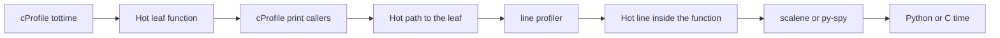
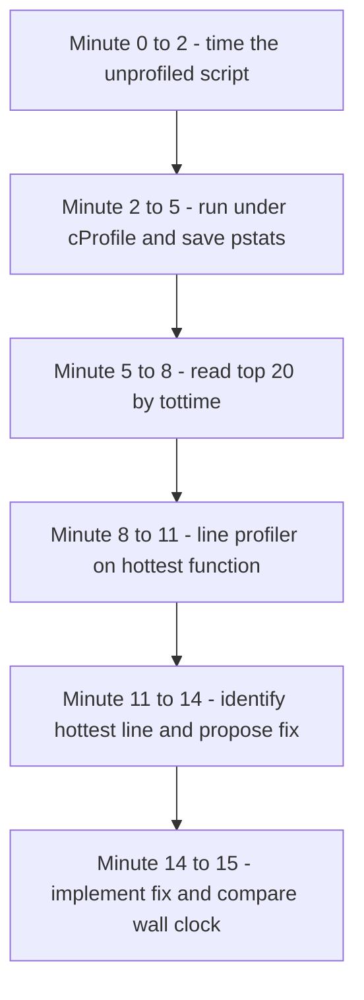

# Lecture 2 — `cProfile` and `line_profiler`, End to End

> **Duration:** ~2 hours. **Outcome:** You can profile a script three ways without consulting the docs (CLI, programmatic context manager, `pstats` table reading), you can extract the hot path from a `pstats` object in five lines of code, you can drop `@profile` decorators on a hot function and run `kernprof` correctly, and you can read both outputs without confusing exclusive and inclusive time.

## 1. The plan

This lecture is the practitioner's reference for the two stdlib-or-near-stdlib deterministic profilers. By the end you will have run each on real code, read the output, and built the table-reading reflexes that make every subsequent profile session faster.

`cProfile` is your first tool, almost always. It is in the standard library, runs without dependencies, and produces a function-level accounting of where time goes. `line_profiler` is your second tool, after `cProfile` has narrowed the search to a single function and you need to see *which line inside that function* is the cost. Use them in that order; using them out of order is a common (and time-wasting) mistake.

## 2. `cProfile` — three ways to invoke it

### 2.1 The command line

The fastest way to get a profile.

```bash
python -m cProfile script.py
```

Runs `script.py` under cProfile and dumps an unsorted table to stdout when the script exits. The table has six columns: `ncalls`, `tottime`, `percall_t`, `cumtime`, `percall_c`, `filename:lineno(function)`. The default sort is alphabetical by filename, which is useless. **Always** pass a sort:

```bash
python -m cProfile -s tottime script.py
python -m cProfile -s cumulative script.py
python -m cProfile -s ncalls script.py
```

For more than a screenful of output, save to a binary file and analyse later:

```bash
python -m cProfile -o out.pstats script.py
```

`out.pstats` is a pickled `pstats.Stats` object. Read it with the `pstats` module (next section) or with a viewer like `snakeviz` (`pip install snakeviz; snakeviz out.pstats`).

There is a subtle gotcha with `-m cProfile`: it profiles the *entire interpreter session*. If `script.py` does `import slow_library_with_side_effects`, that import is in the profile. If your script's actual work is 0.1 s after a 2 s import, the import dominates the top of the cumulative table. **Mitigation:** run the work twice in your script and rely on `tottime` (which integrates calls regardless of how many times you ran them), or use the programmatic approach below to scope the profile to the work itself.

### 2.2 The programmatic context manager (3.9+)

The most ergonomic API for "profile this block of code, not the whole script."

```python
import cProfile

def work() -> None:
    # ... real code under test ...
    pass

# Optional warmup pass.
work()

# Profile only the second pass.
with cProfile.Profile() as pr:
    work()

# Print to stdout, sorted.
pr.print_stats(sort="tottime")
```

The `Profile()` object is callable as a context manager (3.9+); inside the `with`, every Python call is timed. On exit, `pr` has the data. `print_stats(sort=...)` accepts the same sort keys as the CLI (`'tottime'`, `'cumulative'`, `'ncalls'`, `'pcalls'`, `'name'`, `'file'`, `'line'`, `'nfl'`). It prints to stdout by default; pass a file argument to redirect.

`pr.dump_stats('out.pstats')` writes a binary file you can re-analyse later.

This is the pattern I would internalise first. It cleanly separates the *thing being profiled* from the *profiling apparatus*, which is what you want.

### 2.3 The `cProfile.run` / `cProfile.runctx` shorthand

```python
import cProfile

cProfile.run("work()", sort="tottime")
cProfile.run("work()", filename="out.pstats")
```

A one-liner. The expression argument is `exec`'d. Use this for ad-hoc REPL profiling. The `cProfile.runctx(code, globals, locals)` variant lets you pass explicit namespaces — useful when the code references variables not in `globals()`.

I use the context-manager form 90% of the time, `-m cProfile` for ad-hoc CLI work, and `cProfile.run` essentially never. Pick a primary and stick with it.

## 3. Reading the output, column by column

A representative cProfile output (sorted by `tottime`, truncated to the top 5):

```
         123456 function calls (98765 primitive calls) in 1.234 seconds

   Ordered by: internal time, total time
   List reduced from 412 to 5 due to restriction <5>

   ncalls  tottime  percall  cumtime  percall  filename:lineno(function)
     1000    0.512    0.001    1.123    0.001  /home/u/proj/foo.py:42(parse_one)
   100000    0.412    0.000    0.412    0.000  {method 'split' of 'str' objects}
     5000    0.108    0.000    0.108    0.000  {built-in method json.loads}
    50000    0.087    0.000    0.181    0.000  /home/u/proj/foo.py:78(_normalise)
    10000    0.043    0.000    0.234    0.000  /home/u/proj/foo.py:91(emit)
```

The summary line: **123,456 function calls** (the total across the profile run; this is exact). The **98,765 "primitive calls"** is the count *excluding* recursive re-entries. `ncalls` in the body shows `A/B` (e.g. `1234/100`) for recursive functions: 1234 total calls, 100 of which were the top-level entries. Non-recursive functions show one number.

The body columns:

- **`ncalls`** — number of calls. Exact.
- **`tottime`** — *exclusive* time spent in this function, not counting time spent in functions it called. In seconds, by default. This is the column you sort by to find the leaf doing the work.
- **`percall`** (the first one) — `tottime / ncalls`. Per-call exclusive cost. A function called once for 1 second and a function called a million times for a microsecond each have the same `tottime`; the `percall` tells you which is which.
- **`cumtime`** — *inclusive* time: this function plus everything it called. Always `>= tottime`. Functions at the top of the call graph (your `main`, `<module>`) have huge `cumtime`. Sort by this column to find expensive *call paths*, not expensive functions.
- **`percall`** (the second one) — `cumtime / ncalls`. Per-call inclusive cost.
- **`filename:lineno(function)`** — where the function is defined. For built-ins and C functions, you get `{method 'split' of 'str' objects}` or `{built-in method json.loads}` — the function name as the C-level descriptor sees it.

The two `percall` columns are confusing. They refer, respectively, to the column *immediately to their left*. The header would be clearer as `tottime`, `tottime_percall`, `cumtime`, `cumtime_percall`. The official docs note this; the column header is preserved for backwards compatibility.

## 4. `pstats` — reading the binary `.pstats` file

Once you have `out.pstats`, the `pstats` module is how you query it. The default API is awkward; it prints to stdout when you wish it returned data. A reasonable wrapper:

```python
import pstats

stats = pstats.Stats("out.pstats")
stats.strip_dirs()                    # /home/u/proj/foo.py -> foo.py
stats.sort_stats("tottime")           # sort by exclusive time
stats.print_stats(20)                 # top 20

# Or by call counts:
stats.sort_stats("ncalls").print_stats(20)

# Or for a specific function: who called it, and what did it call?
stats.print_callers("parse_one")
stats.print_callees("parse_one")

# Filter by filename pattern:
stats.print_stats("foo.py", 20)
```

`strip_dirs()` shortens filenames in the output. **Always call it** unless you specifically need to disambiguate same-named files in different directories.

For programmatic access (you want the data as Python objects, not text), use `stats.stats` and `stats.fcn_list`:

```python
import pstats

stats = pstats.Stats("out.pstats")
stats.sort_stats("tottime")

# stats.stats is a dict: {(filename, lineno, funcname): (ncalls, primitive_calls, tottime, cumtime, callers_dict)}
top_5 = [(name, data) for name, data in list(stats.stats.items())[:5]]
for name, data in top_5:
    ncalls, primitive_calls, tottime, cumtime, callers = data
    print(f"{name}: tottime={tottime:.3f}s cumtime={cumtime:.3f}s")
```

The `stats.stats` dict's value tuple is, in order: `(ncalls, primitive_calls, tottime, cumtime, callers)`. The `callers` field is itself a dict mapping caller-name to a tuple of the same shape. This is enough to walk the call graph and answer any question, including "of all callers of `parse_one`, which one accounted for the most cumulative time?"

`stats.fcn_list` is the same data sorted by the most recent `sort_stats` key — useful when you want "the top N by `tottime`" as a list.

## 5. Picking the sort key

This is the single most common cProfile mistake. The wrong sort key sends you to optimise the wrong function.

| Sort key | When to use |
|----------|-------------|
| `tottime` | "What is the slowest leaf function?" The answer to *"what should I rewrite?"* in 80% of cases. |
| `cumulative` (alias for `cumtime`) | "What is the most expensive call path?" Useful for "we should call this function less often." `<module>` is always at the top; ignore it. |
| `ncalls` | "What is called the most?" Useful when caching/memoisation is a fix candidate. |
| `pcalls` | "Primitive calls" — `ncalls` excluding recursion. Useful for recursive code. |
| `name`, `file`, `line` | Alphabetic. For browsing, not for diagnosis. |
| `nfl` | (Name, file, line). Combined alphabetic. |

The right reflex: `sort_stats('tottime').print_stats(20)`. The top 20 by exclusive time, every time. *Then* if the obvious leaf isn't your code (e.g. it's `{method 'split' of 'str' objects}`), sort by `cumulative` and look at where in *your* code that split is being called from.

## 6. A common workflow

```python
import cProfile
import pstats

def main_workload() -> None:
    # ... whatever your script does ...
    pass

# 1. Warmup (skip the first run if it imports heavy modules).
main_workload()

# 2. Profile a representative run.
with cProfile.Profile() as pr:
    main_workload()

# 3. Save to disk for later analysis.
pr.dump_stats("workload.pstats")

# 4. Print the top 20 by tottime, immediately.
stats = pstats.Stats(pr).strip_dirs().sort_stats("tottime")
stats.print_stats(20)

# 5. Look at callers of the slowest leaf (if it isn't yours).
stats.print_callers("split")     # if the top was a str.split
```

Five steps, ~2 minutes including reading the output. If you cannot do this in your sleep by Sunday, you have not practised enough.

## 7. The `tottime` vs. `cumtime` trap, in code

We saw the obvious-looking-bottleneck story in Lecture 1 §11. Here is the code.

```python
# bad_sort.py
import cProfile, pstats

def transform(record: dict[str, str]) -> str:
    parts: list[str] = []
    for k in sorted(record.keys()):
        parts.append(f"{k}={record[k]}")
    return "|".join(parts)

def main() -> None:
    records = [{"id": str(i), "name": "x", "email": "y", "phone": "z"} for i in range(100_000)]
    out = [transform(r) for r in records]
    assert len(out) == 100_000

with cProfile.Profile() as pr:
    main()

stats = pstats.Stats(pr).strip_dirs()

print("---- by cumulative ----")
stats.sort_stats("cumulative").print_stats(8)

print("---- by tottime ----")
stats.sort_stats("tottime").print_stats(8)
```

Run it. The `cumulative` table shows `<module>` first, `main` second, `transform` third — all with similar cumtimes around 0.4 s. The `tottime` table shows different leaders: `transform` has a modest `tottime`, while `sorted`, `dict.keys`, `dict.__getitem__`, and the f-string machinery account for most of the *real* work.

The fix is *not* to rewrite `transform` faster; the fix is to stop calling `sorted(record.keys())` once per record when the schema is stable:

```python
def transform_v2(record: dict[str, str], keys: tuple[str, ...]) -> str:
    return "|".join(f"{k}={record[k]}" for k in keys)

def main_v2() -> None:
    records = [...]
    keys = ("email", "id", "name", "phone")  # sorted once, hardcoded
    out = [transform_v2(r, keys) for r in records]
```

The wall-clock improvement on my laptop: 0.41 s → 0.12 s (3.4x). Same algorithm. Same data. The fix was *moving the sort out of the inner loop*, which the `tottime` sort surfaced and the `cumtime` sort hid.

Repeat after me: **`tottime` for "what is slow," `cumtime` for "what is expensive to call."**

## 8. `line_profiler` — the line-level complement

Once `cProfile` has named the hot function, `line_profiler` tells you which *line* inside it is the cost. The tool was Robert Kern's, 2008; maintained today by the pyutils organisation.

Install:

```bash
pip install line_profiler
```

Decorate the function under test with `@profile`:

```python
# script.py

@profile  # <-- not imported from anywhere; kernprof injects it
def transform(record: dict[str, str]) -> str:
    parts: list[str] = []
    for k in sorted(record.keys()):
        parts.append(f"{k}={record[k]}")
    return "|".join(parts)

def main() -> None:
    records = [{"id": str(i), "name": "x", "email": "y", "phone": "z"} for i in range(100_000)]
    out = [transform(r) for r in records]
    assert len(out) == 100_000

if __name__ == "__main__":
    main()
```

Run under `kernprof`:

```bash
kernprof -l -v script.py
```

`-l` enables line profiling. `-v` prints the report to stdout when the script exits. (Without `-v`, you get a `script.py.lprof` binary file you can read later with `python -m line_profiler script.py.lprof`.)

Output:

```
Wrote profile results to script.py.lprof
Timer unit: 1e-06 s

Total time: 0.451 s
File: script.py
Function: transform at line 4

Line #      Hits         Time  Per Hit   % Time  Line Contents
==============================================================
     4                                           @profile
     5                                           def transform(record: dict[str, str]) -> str:
     6    100000      24531.0      0.2      5.4      parts: list[str] = []
     7    400000     142890.0      0.4     31.7      for k in sorted(record.keys()):
     8    400000     201234.0      0.5     44.6          parts.append(f"{k}={record[k]}")
     9    100000      82301.0      0.8     18.3      return "|".join(parts)
```

Now you see exactly what is expensive. Line 7 (`sorted(record.keys())`) is 31.7% — and it's executed 400,000 times because the per-record loop iterates 4 times. The cost is `sorted` (called once per record) plus per-iteration overhead. Line 8 is 44.6%, dominated by f-string formatting and `dict.__getitem__`. The fix is identical to what we predicted: hoist the sort, batch the formatting.

### 8.1 What `@profile` is, exactly

`@profile` is *not* an import. There is no `from line_profiler import profile` you should write at the top of a profiled script. The decorator is *injected* into the global namespace by `kernprof` when it runs your script. This is a deliberate choice — it lets you sprinkle `@profile` decorators in the source for the duration of an investigation, then remove them, without needing a conditional import. The downside is that running the script *without* `kernprof` raises `NameError: name 'profile' is not defined`.

The standard workaround for "let me run this script with or without kernprof":

```python
try:
    profile  # type: ignore[name-defined]
except NameError:
    def profile(fn):
        return fn
```

Drop this at the top of any module that uses `@profile`. The decorators become no-ops when `kernprof` is absent.

### 8.2 Programmatic use

For tests or scripted profiling, use the `LineProfiler` class:

```python
from line_profiler import LineProfiler

def transform(record: dict[str, str]) -> str:
    ...

lp = LineProfiler()
lp.add_function(transform)
lp.enable()

# run the workload
for r in records:
    transform(r)

lp.disable()
lp.print_stats()
```

`add_function` registers a target without decorating it. `enable` / `disable` bracket the code under measurement. `print_stats` writes the table to stdout. This pattern is what pytest plugins for `line_profiler` use internally.

### 8.3 What `line_profiler` does *not* do well

- **Many functions at once.** `line_profiler` is per-decorated-function. If you want every function in the module profiled, that's `cProfile`'s job.
- **Short-running functions.** Per-line overhead is ~1–2 microseconds; functions whose lines individually run in <500 ns will report noisy times. Use `cProfile` aggregated counts plus `timeit` for the inner body.
- **C extensions.** A line that calls into C runs invisibly past the line profiler's hook; the line's time appears as the wall-clock spent inside the C call, but you cannot see *which part of the C call* is hot. Same limitation as cProfile; the fix is `py-spy --native` or `scalene` (next lecture).
- **Asyncio code.** A line that contains an `await` will record the wall-clock elapsed including the suspension, which is usually not what you want. The fix is to refactor: extract the synchronous portion into a helper function and `@profile` that.

## 9. `tottime` columns across tools — what they mean, side by side

| Tool | Output column | Meaning |
|------|---------------|---------|
| `cProfile` | `tottime` | Wall-clock seconds spent in the function, exclusive of callees. |
| `cProfile` | `cumtime` | Wall-clock seconds in the function plus all its callees. |
| `line_profiler` | `Time` | Microseconds spent in the line. *Includes time spent in functions called from that line.* |
| `line_profiler` | `Per Hit` | `Time / Hits`. |
| `line_profiler` | `% Time` | Line's `Time` as a percentage of total time profiled by `line_profiler`. |
| `py-spy` flamegraph | bar width | Number of samples in which this frame was on top. |
| `scalene` (CLI) | `Python time` | Wall-clock spent executing pure Python code at this line. |
| `scalene` (CLI) | `Native time` | Wall-clock spent in C extensions called from this line. |
| `scalene` (CLI) | `System time` | Wall-clock spent in syscalls (IO, sleep) at this line. |

The two columns labeled `% Time` (one in `line_profiler`, one in `scalene`) are *not* directly comparable across tools. `line_profiler`'s percentage is "of total line_profiler-measured time inside the decorated functions"; `scalene`'s percentage is "of total program wall time." When you have both numbers, they will disagree; that is correct, not a bug.

## 10. A four-line summary table

Memorise this:

```
cProfile             → which function is the hot leaf? (tottime sort)
cProfile + callers   → who is calling the hot leaf? (print_callers)
line_profiler        → which line inside the hot function?
scalene/py-spy       → is the hot line Python or C? (next lecture)
```

In that order. Skipping a step (jumping straight from "the function is slow" to "rewrite the function") is the most common time-waster in performance work.


*The tool-escalation order from Section 10 - each step narrows the search.*

## 11. Putting it together: a 15-minute profiling session

A complete session, from "the script is too slow" to "I have a fix."

**Minute 0–2.** Run the script with `time` to confirm the unprofiled wall clock.

```bash
time python script.py
# real    1m23.456s
```

**Minute 2–5.** Run under cProfile, save the result.

```bash
python -m cProfile -o slow.pstats script.py
```

(Note: this is ~30% slower than untraced, but that's fine; we're not comparing absolute times across runs, just looking at the table.)

**Minute 5–8.** Read the top 20 by `tottime`. Note the hottest function that is *yours* (not a built-in).

```python
import pstats
s = pstats.Stats("slow.pstats").strip_dirs().sort_stats("tottime")
s.print_stats(20)
```

**Minute 8–11.** Decorate the hottest function with `@profile`. Add the kernprof-or-not shim. Run `kernprof -l -v script.py`. Read the line-by-line.

**Minute 11–14.** Identify the hottest line. Propose a fix on paper (algorithm change, library swap, hoist computation, cache).

**Minute 14–15.** Implement the fix. Re-run the unprofiled wall clock. Compare.


*The full 15-minute profiling session from unprofiled baseline to a verified fix.*

This is the loop. Faster after practice.

## 12. Common pitfalls

- **`-m cProfile` profiles the warmup.** Use the context-manager form to scope.
- **Sorting by `cumulative` and "fixing" `<module>` or `main`.** Always sort by `tottime` first.
- **Profiling a 0.01-second workload.** Profiler overhead dominates; numbers are noise. Scale up the input or move to `timeit` for micro-benchmarks.
- **Comparing absolute times across cProfile and non-cProfile runs.** The profile is slower by 20–40%. Compare *unprofiled* wall clocks before vs. after a change.
- **Decorating with `@profile` but forgetting to use `kernprof`.** Result: `NameError`. Always add the kernprof-or-not shim.
- **Profiling on a different machine than production.** Cache sizes, memory bandwidth, kernel scheduler differ. The hot function on a laptop may be cold on a server.
- **Multi-threaded code under cProfile.** Each thread's calls are accounted for, but the timer is wall-clock — a thread blocked on a lock has elapsed time, not work time. Use `time.thread_time` as the timer (`Profile(timer=time.thread_time)`) if you want per-thread CPU time, but understand the cost: the timer is per-thread, so the same function in different threads gets different times.
- **Recursive functions and `ncalls`.** `1234/100` means "1234 calls, 100 of them top-level." For recursion, sort by `pcalls` to count primitive entries.

## 13. The line_profiler edge cases worth knowing

- **`Timer unit`.** The header of the output reads `Timer unit: 1e-06 s`. The numbers in the `Time` column are *in those units*. Default is microseconds; you can configure with `LineProfiler(timer=...)` if you need higher resolution.
- **Inlined lines.** Decorators, lambdas, comprehensions count as their own lines, but trace differently. A list comprehension `[f(x) for x in xs]` reports as a single line in the body and shows the total time across all iterations.
- **Functions in C-extension modules.** Even if `cProfile` can call into them (it traces the Python frame), `line_profiler` cannot — there is no Python line table to walk. Decorate the Python wrapper instead.
- **Generators and coroutines.** The line containing `yield` reports time *between* yields, not time *at* the yield. This is usually what you want.

## 14. Read before Lecture 3

- The `py-spy` README (~10 minutes): <https://github.com/benfred/py-spy>. Focus on the "Quick Start" and "FAQ" sections.
- The `scalene` README (~10 minutes): <https://github.com/plasma-umass/scalene>. Focus on the "Usage" section and the screenshot showing the three-column output.
- Brendan Gregg's "Flame Graphs" page (~15 minutes): <https://www.brendangregg.com/flamegraphs.html>. Read it end-to-end. You will be reading flamegraphs all week.

## 15. Summary

- `cProfile` is the first tool. CLI for ad-hoc, `with cProfile.Profile() as pr:` for scoping, `pstats` for reading.
- Six columns: `ncalls`, `tottime`, `percall_t`, `cumtime`, `percall_c`, `filename:lineno(function)`. Sort by `tottime` for "what is slow"; sort by `cumulative` for "what is expensive to call."
- `print_callers(name)` and `print_callees(name)` to walk the call graph.
- `line_profiler` is the second tool. `@profile` (injected by `kernprof`, not imported), run with `kernprof -l -v script.py`.
- Lines are timed *inclusively* of any function called from them. A line that calls a C extension shows the wall-clock through the C call.
- Workflow: `cProfile` → name the hot function → `line_profiler` → name the hot line → propose fix → measure unprofiled before/after.
- Pitfalls: warmup contamination, wrong sort key, micro-benchmark territory, multi-thread complications, missing the kernprof-or-not shim.
- The two deterministic profilers are the right tool for *local CPU workloads where the bottleneck is in your code*. They are the wrong tool for production stalls (Lecture 3, py-spy), memory-bound workloads (Lecture 3, scalene), and async event loops (yappi, mentioned only).
