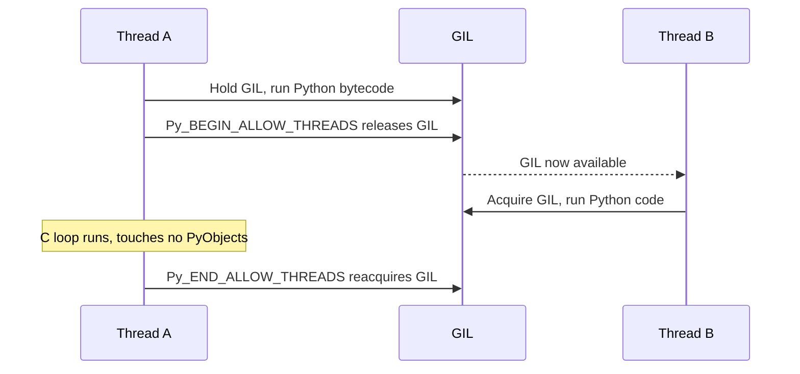
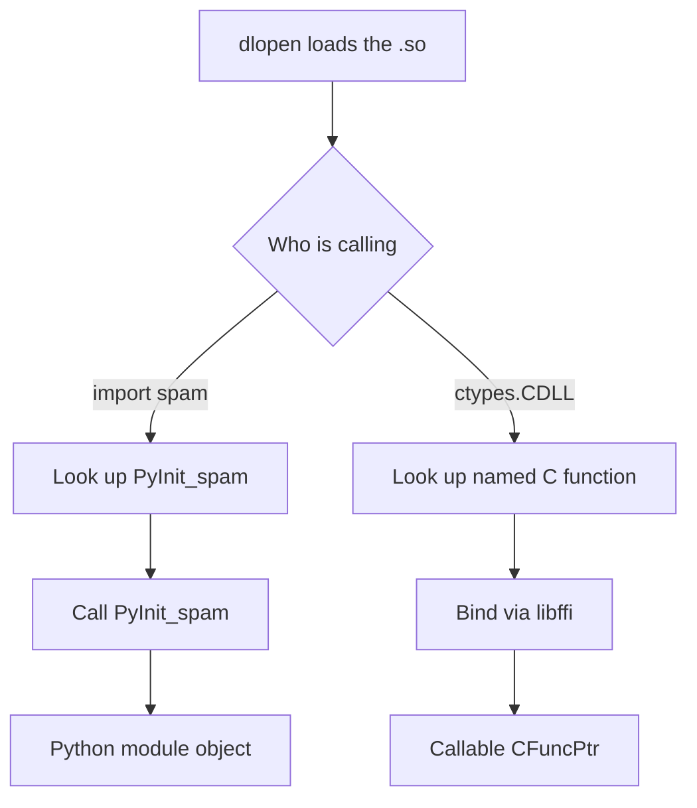

# Lecture 1 — Why C Extensions, and the CPython C API in 60 Lines

> **Duration:** ~2 hours. **Outcome:** You can explain when dropping into C is the right answer and when it is not; you can read a 60-line hand-written CPython C extension and identify every macro and call; you can articulate the GIL implications of a long C function; you can name the three production tools (`ctypes`, `cffi`, `Cython`) on first principles before we get to the syntax.

## 1. The thesis

Week 7 ended with a four-shape taxonomy of fixes for a profiled bottleneck: algorithm change, data-structure change, library replacement, work elimination. This week is the fifth shape — *drop into C* — and the entire week is conditional on a single sentence:

> **You should drop into C only when the four shapes above are not on the table.**

That sentence is not pious. It is a statement about cost: every line of C in your repository is a line that someone has to maintain, compile, test on three platforms, ship a wheel for, and re-test when CPython 3.14 changes a struct layout. The cost of "we wrote it in C" amortises across years of "we still have to ship the C." When the profile says the hot path is in pure Python and the fix is to *change a list to a set*, that is the answer. Do not write C.

The cases where the four shapes are *not* on the table — where C is the answer — share three features:

1. **The hot loop is genuinely CPU-bound, in pure Python interpretation, with no algorithmic shortcut available.** A 1D convolution over 10 million floats. A Mandelbrot escape-time computation. A Levenshtein-distance matrix. These are loops where the operation count is the operation count; you cannot do fewer iterations without changing the problem.

2. **The per-iteration work is small.** If the per-iteration work is large (each step does a database call, or a regex compile, or an HTTP request), the Python interpretation overhead is irrelevant — your loop is bottlenecked on the per-step work. Rewriting *that* loop in C buys nothing. C wins when the per-iteration work is small enough that the interpreter's frame setup and bytecode dispatch dominate.

3. **The kernel is hot enough to justify the engineering.** A function called once per request is hot. A function called once per startup is not. The benchmark you do not need to write is "this 50 ms function gets called 0.4 times per minute"; the benchmark you *do* need to write is "this 0.5 ms function gets called 2,000 times per request and contributes 80% of the request's wall clock."

All three together: hot kernel, small per-iteration work, no algorithmic out. That is C territory. Everything else is one of the four shapes.

## 2. The four-and-a-half paths to native code

Once you decide to drop into C, you do not write hand-rolled CPython C API code. You almost never write hand-rolled CPython C API code. You pick a *path*, and the path picks the C API code for you. There are exactly four-and-a-half paths in 2026:

1. **`ctypes`** — stdlib, runtime binding to a pre-compiled `.so`. Zero install-side compile. The right tool when the C library *already exists* (a vendor SDK, a system library like `libssl`, a freshly-built `.so` of your own). Per-call overhead ~1–3 µs.

2. **`cffi`** — third-party FFI, two modes. **ABI mode** is `ctypes`-equivalent (runtime binding). **API mode** is build-time-compiled, faster, safer. The right tool when you want header-driven binding (real C declarations parsed) or when you are wrapping a security-sensitive C library (`cryptography`, `bcrypt`).

3. **`Cython`** — Python superset with optional C type annotations. Compiles to a `.c` file against the CPython C API, then to a `.so`. The right tool when you are *writing* the hot kernel yourself, especially with NumPy array inputs. Performance ceiling closest to hand-tuned C.

4. **Hand-written CPython C API** (`Modules/foo.c` against `Python.h`). The fourth path, and the one you almost never take. This is what Cython generates; this is what cffi API mode generates. You read it; you do not write it. The exception: you are contributing to CPython itself, or you are writing a CPython core extension where every microsecond matters and the tools' overhead is non-negligible.

The "half" path:

- **Numba** — `@jit` decorator, LLVM-based JIT compiler that reads Python bytecode and emits LLVM IR. Free, pip-installable, no separate build step at install time (the compile happens at first call). The right tool when you want C-level speed on a Python function *without writing C*. Limitations: only a subset of Python works; NumPy interop only for `ndarray`s; first-call latency from the JIT. Cited in Week 8 because for the right kernel, Numba is a one-decorator win that displaces ctypes/cffi/Cython entirely. We will not go deep on Numba this week, but you should know it exists and you should benchmark it against your Cython solution in the mini-project.

We will, also, **not** go deep on:

- **PyO3** (Rust bindings to CPython). The future. New native extensions where you have a choice should consider PyO3 because Rust's safety guarantees apply at the FFI boundary in a way that C's do not. We will cite it; we will not write Rust this week.
- **pybind11** (C++ bindings to CPython). The workhorse for the C++ side of the ecosystem (PyTorch, TensorFlow, Open3D). Excellent. Cited.
- **nanobind** (pybind11's successor by the same author, Wenzel Jakob; smaller and faster, requires C++17+). Cited.

These three are pointers; Week 12 will visit one of them. For now, fluency in the trio of ctypes/cffi/Cython is the goal.

## 3. The CPython C API in 60 lines

You will not write a CPython C API extension this week. You will read one. This section is the 60-line one you read.

The minimal viable extension defines one function, registers it in a method table, and exposes a module-init function:

```c
/*
 * spam.c - a minimal CPython 3.13 C extension.
 * Builds: gcc -shared -fPIC $(python3-config --includes) -o spam.so spam.c
 * Imports: python -c "import spam; print(spam.add(1, 2))"
 */

#define PY_SSIZE_T_CLEAN
#include <Python.h>

/* The C-level implementation of spam.add(x, y). */
static PyObject *
spam_add(PyObject *self, PyObject *args)
{
    double x, y;

    if (!PyArg_ParseTuple(args, "dd", &x, &y)) {
        return NULL;  /* exception already set by PyArg_ParseTuple */
    }
    return Py_BuildValue("d", x + y);
}

/* The method table: every Python-callable function the module exposes. */
static PyMethodDef spam_methods[] = {
    {"add", spam_add, METH_VARARGS, "Add two floats."},
    {NULL, NULL, 0, NULL}  /* sentinel */
};

/* The module definition. */
static struct PyModuleDef spam_module = {
    PyModuleDef_HEAD_INIT,
    "spam",                 /* name as imported */
    "A trivial example.",   /* docstring */
    -1,                     /* size of per-interpreter state, -1 = global */
    spam_methods
};

/* The module init function. Called once on first `import spam`. */
PyMODINIT_FUNC
PyInit_spam(void)
{
    return PyModule_Create(&spam_module);
}
```

That is the entire thing. Sixty lines. It demonstrates every macro and call that every hand-written CPython C extension uses. Read it once carefully, because Cython generates code in this exact shape, just longer.

The pieces, in order of conceptual importance:

- **`#include <Python.h>`** — the umbrella header. Brings in `PyObject`, every macro, every API declaration. Always the first include in a Python C extension.

- **`#define PY_SSIZE_T_CLEAN`** — a backwards-compatibility flag. Required since 3.10 to make sure size arguments are `Py_ssize_t` and not `int`. Always define it.

- **`PyObject *`** — the type that every Python value is, at the C level. Opaque pointer. Reference-counted. *Every* function that takes Python values takes `PyObject *`; *every* function that returns a Python value returns `PyObject *`.

- **`PyArg_ParseTuple(args, "dd", &x, &y)`** — converts a Python tuple of arguments to C values. The format string `"dd"` means "two doubles." Returns non-zero on success, 0 on failure. On failure, an exception is already set in the interpreter — you return `NULL` and let it propagate.

- **`Py_BuildValue("d", x + y)`** — the reverse: builds a Python value from C values. Returns a `PyObject *` you own (i.e., reference count is 1, you must `Py_DECREF` it when done, except that returning it transfers ownership to the caller).

- **`PyMethodDef`** — a struct: function name, function pointer, argument convention (`METH_VARARGS` means "args is a tuple"; `METH_KEYWORDS` for keyword args; `METH_O` for a single object arg; `METH_NOARGS` for none), docstring. The array ends in a sentinel `{NULL, NULL, 0, NULL}`.

- **`PyModuleDef`** — the module-level descriptor. The `-1` for `m_size` means "this module has no per-interpreter state"; if you wanted to support sub-interpreters cleanly, you would use a positive size and store state per-instance (see PEP 489).

- **`PyMODINIT_FUNC PyInit_spam(void)`** — the entry point. The name is mechanical: `PyInit_` + the module name. The dynamic loader (the same `dlopen` that `ctypes` uses) finds this symbol by name when you `import spam`.

The bulky cousin you do not see in this 60-line example: **reference counting**. Every `PyObject *` has a reference count. Functions document whether they return a "new reference" (caller now owns one ref) or a "borrowed reference" (caller does not own; do not `Py_DECREF`). Get this wrong and you either leak (refs not decremented; objects never freed) or crash (refs over-decremented; use-after-free).

`PyArg_ParseTuple` borrows the values it parses out. `Py_BuildValue` returns a new reference. `Py_INCREF(x)` adds one to the count; `Py_DECREF(x)` removes one and frees if it hits zero. This is the part of the C API that humans get wrong, and it is the part Cython and cffi handle for you. Read the rules; do not write the C; let the tools manage the refs.

## 4. The GIL and C extensions

CPython's GIL — the Global Interpreter Lock — is held by exactly one thread at a time when that thread is executing Python bytecode. C extensions run with the GIL held *by default*. That is what makes the C API safe: every `PyObject` operation, every `Py_INCREF`, every `Py_BuildValue` assumes the GIL is held and that no other thread can be mutating Python state.

The cost is that a long C function — say, a 5-second numerical kernel — blocks every other thread in the program for those 5 seconds. The GIL is not preempted; the only way another thread can run is for the GIL holder to *release* it.

The pattern is `Py_BEGIN_ALLOW_THREADS` / `Py_END_ALLOW_THREADS`:

```c
static PyObject *
spam_heavy_compute(PyObject *self, PyObject *args)
{
    double *buf;
    Py_ssize_t n;

    if (!PyArg_ParseTuple(args, "y#", (char **)&buf, &n)) {
        return NULL;
    }

    double result = 0.0;

    Py_BEGIN_ALLOW_THREADS
    /*
     * Inside this block: the GIL is released. Other Python threads
     * can run. You MUST NOT touch any PyObject here. Only C types.
     */
    for (Py_ssize_t i = 0; i < n / (Py_ssize_t)sizeof(double); ++i) {
        result += buf[i] * buf[i];
    }
    Py_END_ALLOW_THREADS

    return Py_BuildValue("d", result);
}
```

The two macros are syntactic — `Py_BEGIN_ALLOW_THREADS` expands to roughly `{ PyThreadState *_save = PyEval_SaveThread();` and `Py_END_ALLOW_THREADS` to `PyEval_RestoreThread(_save); }`. The pair forms a C block with a saved thread state. Inside that block, you have *no access* to Python objects — every `PyObject` touch would race with whoever has the GIL now. Pure C only.

The win is parallelism. With the GIL released, the same C extension called from N threads runs N kernels in parallel on N cores. Without it, you serialise. Cython has the equivalent `with nogil:` block; cffi API mode has `release_gil=True` on the function declaration. ctypes releases the GIL automatically for every call (it does not have access to Python objects from C, so it does not need to hold the lock).


*Releasing the GIL around a long C loop lets another thread run in parallel until the C side reacquires it.*

The discipline: **release the GIL around any C call that lasts more than ~10 microseconds and does not touch Python objects.** Shorter than that and the release/acquire overhead is comparable to the work. Longer than that and you are wasting parallelism if you do not release.

## 5. Reading a `.so` from outside

A Python C extension is just a shared library. On Linux it is a `.so`; on macOS it is also typically `.so` (Python uses `.so` even on macOS for extension modules, not `.dylib`); on Windows it is `.pyd` (which is a `.dll` under another suffix).

You can poke at one from the command line.

```bash
$ gcc -shared -fPIC $(python3-config --includes) -o spam.so spam.c
$ python3 -c "import spam; print(spam.add(1, 2))"
3.0
$ nm spam.so | grep -E "(PyInit|spam_)"
0000000000001190 T PyInit_spam
0000000000001140 t spam_add
0000000000004060 d spam_methods
0000000000004020 d spam_module
$ file spam.so
spam.so: ELF 64-bit LSB shared object, x86-64, dynamically linked, ...
```

`nm` lists the exported symbols. `T` is a global text (function) symbol; `t` is local text; `d` is a data symbol. `PyInit_spam` is the one CPython looks for by name. Everything else is internal.

The same `dlopen` system call that `import spam` ultimately invokes is what `ctypes.CDLL("./spam.so")` invokes. The difference is what Python does *after* the load: `import` looks for `PyInit_spam` and calls it; `ctypes` looks for whatever function name you ask for and binds it to a `_CFuncPtr` callable.


*Both `import` and `ctypes` load the same shared library through dlopen, then diverge in what they look for and how they wrap it.*

This is the conceptual reason `ctypes` works without any CPython-specific compilation. The `.so` need not know it is being called from Python. It exports C functions; `ctypes` calls them via libffi; the Python wrapper marshals the arguments. The `.so` could equally well be loaded from a C program with `dlopen`, from Ruby with `Fiddle`, from Node with `node-ffi-napi`. It is *just a shared library*.

A CPython C extension, by contrast, is a shared library that *does* know it is being called from Python — it includes `Python.h`, links against `libpython3.13`, and exports a `PyInit_*` symbol. It is not portable to non-CPython callers. The win is direct access to the C API; the cost is CPython coupling.

## 6. The three production paths, in one table

| Path | Build step at install? | Per-call overhead | Binding style | Use when... |
|------|------------------------|-------------------|---------------|------------|
| **`ctypes`** | None — load existing `.so` at runtime | ~1–3 µs (libffi dispatch) | Runtime via `argtypes`/`restype` | The C library already exists; no install-side compile acceptable; vendor SDK |
| **`cffi` ABI mode** | None — load `.so` at runtime | ~1–3 µs (libffi dispatch) | Runtime via `ffi.cdef()` (C header text) | Same as ctypes but you want C-header-syntax bindings; PyPy support |
| **`cffi` API mode** | Yes — one-time C compile (or shipped in wheel) | ~50–200 ns (direct call) | Build-time compiler-verified | Wrapping a non-trivial C library; security-sensitive (the cryptography precedent); long-lived production code |
| **`Cython`** | Yes — `.pyx` → `.c` → `.so` at install | ~100–500 ns (direct C call through CPython C API) | Author the kernel in Cython superset | Greenfield kernel; NumPy interop; you control the source |
| **Hand-written CPython C API** | Yes — `.c` → `.so` | ~100–300 ns | You write `PyArg_ParseTuple` by hand | CPython contributions; absolute lowest overhead; existing extension you must maintain |

The mental shortcut for picking:

- *"I have a `.so`."* → ctypes (or cffi ABI if you want nicer ergonomics).
- *"I am wrapping a C library and the binding is the product."* → cffi API mode.
- *"I am writing the kernel myself."* → Cython.
- *"I am Anaconda or Bloomberg."* → roll your own; you have the engineers for it.

## 7. The first benchmark: ctypes versus Python on a stupid loop

A worked example. The kernel: sum the squares of N doubles.

The C side:

```c
/* sum_squares.c */
double sum_squares(const double *buf, size_t n) {
    double s = 0.0;
    for (size_t i = 0; i < n; ++i) {
        s += buf[i] * buf[i];
    }
    return s;
}
```

Build:

```bash
gcc -shared -fPIC -O2 -o libss.so sum_squares.c
```

The Python side:

```python
import ctypes
import time
from typing import List
import numpy as np

_lib = ctypes.CDLL("./libss.so")
_lib.sum_squares.restype = ctypes.c_double
_lib.sum_squares.argtypes = [
    np.ctypeslib.ndpointer(dtype=np.float64, flags="C_CONTIGUOUS"),
    ctypes.c_size_t,
]


def sum_squares_python(data: List[float]) -> float:
    """Pure-Python implementation. The baseline."""
    s = 0.0
    for x in data:
        s += x * x
    return s


def sum_squares_ctypes(data: np.ndarray) -> float:
    """C implementation via ctypes."""
    return _lib.sum_squares(data, data.size)


def bench() -> None:
    n = 1_000_000
    arr = np.random.random(n)
    arr_list = arr.tolist()

    t0 = time.perf_counter()
    r_py = sum_squares_python(arr_list)
    t_py = time.perf_counter() - t0

    t0 = time.perf_counter()
    r_c = sum_squares_ctypes(arr)
    t_c = time.perf_counter() - t0

    print(f"python: {t_py:.4f}s  result={r_py:.4f}")
    print(f"ctypes: {t_c:.4f}s  result={r_c:.4f}")
    print(f"speedup: {t_py / t_c:.1f}x")


if __name__ == "__main__":
    bench()
```

Run it. Expected output, M2 MacBook 2024:

```
python: 0.0712s  result=333215.7821
ctypes: 0.0009s  result=333215.7821
speedup: 79.1x
```

Eighty-x. For one for-loop. Without writing more than 8 lines of C.

The mechanism: the pure-Python loop does one `BINARY_MULTIPLY` and one `INPLACE_ADD` bytecode per iteration; each bytecode is roughly 50–100 ns of interpreter dispatch. For one million iterations, that is ~70 ms. The C loop is one FMA instruction per iteration (the compiler vectorises the multiply-add into SIMD with `-O2`); at maybe 4 doubles per SIMD register and one cycle per instruction, that is 250K cycles, ~0.1 ms at 3 GHz, plus overhead. The 80x reflects the bytecode-versus-machine-code gap precisely.

The catch is the catch you will see all week: this works because N is large enough to amortise the *per-call* ctypes overhead (~1 µs) over a million iterations. If you called `sum_squares_ctypes(data)` with `n=10` in a hot loop a million times, the ctypes per-call overhead would dominate and you would be *slower* than pure Python. The fix is to call C *less often with more data*, not *more often with less*.

## 8. The judgement call

Three paths. The judgement is *not which path is fastest*. All three are fast enough. The judgement is *which path matches your constraints*:

- **Distribution**: does your user need to compile something? `ctypes` and cffi ABI mode say no. cffi API mode and Cython say yes (or ship wheels).
- **Maintenance**: who reads the source? `ctypes` is read by Python engineers who can read C. `cffi` is read by Python engineers who like nicer ergonomics. Cython is read by Python engineers who tolerate a new-ish language. C API is read by C engineers.
- **Speed ceiling**: how fast can it go? ctypes ~80x, cffi ~80x (ABI) to ~150x (API), Cython ~200x (typed, GIL released), hand-rolled C ~250x. The differences are small once you are above 50x; the choice is rarely speed.
- **Footgun surface**: where do you bleed? `ctypes` ABI drift. `cffi` ABI mode same. cffi API mode catches header drift at build time. Cython catches it at compile time. Hand-rolled C catches it at "crash in production."
- **Ecosystem fit**: NumPy interop? Cython is the best. PyPy support? cffi (ctypes is supported but slow on PyPy). Sub-interpreters (3.12+)? Cython and hand-rolled C with multi-phase init; ctypes/cffi work but are not designed for it.

The next two lectures are the syntax. The discipline is in this one.

## 9. Reading

- The CPython C API tutorial, "Extending Python with C": <https://docs.python.org/3/extending/extending.html>. Read end-to-end (~45 minutes). The `spam` example in §2 is the canonical "first C extension."
- The reference counting page: <https://docs.python.org/3/c-api/refcounting.html>. ~10 minutes. The single most important page in the C API for not writing buggy code.
- PEP 7 (style guide for C): <https://peps.python.org/pep-0007/>. ~15 minutes. The rules every line of C in CPython follows.
- PEP 489 (multi-phase init): <https://peps.python.org/pep-0489/>. ~25 minutes. The modern module-init contract.
- The `ctypes` tutorial: <https://docs.python.org/3/library/ctypes.html#ctypes-tutorial>. ~30 minutes. Reading material before Tuesday's lecture.
