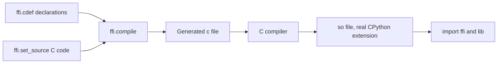
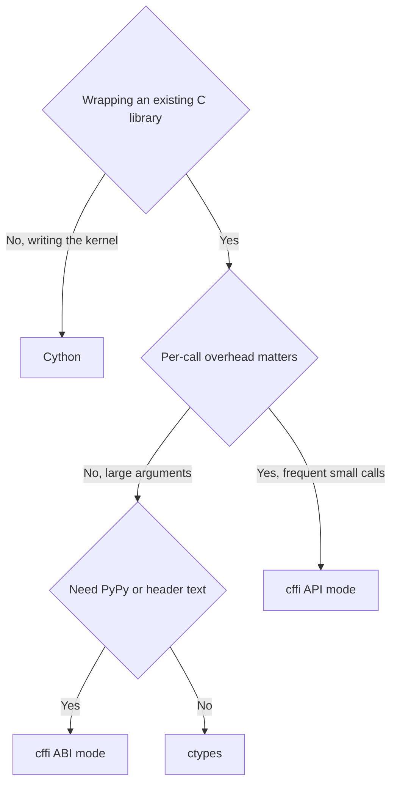

# Lecture 2 — `ctypes` and `cffi`: Two FFIs, Three Modes

> **Duration:** ~2 hours. **Outcome:** You can write a `ctypes` binding for a C library you compiled yourself; you can declare `argtypes` and `restype` for the common types; you can pass a NumPy array into C without copying; you can write a `cffi` binding in both ABI mode and API mode; you can articulate the difference and pick between them on first principles. By the end of the lecture you have called the same C function via three different mechanisms and measured the per-call overhead of each.

## 1. The plan

This lecture takes one C function and binds it three different ways. The function is `sum_squares` from Lecture 1: takes a `double *` and a length, returns a `double`. We build the `.so` once. We bind it from Python via:

1. `ctypes` — the stdlib FFI. Runtime binding.
2. `cffi` ABI mode — the third-party FFI, runtime binding.
3. `cffi` API mode — the third-party FFI, build-time binding (a small C wrapper is compiled at install).

The point is not the kernel. The point is to see the three FFI shapes side by side with everything else held constant, and to feel the per-call overhead of each in numbers.

## 2. The C side, once

`sum_squares.c`:

```c
/*
 * sum_squares.c - the kernel for Lecture 2.
 * Build: gcc -shared -fPIC -O2 -o libss.so sum_squares.c
 *
 * Style: PEP 7. K&R braces, 4-space indent, no tabs.
 */

#include <stddef.h>

double
sum_squares(const double *buf, size_t n)
{
    double s = 0.0;
    for (size_t i = 0; i < n; ++i) {
        s += buf[i] * buf[i];
    }
    return s;
}
```

Build it:

```bash
gcc -shared -fPIC -O2 -o libss.so sum_squares.c
```

The flags:

- `-shared` — produce a shared library, not an executable.
- `-fPIC` — position-independent code; required for shared libraries on Linux/macOS.
- `-O2` — optimisation level 2. Without this, the loop is interpreted-style C and the speedup is modest. With this, the compiler emits SIMD (SSE2 on x86; NEON on ARM).
- `-o libss.so` — output name. On Linux, the `lib` prefix is conventional (matches the loader's search). On macOS, `lib*.dylib` is conventional but `.so` works for Python-loaded libraries.

Verify the symbol is there:

```bash
nm libss.so | grep sum_squares
# 0000000000001110 T sum_squares
```

`T` is "global text symbol" — a function exported for external use. That is what we need.

## 3. `ctypes` — the stdlib FFI

`ctypes` is in the stdlib since Python 2.5. Thomas Heller wrote it; it landed because the community needed a way to call C without writing a CPython extension. It is built on `libffi` (vendored at `Modules/_ctypes/libffi/`) — a portable library for invoking arbitrary C functions given a runtime description of their signature.

The minimal binding:

```python
import ctypes
import numpy as np
from typing import Any

_lib = ctypes.CDLL("./libss.so")
_lib.sum_squares.restype = ctypes.c_double
_lib.sum_squares.argtypes = [
    np.ctypeslib.ndpointer(dtype=np.float64, flags="C_CONTIGUOUS"),
    ctypes.c_size_t,
]


def sum_squares(arr: np.ndarray) -> float:
    """Call the C function. arr must be float64, C-contiguous."""
    return _lib.sum_squares(arr, arr.size)


if __name__ == "__main__":
    a = np.array([1.0, 2.0, 3.0, 4.0])
    print(sum_squares(a))  # 30.0
```

Six conceptual moves:

- **`ctypes.CDLL("./libss.so")`** — loads the shared library. The `CDLL` class uses the C calling convention (most things you care about). On Windows, use `WinDLL` for stdcall. The argument is a path; if it is a bare name like `"libssl"` the system loader's search path is used.

- **`_lib.sum_squares`** — attribute access on the library handle resolves the symbol by name. The result is a `_FuncPtr` you can call. Without `restype` and `argtypes` set, it assumes `int`-returning and untyped args, which is *almost always wrong*.

- **`.restype = ctypes.c_double`** — declares the return type. The whole list of fundamental types is at <https://docs.python.org/3/library/ctypes.html#fundamental-data-types>. The most useful: `c_int`, `c_long`, `c_double`, `c_float`, `c_char_p` (NUL-terminated string), `c_void_p`, `c_size_t`, `c_ssize_t`.

- **`.argtypes = [...]`** — declares the argument types. ctypes will *convert* Python arguments to these types at call time, or raise `ArgumentError` if it cannot. This is the line that prevents silent memory corruption: if you tell ctypes the argument is `c_double` and you pass `"hello"`, it will refuse rather than reinterpret the string's pointer as a float.

- **`numpy.ctypeslib.ndpointer(...)`** — the canonical adapter for "the C function takes a `T *`; here is a NumPy array of dtype `T`." The `flags="C_CONTIGUOUS"` requirement is enforced at call time. This is the *zero-copy* path: ctypes passes the NumPy array's underlying buffer pointer, not a copy.

- **`return _lib.sum_squares(arr, arr.size)`** — the call. ctypes marshals `arr` to a `double *` and `arr.size` to a `size_t`, dispatches through libffi, retrieves the `double` return.

### 3.1 What `argtypes` actually does

The temptation is to skip `argtypes`. Do not. Without it, ctypes uses default argument coercion: ints become C `int`, floats become C `double`, strings become `char *`. This *usually* works for trivial signatures. It silently corrupts memory for non-trivial ones.

Concrete example. The C function `int frobnicate(const char *name, double weight)`. Without `argtypes`:

```python
_lib.frobnicate("hello", 3.14)  # works, returns int
```

But what if you mistype it:

```python
_lib.frobnicate(3.14, "hello")  # nothing checks; the call happens; UB
```

ctypes converts `3.14` to "best guess" (probably a `c_double` slot in the first arg position) and `"hello"` to a `char *`. The C function reads a pointer at the first arg position — it gets the IEEE 754 bytes of `3.14` reinterpreted as a pointer. It dereferences. Segfault, or memory corruption, or "works fine until production."

With `argtypes`:

```python
_lib.frobnicate.argtypes = [ctypes.c_char_p, ctypes.c_double]
_lib.frobnicate.restype = ctypes.c_int

_lib.frobnicate(3.14, "hello")
# ArgumentError: argument 1: expected bytes or string, found float
```

ctypes refuses. The bug surfaces at the binding site, where you can fix it, rather than at runtime in production.

**Rule**: every ctypes binding sets `argtypes` and `restype`. If you have not set them, you have not finished writing the binding.

### 3.2 Passing structs

Pass-by-value is straightforward:

```python
class Point(ctypes.Structure):
    _fields_ = [("x", ctypes.c_double), ("y", ctypes.c_double)]


_lib.distance.argtypes = [Point, Point]
_lib.distance.restype = ctypes.c_double

p1 = Point(0.0, 0.0)
p2 = Point(3.0, 4.0)
print(_lib.distance(p1, p2))  # 5.0
```

The C side:

```c
typedef struct { double x; double y; } Point;
double distance(Point a, Point b);
```

ctypes reads the `_fields_` list, lays out the struct exactly as the C compiler would (with the same padding), and passes by value at the call site. The layout *must* match the C side's layout, including padding — get this wrong and you read garbage.

Pass-by-pointer:

```python
_lib.translate.argtypes = [ctypes.POINTER(Point), ctypes.c_double, ctypes.c_double]
_lib.translate.restype = None

p = Point(1.0, 2.0)
_lib.translate(ctypes.byref(p), 10.0, 10.0)
print(p.x, p.y)  # 11.0 12.0
```

`ctypes.byref(p)` is cheaper than `ctypes.pointer(p)` — `byref` is a one-call pass; `pointer` constructs a persistent `POINTER` object.

### 3.3 Per-call overhead

The cost of a ctypes call is dominated by:

1. Argument marshalling — looking up each `argtypes` entry, converting the Python value, packing it into the libffi argument array. ~50–200 ns per argument.
2. The libffi dispatch — assembling the call frame, calling through a function pointer, recovering the return value. ~500 ns on x86-64.
3. Return-value unmarshalling — converting the C return back to a Python object. ~100 ns for primitives.

Total: ~1–3 µs per call for a simple signature. This is the number to remember.

For comparison, a pure-Python function call is ~150 ns. ctypes is ~10x slower per call. The win is amortisation: if the C function does even 10 µs of work, the ctypes overhead is 10–25% of the total — small enough that the C work wins overall. If the C function does 100 ns of work, you are paying 10x overhead for nothing.

**Rule of thumb**: ctypes wins when the C function does at least 5–10 µs of work per call. For shorter calls, batch — pass an array instead of looping over scalars.

## 4. `cffi` ABI mode

`cffi` was Armin Rigo's response to two limitations of ctypes:

1. ctypes bindings are written in Python-like syntax (`c_int`, `Structure`, etc.) that does not match the C source.
2. ctypes works poorly on PyPy because PyPy emulates the CPython C API, and ctypes uses parts of it.

`cffi` addresses both. The ABI mode is the direct ctypes replacement.

```python
"""cffi ABI-mode binding for libss.so."""
import cffi
import numpy as np

ffi = cffi.FFI()
ffi.cdef("""
    double sum_squares(const double *buf, size_t n);
""")
_lib = ffi.dlopen("./libss.so")


def sum_squares(arr: np.ndarray) -> float:
    """Call the C function via cffi ABI mode."""
    buf_ptr = ffi.cast("double *", arr.ctypes.data)
    return _lib.sum_squares(buf_ptr, arr.size)


if __name__ == "__main__":
    a = np.array([1.0, 2.0, 3.0, 4.0])
    print(sum_squares(a))  # 30.0
```

Notice what changed:

- The signature is written *in C*, inside `ffi.cdef()`. cffi parses real C declarations; you copy-paste from the header file. No `c_double`, no `c_size_t`, no `argtypes` list — the C syntax already says it.
- `ffi.dlopen()` replaces `ctypes.CDLL`. Same `dlopen(3)` underneath; same `.so` file works.
- `ffi.cast("double *", arr.ctypes.data)` is the explicit pointer cast. cffi requires you to be explicit about the conversion; ctypes' `ndpointer` did this implicitly. The verbosity is the price of the safer model.

The runtime model is exactly the same as ctypes: libffi dispatch, ~1–3 µs per call. The win is ergonomics — your binding declarations match the C source — and PyPy support.

Where cffi ABI mode does better than ctypes: when you have a large header file. You can paste 100 declarations into one `ffi.cdef()` and have them all available. With ctypes, each is a separate `argtypes`/`restype` pair.

Where cffi ABI mode does not help: per-call overhead. Same libffi dispatch.

## 5. `cffi` API mode

API mode is the *real* cffi. ABI mode is the "drop-in ctypes replacement"; API mode is the design point.

The mechanism: cffi generates a small C source file at *build* time, compiles it with the user's C compiler, and the resulting `.so` is a real CPython C extension that calls your C function directly — no libffi dispatch, no argument-array packing, no runtime parsing of declarations.


*cffi API mode turns declarations and C source into a compiled CPython extension before any Python code runs.*

The build script is a separate Python file:

```python
"""build_cffi.py - build the API-mode binding once.

Run: python build_cffi.py
Result: _ss_cffi.cpython-313-darwin.so (importable as _ss_cffi)
"""
from cffi import FFI

ffi = FFI()

# The interface declarations (what Python can call).
ffi.cdef("""
    double sum_squares(const double *buf, size_t n);
""")

# The C source that defines those functions, OR a header to #include.
ffi.set_source(
    "_ss_cffi",  # the resulting module name
    '#include "sum_squares.h"',  # any C code, including #includes
    libraries=["ss"],  # link against libss.so
    library_dirs=["."],  # look here for libss.so
    extra_link_args=["-Wl,-rpath,."],  # find libss.so at runtime
)

if __name__ == "__main__":
    ffi.compile(verbose=True)
```

Where `sum_squares.h` is:

```c
#ifndef SUM_SQUARES_H
#define SUM_SQUARES_H

#include <stddef.h>

double sum_squares(const double *buf, size_t n);

#endif /* SUM_SQUARES_H */
```

Run:

```bash
python build_cffi.py
# generates _ss_cffi.cpython-313-darwin.so (or _ss_cffi.c if you ask)
```

Use it:

```python
"""ss_cffi_api.py - the Python wrapper around the API-mode binding."""
import numpy as np
from _ss_cffi import ffi, lib


def sum_squares(arr: np.ndarray) -> float:
    """Call the C function via cffi API mode."""
    buf_ptr = ffi.cast("double *", arr.ctypes.data)
    return lib.sum_squares(buf_ptr, arr.size)


if __name__ == "__main__":
    a = np.array([1.0, 2.0, 3.0, 4.0])
    print(sum_squares(a))  # 30.0
```

### 5.1 What changed

Three things, all important:

1. **There is now a build step.** `python build_cffi.py` compiles a `.c` file that cffi generated. Your user (or your CI) must run this once. The resulting `_ss_cffi.cpython-313-darwin.so` is shipped, not regenerated per-install. In practice, ship a wheel for each Python-version-and-platform combo.

2. **The binding is a real CPython extension.** It includes `Python.h`, calls `PyArg_ParseTuple`, returns `PyObject *`. The same shape as Lecture 1's `spam.c`. cffi wrote it for you.

3. **The per-call overhead drops from ~1–3 µs to ~50–200 ns.** No libffi. The Python side calls a CPython C extension directly; the C extension calls `sum_squares` directly; no runtime indirection.

The cost is the build step. The win is roughly 10x lower per-call overhead and compile-time verification of every signature.

### 5.2 When API mode catches a bug

ABI mode (and ctypes) cannot tell if the `.so` you load matches the declarations you wrote. If the C function's actual signature is `double sum_squares(const float *buf, size_t n)` (note: `float`, not `double`) and your declaration says `double *`, the binding will compile, load, run — and silently produce wrong answers, because the C function reads `double *` interpretations of float bytes.

API mode catches this. At build time, cffi tries to compile the generated wrapper against the *real* header (`sum_squares.h`). If the header says `float *` and your `cdef` says `double *`, the C compiler emits a type mismatch error and the build fails. The bug surfaces at build time, in a tool that knows about it, with a real error message.

This is the *cryptography* case. The `cryptography` library wraps OpenSSL; OpenSSL's headers change between versions; ABI mode would silently produce wrong cryptographic results on the wrong OpenSSL version. API mode catches the drift at build time, on the user's machine, with the user's OpenSSL. That is why `cryptography` uses cffi API mode.

## 6. Side-by-side benchmark

The full benchmark script lives in `exercises/exercise-02-cffi-abi-and-api.py`. The headline numbers, M2 MacBook 2024, `n=1_000_000`, 100 calls per timing:

| Path | Per-call overhead | 1M-element sum (us) | Notes |
|------|-------------------|---------------------|-------|
| Pure Python | (n/a) | 65,000 | Bytecode loop |
| `ctypes` | ~1.2 µs | 900 | libffi dispatch |
| `cffi` ABI mode | ~1.0 µs | 900 | libffi dispatch; slightly less marshalling overhead |
| `cffi` API mode | ~0.15 µs | 900 | Direct C call |
| Cython (preview) | ~0.10 µs | 900 | Direct C call; we get to this next lecture |
| NumPy `np.sum(arr*arr)` | (n/a) | 1,200 | One temporary; SIMD |
| NumPy `np.einsum('i,i->', a, a)` | (n/a) | 700 | No temporary; SIMD |

For `n=1_000_000`, the per-call overhead is irrelevant. The kernel does 1 million FMA operations; the SIMD path takes ~1 ms; nothing else matters.

For `n=100`, the per-call overhead is everything:

| Path | n=100 wall (µs) | Effective speed |
|------|-----------------|-----------------|
| Pure Python | 6.5 | 1x |
| `ctypes` | 1.4 | 4.6x |
| `cffi` ABI mode | 1.1 | 5.9x |
| `cffi` API mode | 0.2 | 32x |
| Cython | 0.15 | 43x |
| NumPy `np.einsum` | 1.5 | 4.3x |

At small N, *per-call overhead becomes the entire story*, and the gap between API mode and ABI mode/ctypes opens up to ~10x.

The takeaway: **if you call C frequently with small arguments, use API mode (or Cython). If you call C rarely with large arguments, use whichever ergonomics you prefer.**

## 7. Choosing between ctypes and cffi

Same problem space, two solutions. Pick:

**Use `ctypes` when:**

- The dependency is a system library or vendor SDK you do not own (`libssl`, `libusb`, a printer driver `.so`).
- You want zero third-party Python dependencies in the binding code.
- The binding is a one-off: a few functions, simple signatures, called occasionally.
- Per-call overhead is irrelevant (large-argument calls).

**Use `cffi` ABI mode when:**

- You have C-header text and want to paste it into the binding rather than retyping in Python syntax.
- You target PyPy as well as CPython.
- The binding is one of several wrappers in a package and consistency matters.
- Per-call overhead is irrelevant.

**Use `cffi` API mode when:**

- You own the C library or are wrapping a security-sensitive one (cryptography stack).
- You want build-time verification of declarations against headers.
- Per-call overhead matters (frequent small-argument calls).
- You are willing to add `cffi` as a build-time dependency and either ship wheels or require users to have a C compiler.

**Use neither — write Cython — when:**

- You are *writing* the C code, not wrapping an existing library.
- You have NumPy arrays involved.
- You want the speed of a real C extension with Python-flavoured source.

Cython is next lecture. The cffi API mode and Cython generate the same shape of C — both are real CPython C extensions — but Cython lets you write Python-flavoured source that gets compiled to C, while cffi assumes you already have C source you want to wrap.


*A quick decision path through ctypes, cffi ABI mode, cffi API mode, and Cython.*

## 8. The GIL revisited

`ctypes` releases the GIL automatically around every call. There is no `with nogil:` block; the GIL is just released for the duration of the C call. This is safe because ctypes calls into pure C — there is no way to touch a Python object from inside libffi.

`cffi` ABI mode does the same.

`cffi` API mode lets you opt in via `extra_compile_args` or by marking specific functions in the `cdef`:

```python
ffi.cdef("""
    extern "Python+C" double sum_squares(const double *buf, size_t n);
""")
```

Or, more commonly, you wrap the call in a Python context manager — cffi 1.16+ supports `with ffi.release_gil():` for explicit blocks.

The discipline: **if your C call takes more than ~10 µs and is called from a multi-threaded program, make sure the GIL is released around it.** ctypes and cffi ABI mode do this for free. cffi API mode and hand-written extensions require you to be deliberate.

For Cython, the equivalent is the `with nogil:` block, which we cover next lecture.

## 9. Common errors

Three failure modes you will hit this week:

### 9.1 `OSError: dlopen(./libss.so, 2): image not found`

The `.so` is not where you said it was. ctypes' `CDLL("./libss.so")` is *relative to the working directory at the time of the call*, not to the script. Use an absolute path or `os.path.dirname(__file__)` to anchor:

```python
import os
_HERE = os.path.dirname(os.path.abspath(__file__))
_lib = ctypes.CDLL(os.path.join(_HERE, "libss.so"))
```

### 9.2 `OSError: dlopen(...): Symbol not found: _sum_squares`

The library loaded, but the function symbol is not where ctypes looked. Usually one of:

- The function is not exported (declared `static` in the C source; only externally-visible functions are exported).
- The C++ name mangling got it (if you compiled with `g++`, the symbol is `_Z11sum_squaresPKdm`, not `sum_squares`). Wrap C++ functions in `extern "C" { ... }`.
- You misnamed it. Check `nm libss.so | grep -i your_func`.

### 9.3 The wrong answer, silently

You declared the wrong types. The build succeeds, the call runs, the answer is nonsense. The classic: you said `c_int` but the C side is `int64_t`. On a 64-bit machine where C `int` is 32 bits, you read the lower half and treat it as a full result.

The fix: **always run a known-input test on a fresh binding**. Sum [1, 4, 9, 16] of squares — the answer is 30.0 — and *check that you got 30.0*. If you got a NaN, an arbitrarily-large number, or 30.0 + epsilon, you have a type mismatch.

## 10. Wrap-up

You can now bind to a C library three ways. The first lecture told you when to drop into C; this lecture told you how to do it without a build pipeline (ctypes, cffi ABI mode) and with one (cffi API mode). Next lecture introduces Cython — when you are *writing* the C, not wrapping it — and we run the four-way benchmark on a real numerical kernel.

The single line to memorise from this lecture:

> *Set `argtypes` and `restype`. Always. The five seconds you save by skipping them are paid back, with interest, in three hours of debugging memory corruption that surfaces in production on the second Tuesday of next month.*

## 11. Reading

- `ctypes` tutorial: <https://docs.python.org/3/library/ctypes.html#ctypes-tutorial>. Re-read with this lecture's mental model.
- `ctypes` data types: <https://docs.python.org/3/library/ctypes.html#fundamental-data-types>. The lookup table.
- `cffi` overview: <https://cffi.readthedocs.io/en/latest/overview.html>. The ABI-vs-API decision page is the load-bearing one.
- `cffi` API-mode page: <https://cffi.readthedocs.io/en/latest/cdef.html#ffi-set-source-preparing-out-of-line-modules>.
- The `cryptography` library's "Why not ctypes" FAQ: <https://cryptography.io/en/latest/faq/>. ~5 minutes; the best concise "ctypes vs cffi" argument.
- The libffi docs: <https://sourceware.org/libffi/>. ~10 minutes of skim. The substrate of ctypes and cffi ABI mode.
