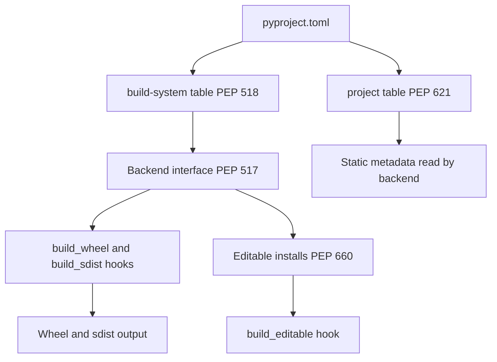

# Lecture 1 — The Four PEPs and `pyproject.toml`

> **Duration:** ~2 hours. **Outcome:** You can cite PEP 517, 518, 621, and 660 by number and explain what each one defines. You can write a complete `pyproject.toml` from scratch and validate it parses. You can read a real-project `pyproject.toml` and identify every section.

## 1. The thesis: one declarative file

In 2017 the Python packaging ecosystem looked like this. A library shipped a `setup.py` (executable Python code that called `setuptools.setup(...)`), a `setup.cfg` (declarative key-value config that `setup.py` could optionally consume), a `MANIFEST.in` (lines like `recursive-include src *.py` to tell sdist what to include), a `requirements.txt` (the runtime dependencies, sometimes), a `dev-requirements.txt` (the test/lint/build dependencies, sometimes), a `Makefile` or `tox.ini` (the runner), and — if it was unlucky — a `pip.conf` and a `versioneer.py` somewhere too. The number of files was not the problem. The problem was that *the configuration was not declarative*. `setup.py` is Python code; running it could do anything; `pip` had to *execute* it to learn the package's metadata, which meant `pip` had to install setuptools first, which meant a bootstrap loop, which meant special cases everywhere.

In 2026 a library ships a `pyproject.toml`. That is the entire required configuration. `setup.py` is allowed but optional; `setup.cfg` is allowed but rarely useful; `MANIFEST.in` is allowed but most backends do not need it; `requirements.txt` is replaced by `[project.dependencies]` and a lockfile (`uv.lock` or equivalent); the runner config (`tox`, `nox`, `pytest`) lives in `pyproject.toml`'s `[tool.*]` tables. *One file. Declarative. Static. Parseable without executing any code.*

The four PEPs that made this possible are PEP 517, 518, 621, and 660. They were not invented as a set; they accreted over six years (2015–2021) as the community converged on the architecture. The architecture is: a small *interface* (PEP 517) that `pip` or `uv` calls into; a *manifest* (PEP 518) that says which build backend implements that interface; a *metadata schema* (PEP 621) that the backend reads from `pyproject.toml`; and an *editable-install protocol* (PEP 660) that makes the development workflow work in the same model. This lecture walks the four PEPs in that order, then walks the resulting `pyproject.toml` shape.


*How the four PEPs fit together around one pyproject.toml file.*

You can read all four end-to-end in about 90 minutes. We will not do that here. We will read the *interesting* parts.

## 2. PEP 517 — the build-system interface

PEP 517, "A build-system independent format for source trees" (Brett Cannon, Nathaniel Smith, 2015): <https://peps.python.org/pep-0517/>.

The motivating problem. `pip install foo` from source requires `pip` to (1) get setuptools running, (2) ask setuptools to build a wheel, (3) install the wheel. Step 1 is the bootstrap loop — `pip` has to install setuptools before it can build anything, and setuptools is itself a package that gets installed. Step 2 means `pip` has to know about setuptools's API specifically. There is no way to use a different build backend (Flit, hatchling, poetry-core, ...) without `pip` learning each one.

The solution. Define a *standard interface* a build backend must implement, and let `pip` invoke any backend through that interface. The interface is a Python module with three required and several optional hook functions:

```python
# in any PEP 517 backend module, e.g. hatchling.build:

def build_wheel(
    wheel_directory: str,
    config_settings: dict[str, str] | None = None,
    metadata_directory: str | None = None,
) -> str:
    """Build a wheel, return its filename."""

def build_sdist(
    sdist_directory: str,
    config_settings: dict[str, str] | None = None,
) -> str:
    """Build an sdist, return its filename."""

def prepare_metadata_for_build_wheel(
    metadata_directory: str,
    config_settings: dict[str, str] | None = None,
) -> str:
    """Optional. Compute just the metadata for a fast no-build install."""

def get_requires_for_build_wheel(
    config_settings: dict[str, str] | None = None,
) -> list[str]:
    """Optional. Extra build deps beyond [build-system].requires."""
```

`pip` invokes these by importing the module specified in `[build-system].build-backend` in `pyproject.toml`, then calling `build_wheel(...)`. The backend can be anything: setuptools, hatchling, flit-core, pdm-backend, poetry-core, uv_build, or a fresh backend you write tomorrow. The frontend (`pip`, `uv`, `build`) does not know which backend it is calling.

The PEP also defines the *invocation model*: the backend runs in an *isolated* Python environment, separate from your project's runtime environment. `pip` creates a temporary venv, installs `[build-system].requires`, imports `[build-system].build-backend`, and calls the hook. This is why a project's build-time deps and run-time deps are tracked separately and why "I have an old setuptools in my venv" cannot break a fresh build.

PEP 660 (covered in §5) adds two more hooks to this same interface for editable installs: `build_editable` and `get_requires_for_build_editable`.

That is PEP 517 in 300 words. The interface PEP. Read the full text once for the formal contract — particularly §"Build environment" and §"Mandatory hooks." It is short for a PEP (about 4,000 words) and is the architectural foundation of everything else.

## 3. PEP 518 — the `[build-system]` table

PEP 518, "Specifying minimum build system requirements for Python projects" (Brett Cannon, Nick Coghlan, Donald Stufft, Nathaniel Smith, 2016): <https://peps.python.org/pep-0518/>.

PEP 518 is the smaller PEP that introduced the `pyproject.toml` file itself, but only for one purpose: to declare which build backend a project uses and what its build-time dependencies are. The table:

```toml
[build-system]
requires = ["hatchling >= 1.27", "hatch-vcs >= 0.4"]
build-backend = "hatchling.build"
```

Two keys. `requires` is a list of PEP 508-style dependency specifiers that `pip` installs into the isolated build environment before invoking the backend. `build-backend` is the dotted module path `pip` imports to get the PEP 517 hooks. That is it. PEP 518 is the *delivery vehicle* for `pyproject.toml`; PEP 517 specifies the *interface* the table refers to.

Why a new file format? The PEP discusses the alternatives — extending `setup.cfg`, inventing a new `Pyproject` Python script, etc. — and arrived at TOML because (a) TOML is *not Python* (it is purely declarative; parsing cannot execute code), (b) TOML is human-writable, (c) TOML has a single defined parser per ecosystem (`tomllib` since Python 3.11, vs. the YAML zoo of parsers), and (d) Rust and many other ecosystems were already using TOML (`Cargo.toml`). The choice has aged well; in 2026, every active Python project's `pyproject.toml` parses with the same `tomllib`.

The build isolation rule. PEP 518 mandates that the build run in an *isolated* environment unless explicitly opted out. The practical effect: you cannot accidentally rely on a package installed in your project's main environment to influence the build. The downside: every build runs `pip install hatchling` afresh — slow for first build, but cached after. Modern tooling (`uv`, `pip`'s wheel cache) makes this fast enough that nobody notices.

## 4. PEP 621 — the `[project]` table

PEP 621, "Storing project metadata in pyproject.toml" (Brett Cannon, Dustin Ingram, Pradyun Gedam, Sébastien Eustace, Thomas Kluyver, 2020): <https://peps.python.org/pep-0621/>.

PEP 518 gave us a place to declare the *build* config. PEP 621 gave us a place to declare the *package* metadata. Before 2020, every backend defined its own metadata schema — setuptools used `setup.py` arguments (or, later, `setup.cfg` keys), flit used `[tool.flit.metadata]`, poetry used `[tool.poetry]`. Moving between backends meant rewriting the metadata. PEP 621 standardised it.

The minimal `[project]` table:

```toml
[project]
name = "convoltools"
version = "0.3.1"
description = "1D convolution kernels for time-series data."
readme = "README.md"
requires-python = ">= 3.11"
license = "MIT"
authors = [
    { name = "Ada Lovelace", email = "ada@example.org" },
]
keywords = ["signal-processing", "convolution"]
classifiers = [
    "Development Status :: 4 - Beta",
    "Programming Language :: Python :: 3",
    "Programming Language :: Python :: 3.11",
    "Programming Language :: Python :: 3.12",
    "Programming Language :: Python :: 3.13",
    "License :: OSI Approved :: MIT License",
    "Operating System :: OS Independent",
]
dependencies = [
    "numpy >= 1.26",
    "typing-extensions >= 4.7; python_version < '3.12'",
]

[project.optional-dependencies]
test = ["pytest >= 7", "pytest-cov >= 5"]
dev = ["ruff >= 0.5", "mypy >= 1.10"]

[project.scripts]
convoltools-cli = "convoltools.cli:main"

[project.urls]
Homepage = "https://github.com/example/convoltools"
Documentation = "https://convoltools.readthedocs.io"
Issues = "https://github.com/example/convoltools/issues"
```

A close reading. **`name`** is the distribution name on PyPI (case-normalised per PEP 503; `My_Package`, `my-package`, and `my.package` are equivalent). **`version`** is a PEP 440 version string. If you derive the version from git tags via `setuptools_scm` or `hatch-vcs`, omit this key and add `dynamic = ["version"]` instead (we will use this pattern in the mini-project). **`description`** is a single-line summary (shows up on PyPI's index page). **`readme`** is either a filename string or a table `{ file = "README.md", content-type = "text/markdown" }`. **`requires-python`** is a PEP 440 version specifier that constrains the Python interpreters a wheel can install on; `pip` enforces it.

**`license`**. As of PEP 639 (adopted late 2024), the modern form is a SPDX expression: `license = "MIT"`, `license = "Apache-2.0"`, `license = "MIT OR Apache-2.0"`. The legacy `license = { file = "LICENSE" }` and `license = { text = "MIT" }` still work but are discouraged. SPDX expressions are validated by tooling; the table form is not. Cite PEP 639: <https://peps.python.org/pep-0639/>.

**`authors`** and **`maintainers`** are lists of `{ name, email }` tables. Either field is optional, but `authors` is conventional.

**`keywords`** is a list of search terms; PyPI uses them for its search index. **`classifiers`** are from <https://pypi.org/classifiers/> — a controlled vocabulary. The most commonly needed: a Development Status (1-Planning through 6-Mature), the supported Python versions (one per minor version you test), an OSI-approved license classifier (still required even with PEP 639 SPDX, for now), and at minimum one Operating System classifier. The classifier list is short and worth bookmarking.

**`dependencies`** is a list of PEP 508 strings. Each string is `name [extras] specifier [; marker]`. Examples: `numpy >= 1.26`, `httpx[http2] >= 0.27`, `typing-extensions >= 4.7; python_version < '3.12'`. The marker syntax is rich (see PEP 508 §"Environment Markers") and lets you express platform-conditional deps. Cite PEP 508: <https://peps.python.org/pep-0508/>.

**`[project.optional-dependencies]`** declares "extras" — named groups of optional deps activated by `pip install convoltools[test]`. The convention is to ship at least `test` (the dev install for running the test suite) and `dev` (everything for local development).

**`[project.scripts]`** declares CLI entry points. `convoltools-cli = "convoltools.cli:main"` means: when the package is installed, `pip` installs a `convoltools-cli` script in the venv's `bin/` directory whose body is roughly `from convoltools.cli import main; sys.exit(main())`. The format is `entry-name = "module.path:callable"`. The script is platform-appropriate (POSIX shell on Linux/macOS; `.exe` shim on Windows). For GUI entry points (no console window on Windows) use `[project.gui-scripts]`.

**`[project.urls]`** is a free-form dict of label → URL. PyPI's project page renders these in the sidebar. Conventional labels: `Homepage`, `Documentation`, `Issues`, `Changelog`, `Source`, `Funding`. They are not required, but a project page without them looks unfinished.

The full PEP 621 field list also includes:

- **`dynamic`** — a list of metadata fields the backend will fill in dynamically. If `version` comes from `setuptools_scm`, set `dynamic = ["version"]` and omit `version` from the static table. Other commonly-dynamic fields: `description` (from a docstring), `readme` (when the backend reads it from a file path).
- **`dependencies` markers** — PEP 508 environment markers let you condition deps on `python_version`, `sys_platform`, `os_name`, `platform_machine`, and a handful of others. `numpy >= 1.26; python_version >= "3.13"` means "only on 3.13+." The full marker grammar is at <https://peps.python.org/pep-0508/#environment-markers>.

Read the full PEP 621 once; it is the metadata reference you go back to whenever you forget what `dynamic` means or whether `keywords` is a list or a string.

## 5. PEP 660 — editable installs

PEP 660, "Editable installs for pyproject.toml based builds (wheel based)" (Stefan Hoelzl, Brett Cannon, 2021): <https://peps.python.org/pep-0660/>.

The problem PEP 660 solves. Before PEP 517, `pip install -e .` worked through `setup.py develop`, a setuptools-specific command that installed a `.egg-info` directory pointing at the source tree. The result: edit a `.py` file in your source tree, the change is immediately visible to any process that imports the package. Essential for development.

PEP 517 deprecated `setup.py`-based workflows but did not initially define editable installs. For about three years (2018–2021), editable installs in the PEP 517 world were unstandardised — every backend handled them differently, some not at all. PEP 660 fixed this.

The PEP adds two hooks to the PEP 517 interface:

```python
def build_editable(
    wheel_directory: str,
    config_settings: dict[str, str] | None = None,
    metadata_directory: str | None = None,
) -> str:
    """Build an *editable* wheel. Same signature as build_wheel."""

def get_requires_for_build_editable(
    config_settings: dict[str, str] | None = None,
) -> list[str]:
    """Optional. Extra build deps for editable installs."""
```

The output of `build_editable` is a wheel — same file format as a regular wheel — that, when installed, makes the source tree available for import without copying the source into `site-packages`. The mechanism is backend-specific (some backends use a `.pth` file that adds the source directory to `sys.path`; some use a custom `__init__.py` "loader" file; some use an import hook), but the *interface* and the *artifact format* are standardised.

The practical implication. In 2026, `pip install -e .` works for every PEP 517-compliant backend that implements PEP 660. As of early 2026, that is **all major backends** — setuptools, hatchling, flit-core, pdm-backend, poetry-core. The legacy "editable install requires setuptools" rule is gone; you can `pip install -e .` a hatchling-built project and edit-and-reload normally.

The one footgun: some backends produce a "strict" editable install (only the exact files declared in `pyproject.toml` are visible, not arbitrary files you add later) and some produce a "lax" one (everything in the source tree is visible). Hatchling defaults to lax via `[tool.hatch.build.targets.wheel].dev-mode-dirs`; setuptools defaults to strict. Read your backend's docs once to confirm which.

## 6. The full `pyproject.toml`, annotated

Here is a complete `pyproject.toml` for a hypothetical pure-Python library called `convoltools`. Every line is annotated.

```toml
# pyproject.toml - convoltools 0.3.1
# Backend: hatchling. Version: derived from git tags via hatch-vcs.

[build-system]
# PEP 518: tells pip what to install in the build environment.
requires = ["hatchling >= 1.27", "hatch-vcs >= 0.4"]
# PEP 517: tells pip which module to import for the hooks.
build-backend = "hatchling.build"

[project]
# PEP 621: the metadata table.
name = "convoltools"
# version is "dynamic" because hatch-vcs derives it from git tags.
dynamic = ["version"]
description = "1D convolution kernels for time-series data."
readme = "README.md"
requires-python = ">= 3.11"
license = "MIT"
authors = [
    { name = "Ada Lovelace", email = "ada@example.org" },
]
keywords = ["signal-processing", "convolution"]
classifiers = [
    "Development Status :: 4 - Beta",
    "Intended Audience :: Developers",
    "Intended Audience :: Science/Research",
    "License :: OSI Approved :: MIT License",
    "Operating System :: OS Independent",
    "Programming Language :: Python :: 3",
    "Programming Language :: Python :: 3.11",
    "Programming Language :: Python :: 3.12",
    "Programming Language :: Python :: 3.13",
    "Topic :: Scientific/Engineering",
]
dependencies = [
    "numpy >= 1.26",
]

[project.optional-dependencies]
test = [
    "pytest >= 7",
    "pytest-cov >= 5",
    "hypothesis >= 6.100",
]
dev = [
    "ruff >= 0.5",
    "mypy >= 1.10",
    "convoltools[test]",
]

[project.scripts]
convoltools-cli = "convoltools.cli:main"

[project.urls]
Homepage = "https://github.com/example/convoltools"
Documentation = "https://convoltools.readthedocs.io"
Issues = "https://github.com/example/convoltools/issues"
Changelog = "https://github.com/example/convoltools/blob/main/CHANGELOG.md"

# Backend-specific tables follow. These are NOT standardised across backends;
# the [tool.hatch.*] keys are valid only for hatchling.

[tool.hatch.version]
# Tell hatch-vcs to read the version from git tags.
source = "vcs"

[tool.hatch.build.targets.wheel]
# Where the package source lives. Hatch uses "src layout" by default.
packages = ["src/convoltools"]

[tool.hatch.build.targets.sdist]
# What to include in the source distribution.
include = [
    "/src",
    "/tests",
    "/CHANGELOG.md",
    "/README.md",
    "/LICENSE",
    "/pyproject.toml",
]

# Tool configs - not part of PEP 621 but ride in pyproject.toml by convention.

[tool.ruff]
line-length = 100
target-version = "py311"

[tool.mypy]
strict = true
python_version = "3.11"

[tool.pytest.ini_options]
testpaths = ["tests"]
```

Eighty lines. That is the entire configuration of a production library. Compare to the 2017 equivalent (a `setup.py` + `setup.cfg` + `MANIFEST.in` + `requirements.txt` + `requirements-dev.txt` + `tox.ini` + `pytest.ini` + `.flake8` + `mypy.ini`) and the consolidation is the win.

A few notes:

- **Sections are read by different consumers.** `[build-system]` is read by `pip`/`uv`/`build`. `[project]` is read by every PEP 621-compliant tool. `[tool.hatch.*]` is read by hatchling. `[tool.ruff]`, `[tool.mypy]`, `[tool.pytest.ini_options]` are read by ruff, mypy, pytest. The convention is *all your tool configs ride in pyproject.toml*, but the keys are tool-specific.
- **The `[tool.<name>]` namespace is not standardised in detail.** Each tool defines its own schema under its prefix. This is intentional — PEP 518 reserves the `[tool]` table for non-standard tool config.
- **`dynamic = ["version"]`** is the key idiom. Combined with `[tool.hatch.version] source = "vcs"`, hatch-vcs reads `git describe --tags` to populate `version` at build time. The version literal exists nowhere in the source. Equivalent for setuptools: `dynamic = ["version"]` + `[tool.setuptools_scm]`.
- **The src layout** (`src/convoltools/`) is the modern convention. The package directory lives under `src/` rather than at the project root. The benefit: you cannot accidentally `import convoltools` from the project root and pick up the unbuilt source instead of the installed one. The cost: one extra directory in your path. Worth it.

## 7. Reading a real project's `pyproject.toml`

Now go look at <https://github.com/pypa/pip/blob/main/pyproject.toml> (the `pip` installer's own config). Notice:

- `requires = ["setuptools >= 67"]` — pip uses setuptools as its backend.
- `dynamic = ["version"]` plus a `[tool.setuptools.dynamic]` section that reads `version` from `src/pip/__init__.py`.
- A massive `dependencies = []` list (pip vendors its dependencies; the runtime list is short).
- `[tool.pytest.ini_options]`, `[tool.mypy]`, `[tool.coverage.run]` — all the tool configs in one file.
- `[tool.setuptools.packages.find]` — telling setuptools where to find the package directories.

The file is 250 lines and covers everything `pip` needs. The hand-written `setup.py` it replaced was three times that long.

Now look at <https://github.com/encode/httpx/blob/master/pyproject.toml> (the `httpx` HTTP client). Notice:

- `requires = ["hatchling"]` — hatchling as the backend; no `hatch-vcs` (httpx pins versions manually in `_version.py`).
- A clean `[project]` table with all the PEP 621 fields.
- `[project.optional-dependencies]` for `cli`, `http2`, `brotli`, `socks` — the extras pattern in action.
- Minimal `[tool.hatch.*]` config — hatchling's defaults are sensible enough that most projects need only a few overrides.

Two projects. Two different backends. The same shape of file. That is the win of the four PEPs.

## 8. The judgement

In 2026, every new Python package starts with `pyproject.toml`. The four PEPs are bedrock. The choice of backend, the choice of versioning scheme, the choice of editable-install semantics — those are choices you make on top of the bedrock. The next lecture covers the backend choice.

The discipline: **write your `pyproject.toml` first.** Before any code. The name, the description, the Python version requirements, the license, the URLs — these are decisions about the package. The code is the implementation. Many failed packages were code that never got a `pyproject.toml` because the author "would get to it later." The author never did.

## 9. Reading

- PEP 517 end-to-end (~30 minutes): <https://peps.python.org/pep-0517/>.
- PEP 518 end-to-end (~20 minutes): <https://peps.python.org/pep-0518/>.
- PEP 621 end-to-end (~25 minutes): <https://peps.python.org/pep-0621/>.
- PEP 660 end-to-end (~20 minutes): <https://peps.python.org/pep-0660/>.
- The packaging.python.org pyproject.toml specification (~15 minutes): <https://packaging.python.org/en/latest/specifications/pyproject-toml/>.
- The PyPA "Packaging Python Projects" tutorial — read up to the "Generating distribution archives" section (~25 minutes): <https://packaging.python.org/en/latest/tutorials/packaging-projects/>.
- Brett Cannon's PyCon US 2024 "State of Python Packaging" talk (~45 minutes) — search YouTube.
- One example project's `pyproject.toml`: pick `httpx`, `attrs`, `structlog`, or `rich` and read it line by line.
