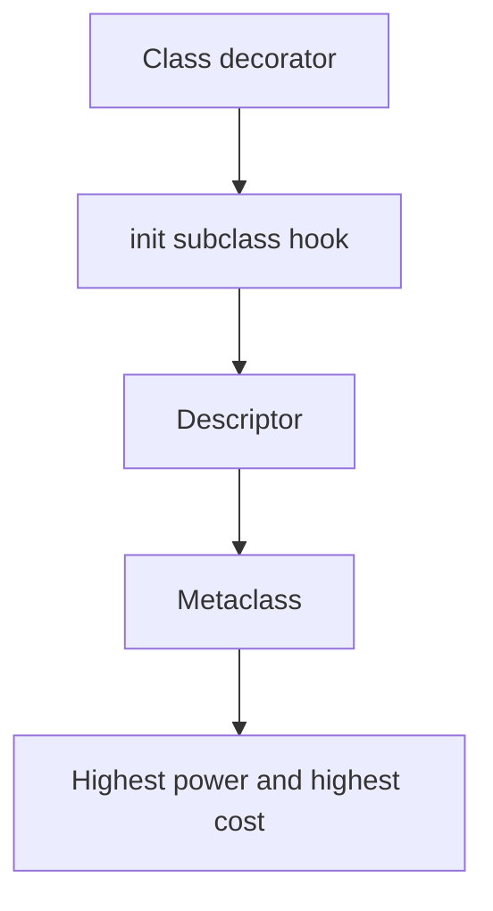

# Lecture 1 — Class decorators and `__init_subclass__`

> *Most of the time you are reaching for a metaclass, you do not need one. Most of the time you are reaching for `__init_subclass__`, you do not need that either — a class decorator will do. Most of the time you are reaching for a class decorator, the language already provides one: `@dataclass`. The four-step ladder of metaprogramming power — class decorator, then `__init_subclass__`, then descriptors, then metaclass — is best traversed from the bottom up, and most engineers should expect to climb only one or two rungs in their entire career. This lecture introduces the bottom two rungs and shows how PEP 487 (Martin Teichmann, 2016) systematically retired the metaclass for everything except a handful of niche cases.*

## Why this lecture exists

The Python ecosystem has a problem and it is the same problem the C++ ecosystem has: the language gives you a sharp tool, the textbooks teach you the sharp tool exists, and then the textbooks fail to teach you that **the cost of the sharp tool is usually higher than the benefit**. A class decorator is sharper than a function decorator; `__init_subclass__` is sharper than a class decorator; a descriptor is sharper than `__init_subclass__`; a metaclass is sharper than everything else. Sharpness is power. Power is also the rope you hang yourself with.


*The four-rung metaprogramming ladder — climb only as high as the problem requires.*

The right discipline is to climb only as high on the ladder as the problem requires, and not one rung higher. The way to learn the discipline is to climb each rung at least once, to feel the friction of each, and to develop an opinion about when the friction is worth it. This lecture is that climb for the bottom two rungs. Lectures 2 and 3 cover the top two.

## What a class decorator actually is

A class decorator is a function whose signature is `Callable[[type], type]`. It takes a class. It (usually) returns the same class, modified. The syntax is the same as a function decorator:

```python
def my_decorator(cls: type) -> type:
    cls.added_attr = "hello"
    return cls

@my_decorator
class Foo:
    pass

# Equivalent to:
class Foo:
    pass
Foo = my_decorator(Foo)
```

That equivalence is the whole story. `@my_decorator` above a class statement runs `Foo = my_decorator(Foo)` immediately after the class is constructed. The decorator sees a fully-built class (its `__dict__` is populated, its MRO is computed, its `__init_subclass__` has run if it has one). The decorator can then add attributes, replace methods, register the class in a global table, wrap `__init__`, anything.

`dataclasses.dataclass` is the canonical example. It is about 200 lines of careful machinery inside CPython (`Lib/dataclasses.py`, function `_process_class`); the public API is one decorator. It walks the class's `__annotations__`, generates an `__init__`, `__repr__`, `__eq__`, optionally `__hash__` and `__order__`, and attaches them as methods. It does not use a metaclass. It does not need to. PEP 557 (Eric V. Smith, 2017) made this the canonical pattern.

## The PEP-557 rationale, paraphrased

PEP 557 — the dataclasses PEP — explicitly chose a decorator over a metaclass for three reasons. They are worth quoting because they are exactly the reasons you should prefer decorators in your own code.

**Reason 1: metaclasses do not compose.** A class can have exactly one metaclass (subject to the MRO-conflict rules). If you want `@dataclass`-like behaviour on a class that already inherits from a class with a non-`type` metaclass — say, an `abc.ABC` — you have a problem. A decorator composes naturally. You can stack `@dataclass(frozen=True)` over `@some_other_decorator` and over an `abc.ABC` base, and nothing breaks.

**Reason 2: metaclasses surprise people.** Most Python programmers have never written a metaclass and reasonably consider it black magic. A class decorator looks like a function. The cognitive load is low. The Python community in 2017 was, the PEP argues, "more comfortable with decorators than with metaclasses." Eight years later this is still true.

**Reason 3: type checkers understand decorators.** mypy and pyright treat `@dataclass` as a known transformation. They understand that the decorated class has an `__init__` taking the annotated fields. PEP 681 (`dataclass_transform`) generalised this in 2022 so that *any* class decorator can claim "I behave like `@dataclass`" and the type checker will believe it. Metaclasses get no such cooperation by default; they need a mypy plugin (`pydantic-mypy`, `django-stubs`) to be understood.

These three reasons are the case for class decorators over metaclasses, and PEP 487 — which we will get to in a moment — added a fourth: most legitimate metaclass uses are now expressible without a metaclass at all.

## Worked example: `@validated_model`, version 1

We build the validated-model library four times this week. Version one is a class decorator. Here is the spec:

```python
@validated_model
class User:
    name: str
    age: int
    email: str

u = User(name="alice", age=30, email="alice@example.com")
# u.name == "alice"
# u.age == 30

User(name="alice", age=-1, email="alice@example.com")  # ValueError: age must be >= 0
User(name="x" * 1000, age=30, email="...")             # ValueError: name too long
```

Validation rules come from the annotation (`int` → must be `int`; `str` → must be `str`) plus optional metadata attached to the field. The decorator walks `__annotations__`, builds an `__init__` that assigns each attribute (running validation), builds a `__repr__` that prints each field, and returns the (mutated) class.

A first cut, about 60 lines:

```python
from __future__ import annotations
from typing import Any


def validated_model(cls: type) -> type:
    annotations: dict[str, type] = getattr(cls, "__annotations__", {})
    field_names: list[str] = list(annotations.keys())

    def __init__(self: Any, **kwargs: Any) -> None:
        for name in field_names:
            if name not in kwargs:
                raise TypeError(f"missing required argument: {name!r}")
            value = kwargs[name]
            expected = annotations[name]
            if not isinstance(value, expected):
                raise TypeError(
                    f"{name!r} expected {expected.__name__}, got {type(value).__name__}"
                )
            # additional per-type validation
            if expected is int and value < 0:
                raise ValueError(f"{name!r} must be >= 0")
            if expected is str and len(value) > 256:
                raise ValueError(f"{name!r} must be <= 256 chars")
            setattr(self, name, value)

    def __repr__(self: Any) -> str:
        parts: list[str] = [f"{n}={getattr(self, n)!r}" for n in field_names]
        return f"{cls.__name__}({', '.join(parts)})"

    cls.__init__ = __init__   # type: ignore[method-assign]
    cls.__repr__ = __repr__   # type: ignore[method-assign]
    cls._fields = tuple(field_names)  # type: ignore[attr-defined]
    return cls
```

That is the whole library. Sixty lines, no metaclass, no descriptors, no `__init_subclass__`. It cooperates with mypy because it returns the same class (mypy sees `User` as a class with attributes `name: str`, `age: int`, `email: str` — exactly what the annotations declare). It cooperates with pyright for the same reason. The validation rules are hard-coded; a more sophisticated version would accept a `Field(min_value=0, max_length=256)` sentinel as the default value, much as `dataclasses.field` does.

The full version (Exercise 1) generalises this with per-field metadata; the rough shape stays the same. Sixty lines, scaling to about a hundred and twenty.

## When a class decorator stops being enough

The decorator works fine. It scales. It is debuggable. The error messages are clear. So what is it missing?

**It does not compose with inheritance.** If you write:

```python
@validated_model
class User:
    name: str

class Admin(User):
    role: str

a = Admin(name="alice", role="root")
```

…then `Admin` does not get `role` validation. The decorator ran once, on `User`. `Admin` inherits `User.__init__`, which only knows about `name`. The `Admin` author has to either re-decorate (`@validated_model class Admin(User): ...`) or accept that `role` is unvalidated. This is a real cost in real codebases.

**It cannot react to subclasses after the fact.** If a library defines `class Model: ...` and asks users to subclass it (`class User(Model): name: str`), the library author cannot use the decorator approach — there is no decorator the *user* puts on each subclass, only the base class. To make a base class that turns every subclass into a validated model, you need a hook that fires when the subclass is created.

That hook is `__init_subclass__`. It was added to the language by PEP 487 (Martin Teichmann, 2016) specifically to replace the metaclass for this kind of "base class that customises its subclasses" use case.

## PEP 487, the short version

PEP 487 added two methods to `object` (well, to the data model; they are not actual methods on `object`, they are hooks the type machinery calls).

**`__init_subclass__(cls, **kwargs)`** — a classmethod on the base class, called once for each subclass at class-creation time, with the new subclass passed as `cls`. The `**kwargs` come from extra keyword arguments in the `class` statement: `class Foo(Base, plugin_name="my_plugin"): ...`.

**`__set_name__(self, owner, name)`** — a method on a descriptor (or any class-body attribute), called when the class containing it is created, with the containing class as `owner` and the attribute name as `name`. This is the bug-fixing addition: before PEP 487, a descriptor that wanted to know its own attribute name had no way to learn it without a metaclass or by being named twice.

The PEP's rationale is direct: "the most common things people write metaclasses for — registry patterns, subclass validation, descriptor naming — can now be done without one." We will walk both hooks.

## `__init_subclass__` in three notes

**Note 1**: it is implicitly a classmethod even though you write it as a method. You write:

```python
class Base:
    def __init_subclass__(cls, **kwargs: Any) -> None:
        super().__init_subclass__(**kwargs)
        print(f"new subclass: {cls.__name__}")
```

…not `@classmethod def __init_subclass__(...)`. The data model takes care of the classmethod-wrapping. (You can write `@classmethod` if you want; it works, but it is redundant.)

**Note 2**: it runs *after* the class body has executed and *after* the metaclass (if any) has produced the class. The class is fully formed when `__init_subclass__` sees it. You can mutate it (`cls.added = "value"`), inspect `cls.__dict__`, walk `cls.__annotations__`, and so on.

**Note 3**: cooperative multiple inheritance requires that you forward `**kwargs` via `super().__init_subclass__(**kwargs)`. If you do not, and someone in the MRO above you was expecting a keyword argument, it silently fails. This is the most common `__init_subclass__` bug.

## Worked example: `@validated_model`, version 2

The same library, written as a `Model` base class with `__init_subclass__`:

```python
from __future__ import annotations
from typing import Any


class Model:
    _fields: tuple[str, ...] = ()

    def __init_subclass__(cls, **kwargs: Any) -> None:
        super().__init_subclass__(**kwargs)
        annotations: dict[str, type] = cls.__annotations__
        cls._fields = tuple(annotations.keys())
        cls._field_types = dict(annotations)

    def __init__(self, **kwargs: Any) -> None:
        for name in type(self)._fields:
            if name not in kwargs:
                raise TypeError(f"missing required argument: {name!r}")
            value = kwargs[name]
            expected = type(self)._field_types[name]
            if not isinstance(value, expected):
                raise TypeError(
                    f"{name!r} expected {expected.__name__}, got {type(value).__name__}"
                )
            if expected is int and value < 0:
                raise ValueError(f"{name!r} must be >= 0")
            if expected is str and len(value) > 256:
                raise ValueError(f"{name!r} must be <= 256 chars")
            setattr(self, name, value)

    def __repr__(self) -> str:
        parts: list[str] = [f"{n}={getattr(self, n)!r}" for n in type(self)._fields]
        return f"{type(self).__name__}({', '.join(parts)})"


class User(Model):
    name: str
    age: int


class Admin(User):
    name: str  # inherited; redeclaration is optional
    age: int
    role: str


a = Admin(name="alice", age=30, role="root")
# a._fields == ("name", "age", "role")
```

Notice how `Admin` *just works*. The `__init_subclass__` hook runs once when `User` is defined (gathers `name`, `age`) and *again* when `Admin` is defined (gathers `name`, `age`, `role`). The base class's `__init__` reads `type(self)._fields` at call time, so it sees the correct field list for whichever subclass it is constructing. The library is now hereditary-aware for free.

This is the central PEP 487 dividend. The decorator version required the library author to make a judgement on the consumer's behalf ("you must re-decorate subclasses"). The `__init_subclass__` version makes inheritance a first-class citizen. **For libraries with a base-class-and-many-subclasses shape — ORMs, plugin systems, validated models, event emitters — this is the right tool.**

## What `__init_subclass__` does *not* solve

It does not solve the "I want this to apply to a class I do not own" problem. If the user wants to take an existing third-party `Animal` class and add validation, `__init_subclass__` is no help — the user is not in the inheritance chain. A class decorator is the answer there.

It does not solve the "I want to customise namespace creation before the class body runs" problem. `__init_subclass__` runs after the class body has executed. If you need `enum.Enum`'s trick of detecting duplicate values during class-body execution, you need `__prepare__` and therefore a metaclass.

It does not solve the "I want every method to be wrapped" problem (decoratively, that is — you can do it explicitly per method). A metaclass can intercept class creation and decorate every method by walking the namespace; `__init_subclass__` can do this too, but only after the class is built (and the cost of replacing every method at that point is the same).

## `__set_name__` in three notes

**Note 1**: it is called on *any* class-body attribute that defines it, with two arguments — the owner class and the attribute name. The protocol applies to descriptors most commonly, but technically applies to anything; `dataclasses.Field` uses it.

**Note 2**: before PEP 487, a descriptor that needed to know its own name had to be assigned twice:

```python
class Old:
    name = Field("name")  # name passed in twice; redundant and error-prone
```

…with PEP 487:

```python
class New:
    name = Field()  # Field.__set_name__(self, New, "name") runs automatically
```

The second form is unambiguous: there is one source of truth for the attribute name, the class statement.

**Note 3**: it runs *before* `__init_subclass__`. The order is: class body executes, `__set_name__` runs on each descriptor in the namespace, the metaclass's `__init__` runs, the base's `__init_subclass__` runs. This ordering matters when you write descriptors that register themselves with the owner class — by the time `__init_subclass__` sees the class, the descriptors have already learned their names.

## Tying it together: when to pick which

A two-line decision rule, refined throughout the week:

- **Pick a class decorator** if the transformation applies to *specific classes the consumer marks*. `@dataclass`, `@attrs.define`, `@functools.total_ordering`.
- **Pick `__init_subclass__`** if the transformation applies to *all subclasses of a base class you own*. Plugin registries, ORMs, validated-model bases, event-emitter bases.

We will refine this further once descriptors and metaclasses are on the table. The principle that survives: **stay as low on the ladder as the problem allows**.

## A note on `super().__init_subclass__(**kwargs)`

This is the cooperative-multiple-inheritance line. Forgetting it is the most common `__init_subclass__` bug, and it is silent. Consider:

```python
class A:
    def __init_subclass__(cls, **kwargs: Any) -> None:
        super().__init_subclass__(**kwargs)
        print("A saw", cls)

class B:
    def __init_subclass__(cls, **kwargs: Any) -> None:
        # FORGOT super().__init_subclass__(**kwargs)
        print("B saw", cls)

class C(A, B):
    pass

class D(C):
    pass
```

When `D` is created, `C.__init_subclass__` runs. Python's MRO resolution picks `A.__init_subclass__` (it is first in the MRO). `A` correctly calls `super().__init_subclass__(**kwargs)`, which lands at `B.__init_subclass__`. `B` does not forward. The chain stops. `object.__init_subclass__` never runs (which is harmless), but more importantly, if a *third* mixin sits between `B` and `object` in some other subclass, it will silently not fire.

The rule is: **always call `super().__init_subclass__(**kwargs)` first, even if you do not expect to be inherited from**. Cost is one line; benefit is correctness under future inheritance.

## A note on type-checker cooperation (preview)

Both mypy and pyright understand `@dataclass`. They do not understand your `@validated_model` decorator out of the box — mypy sees `validated_model(User)` as a function call returning a generic type, and loses the field type information. PEP 681 (`dataclass_transform`, 2022) fixes this: you decorate your decorator with `typing.dataclass_transform()`, and mypy/pyright treat it as `@dataclass`-equivalent. About six characters of annotation buy back the type-checker cooperation. The exercises cover this.

`__init_subclass__` is also understood by both checkers — they walk the MRO and see the class's annotations, exactly as the runtime does. No special annotation needed.

## Reading

- **PEP 487** — <https://peps.python.org/pep-0487/>. Read the rationale section in particular. Martin Teichmann's prose is excellent.
- **`dataclasses` source** — <https://github.com/python/cpython/blob/main/Lib/dataclasses.py>. Read `_process_class` (~200 lines). The canonical class decorator.
- **PEP 557** — <https://peps.python.org/pep-0557/>. The dataclasses PEP. The rationale section spells out why a decorator was chosen over a metaclass.
- **PEP 681** — <https://peps.python.org/pep-0681/>. `dataclass_transform`. The type-checker cooperation story for class decorators.
- **Data model §3.3.3** — <https://docs.python.org/3/reference/datamodel.html#customizing-class-creation>. The official spec for `__init_subclass__` and `__set_name__`.

## What to take away from this lecture

If you remember three things:

1. **The cost gradient runs decorator < `__init_subclass__` < descriptor < metaclass.** Pick the lowest rung that solves the problem.
2. **PEP 487 retired most legitimate metaclass uses in 2016.** When you read a 2014 tutorial that reaches for a metaclass to do subclass registration, you are reading dated material.
3. **`super().__init_subclass__(**kwargs)` is not optional.** Forgetting it is silent. Always forward.

Tomorrow we go one rung up: descriptors. The thing `@property` and `@classmethod` are made of.
