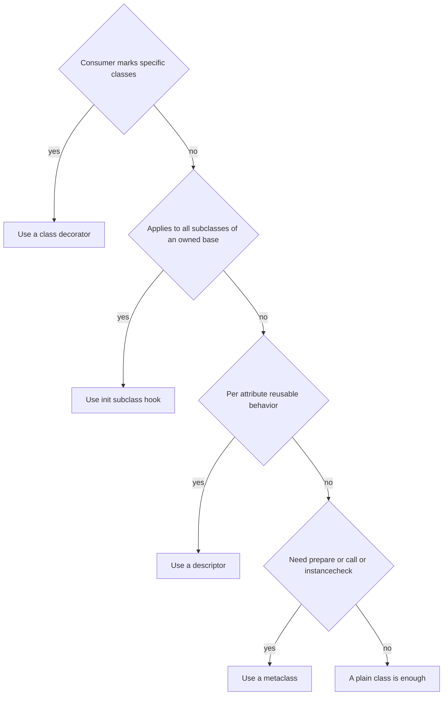

# Lecture 3 — Metaclasses, and when to use them

> *Tim Peters, comp.lang.python, December 2002: "Metaclasses are deeper magic than 99% of users should ever worry about. If you wonder whether you need them, you do not (the people who actually need them know with certainty that they need them, and do not need an explanation about why)." Twenty-four years later this is still the right answer. The remaining 1% is real, however, and it is the territory of ABCs, enums, the typing `Protocol` machinery, and a small group of high-end frameworks (Pydantic v2, Django models). This lecture covers the mechanics so you can recognise the legitimate cases and so you can refuse the illegitimate ones — and it ends with the decision tree that closes the week.*

## Why this lecture exists

You have spent two days learning that you should not write metaclasses. The exam, in some sense, is whether you can articulate *why not* in concrete terms — and the answer requires that you understand what metaclasses can and cannot do. You cannot reject a tool you have not used. So we use it.

The agenda: what a metaclass is, the four-method API (`__new__`, `__init__`, `__prepare__`, `__call__`), the worked example (`@validated_model` version 4), metaclass conflicts, the type-checker story, and the decision tree.

## The fact that opens the door

`type` is itself a class. `int` is an instance of `type`. So is `str`. So is every class you have ever defined. `type(int) == type`. `type(str) == type`. `type(SomeUserClass) == type`. You can verify this in the REPL.

`type` is the *metaclass* of `int`, `str`, `SomeUserClass`. A metaclass is a class whose instances are classes.

The same way `int(...)` constructs an instance of `int`, `type(name, bases, namespace)` constructs an instance of `type` — that is, a class. The `class` statement is, mechanically, sugar for this call:

```python
class Foo(Base):
    x = 1
    def method(self) -> None: pass

# is roughly equivalent to:
Foo = type("Foo", (Base,), {"x": 1, "method": <function>})
```

When you write `class Foo(Base, metaclass=Meta): ...`, you swap `type` for `Meta`. The class statement now does:

```python
Foo = Meta("Foo", (Base,), {"x": 1, ...})
```

That is the whole conceptual story. The rest is the four-method API of `type` (and your subclasses of it).

## The four-method API

A metaclass is a class that inherits from `type`. The four methods you typically override:

**`__prepare__(mcs, name, bases, **kwargs) -> dict`** — called *before* the class body executes. Returns the namespace dict that the class body's assignments will populate. The default returns an ordinary `dict`. Override to use, say, an `OrderedDict` (irrelevant since Python 3.7; insertion order is now preserved in plain dicts) or a custom dict that detects duplicate keys (which is what `enum._EnumDict` does to catch duplicate enum members).

**`__new__(mcs, name, bases, namespace, **kwargs) -> type`** — the constructor. Creates the actual class object. Has to call `super().__new__(mcs, name, bases, namespace)` somewhere to actually allocate. This is where most metaclass logic lives: walking the namespace, harvesting fields, registering the class, validating constraints.

**`__init__(cls, name, bases, namespace, **kwargs) -> None`** — the initialiser. Runs after `__new__`. By convention, used for further setup that does not affect the class identity (registration, post-processing). Most metaclasses do not override `__init__`; the work goes in `__new__`.

**`__call__(cls, *args, **kwargs) -> Any`** — this is the metaclass's `__call__`, which fires when you *call the class* — that is, when you do `SomeClass(arg1, arg2)`. The default implementation calls `cls.__new__(cls, *args, **kwargs)` and then `cls.__init__(instance, *args, **kwargs)`. Override this if you want to intercept instance creation (e.g., to implement a singleton, a registry of instances, or argument validation that happens before `__init__`).

Of these, `__new__` is by far the most commonly overridden. `__prepare__` is needed only for the namespace-customisation cases (enums). `__init__` is rarely needed (folded into `__new__`). `__call__` is needed only for instance-construction-time interception (singletons, factories).

## Worked example: `@validated_model`, version 4 — metaclass

```python
from __future__ import annotations
from typing import Any


class ModelMeta(type):
    def __new__(
        mcs,
        name: str,
        bases: tuple[type, ...],
        namespace: dict[str, Any],
        **kwargs: Any,
    ) -> type:
        annotations = namespace.get("__annotations__", {})
        namespace["_fields"] = tuple(annotations.keys())
        namespace["_field_types"] = dict(annotations)

        # Build __init__ from the field list.
        field_names = list(annotations.keys())

        def __init__(self: Any, **kwargs: Any) -> None:
            for fname in field_names:
                if fname not in kwargs:
                    raise TypeError(f"missing argument: {fname!r}")
                value = kwargs[fname]
                expected = annotations[fname]
                if not isinstance(value, expected):
                    raise TypeError(
                        f"{fname!r}: expected {expected.__name__}, got {type(value).__name__}"
                    )
                if expected is int and value < 0:
                    raise ValueError(f"{fname!r}: must be >= 0")
                if expected is str and len(value) > 256:
                    raise ValueError(f"{fname!r}: too long")
                setattr(self, fname, value)

        def __repr__(self: Any) -> str:
            parts = [f"{n}={getattr(self, n)!r}" for n in field_names]
            return f"{name}({', '.join(parts)})"

        if "__init__" not in namespace:
            namespace["__init__"] = __init__
        if "__repr__" not in namespace:
            namespace["__repr__"] = __repr__

        cls = super().__new__(mcs, name, bases, namespace)
        return cls


class Model(metaclass=ModelMeta):
    pass


class User(Model):
    name: str
    age: int


u = User(name="alice", age=30)
```

This works. It is functionally equivalent to versions 1–3. It is also, importantly, **more code** than version 2 (`__init_subclass__`), **less type-checker-friendly** than versions 1–3 (mypy and pyright do not know about your custom `__init__`), and **introduces metaclass-conflict risk** that the other three versions do not have.

We build it not because it is good but so that you have built one. The mini-project asks you to compare all four side-by-side.

## The metaclass conflict

This is the cost that always-future-bites-you about metaclasses. Consider:

```python
class MetaA(type): ...
class MetaB(type): ...

class A(metaclass=MetaA): ...
class B(metaclass=MetaB): ...

class C(A, B): ...  # TypeError
```

The error: `metaclass conflict: the metaclass of a derived class must be a (non-strict) subclass of the metaclasses of all its bases`. Python does not know which metaclass to use for `C` — `MetaA` or `MetaB`? — so it refuses. The fix is to define a *combined* metaclass:

```python
class MetaAB(MetaA, MetaB): ...

class C(A, B, metaclass=MetaAB): ...  # works
```

…but this is only possible if `MetaA` and `MetaB` are cooperative (their `__new__` methods call `super().__new__` correctly, etc.). If they are not, no combined metaclass works.

This is a real cost in real codebases. If your library defines a metaclass and a user's library defines another metaclass, the user has to manually construct a combined metaclass to use both. This is the largest reason `__init_subclass__` was added: a base class with `__init_subclass__` does not have a metaclass conflict because it does not have a custom metaclass.

## When a metaclass is the right answer

Stripped down, three cases.

**Case 1: `__prepare__` is required.** If you need the class body's namespace to be something other than a default dict — to capture insertion order before 3.7 (irrelevant now), to detect duplicate keys (which `enum._EnumDict` does so duplicate enum members raise), to provide special name bindings during body execution (which `enum` does to make `RED = 1` work) — you need a metaclass. `__init_subclass__` cannot help; it runs *after* the body has executed.

**Case 2: instance creation itself needs interception via `__call__`.** Singletons, factory dispatch, instance pooling. These need `Meta.__call__` to fire before `__new__`/`__init__`, and only a metaclass can provide that. Some of these can be done with class decorators if you are willing to swap the class out, but if you need transparent singleton-ness, the metaclass is cleaner.

**Case 3: an ABC-like registration where you control `__instancecheck__`/`__subclasscheck__`.** `abc.ABCMeta` overrides `__instancecheck__` so that `isinstance(x, MyABC)` consults the ABC's virtual-subclass registry. You cannot override `__instancecheck__` from `__init_subclass__` because it lives on the metaclass, not on the class. If you want custom `isinstance` semantics, you need a metaclass.

That is the full list of cases that survive in 2026. **Subclass registration, field harvesting, descriptor naming, default-method generation, post-creation validation — none of these require a metaclass.** PEP 487 covers all of them.

## Type checkers and metaclasses

The type-checker story for metaclasses is genuinely worse than for the other three mechanisms, and it is worth understanding why.

mypy and pyright are static analysers. They do not run your code. They cannot run your metaclass's `__new__`. So when you write:

```python
class User(Model):
    name: str
    age: int

u = User(name="alice", age=30)
```

…and your metaclass synthesises an `__init__` taking `name` and `age`, the type checker does not know about it. It sees `User` inheriting `Model.__init__`, which (in your code) takes `**kwargs: Any`. The call `User(name="alice", age=30)` type-checks, but only because everything is `Any`. Type errors at the call site are silently lost.

There are three ways to bridge this gap:

**Bridge 1: `typing.dataclass_transform`** (PEP 681, 2022). If your metaclass behaves like `@dataclass` — synthesises an `__init__` from class annotations — you decorate your metaclass with `@typing.dataclass_transform()`, and type checkers will treat instances of classes using that metaclass as if `@dataclass` had been applied. This is how `pydantic.BaseModel` gets full type-checker support in v2.

**Bridge 2: a type-checker plugin.** mypy has a plugin API; you write a plugin that knows about your library. `pydantic` had `pydantic-mypy` before PEP 681; Django has `django-stubs`. This is a real engineering effort — a plugin per type checker, which has to track type-checker versions.

**Bridge 3: explicit type stubs.** Write a `.pyi` file that declares the synthesised methods. Maintenance burden; goes stale.

By contrast, type checkers natively understand:

- Class decorators (they see the decorator's return type; if the decorator is `dataclass_transform`-aware, they see the synthesised `__init__`).
- `__init_subclass__` (they walk the MRO and see the base class's `__init__`; if you do not modify `__init__`, there is nothing to specially understand).
- Descriptors (they see the descriptor's `__get__` return type; this is exactly how `@property` is typed).

The metaclass path is the only one of the four that requires special accommodation. This is, by itself, sufficient reason to prefer the other three when they suffice.

## The decision tree

The synthesis of the week. Apply in order. Stop at the first "yes."

**Q1: Does the consumer of the library mark specific classes for the transformation?**

If yes (`@dataclass`, `@total_ordering`, `@attrs.define`): **use a class decorator.** Apply `@typing.dataclass_transform()` if the transformation synthesises `__init__`. Done.

**Q2: Is the transformation applied to all subclasses of a base class you own?**

If yes (ORM models, plugin systems, validated bases, event-emitter bases): **use `__init_subclass__` on the base class, plus `__set_name__` on any descriptors.** Done.

**Q3: Is the work per-attribute, parameterised, reusable across multiple classes?**

If yes (column types, validating fields, lazy attributes, caching attributes): **use a descriptor.** Combine with Q2 if subclass-aware behaviour is also needed. Done.

**Q4: Do you need `__prepare__` (to customise class-body namespace), `__call__` (to intercept instance creation), or `__instancecheck__` (to customise `isinstance`)?**

If yes (enum-style namespaces, singleton classes, virtual-subclass registries): **use a metaclass.** Accept the metaclass-conflict tax and the type-checker friction. Done.

**Q5: None of the above?**

You may not need metaprogramming at all. A plain class with a plain `__init__` is the right tool surprisingly often.


*The week's decision tree — stop at the first yes, and default to the plain class.*

The tree is the deliverable that goes in the mini-project. Memorise it.

## A note on `Protocol` and the typing module

The `typing.Protocol` machinery uses a metaclass (`_ProtocolMeta`) to implement structural subtyping. This is one of the legitimate metaclass uses — `__instancecheck__` is overridden to do runtime structural-type checking when `runtime_checkable` is set. You are unlikely to write your own Protocol-like metaclass; you are likely to use `Protocol` itself. The mechanism is worth knowing exists.

`typing.Generic` similarly uses metaclass-adjacent machinery (specifically `__class_getitem__` and `__mro_entries__` from PEP 560) so that `Generic[T]` works without forcing every generic class to inherit from a `GenericMeta` metaclass. This is a subtle deliberate choice by Ivan Levkivskyi: PEP 560 was specifically designed to remove the metaclass that earlier `typing` versions had. Even the type system itself migrated away from metaclasses when given the chance.

## A note on `abc.ABCMeta`

The standard-library example of a legitimate metaclass. `abc.ABCMeta` overrides:

- `__call__` — to refuse instantiation of classes that have un-implemented abstract methods.
- `__instancecheck__` / `__subclasscheck__` — to consult the virtual-subclass registry.

`abc.ABC` is a base class that uses `ABCMeta`. You use it the way you use `Model` above — `class MyABC(abc.ABC): @abstractmethod def foo(self): ...`. The metaclass is the right tool here because the behaviour is genuinely about *what counts as an instance of* the class — a question only the metaclass can answer (instance-check semantics live on the metaclass).

## A note on `enum.Enum`

The other standard-library legitimate metaclass. `enum.EnumType` (formerly `EnumMeta`) uses:

- `__prepare__` — to return an `_EnumDict` that catches duplicate member names and tracks insertion order.
- `__new__` — to harvest the members from the namespace, convert them to enum instances, and install them as class attributes.
- `__call__` — to enable `Color(1)` to look up an existing member rather than create a new one (`Color` is a "singleton-per-value" pattern).

Without `__prepare__`, you cannot catch `RED = 1; RED = 2` at class-body time. Without `__call__`, you cannot make `Color(1) is Color.RED` true. Both behaviours require a metaclass.

These two — `ABCMeta` and `EnumType` — are the canonical "metaclass is the right answer" examples in the stdlib. There are perhaps another half-dozen across the ecosystem at large. Pydantic v2 is one. Django models is another (though Django's metaclass exists partly for historical reasons; a 2026-greenfield Django might use `__init_subclass__`).

## Reading

- **PEP 3115** — <https://peps.python.org/pep-3115/>. The metaclass keyword-argument syntax. Talin, 2007.
- **`Lib/abc.py`** — <https://github.com/python/cpython/blob/main/Lib/abc.py>. The reference legitimate metaclass.
- **`Lib/enum.py`** — <https://github.com/python/cpython/blob/main/Lib/enum.py>. The other reference legitimate metaclass; more elaborate.
- **PEP 681** — <https://peps.python.org/pep-0681/>. `dataclass_transform`. The type-checker bridge.
- **Data model §3.3.3** — <https://docs.python.org/3/reference/datamodel.html#customizing-class-creation>. The official spec.

## What to take away from this lecture

1. **A metaclass is a class whose instances are classes.** `type` is the default. You override by passing `metaclass=Meta` in the class statement.
2. **The legitimate use cases in 2026 are narrow.** `__prepare__`, `__call__` for instance interception, `__instancecheck__`. Everything else is covered by the lower rungs of the ladder.
3. **Type-checker cooperation is the largest cost.** No checker runs your metaclass. PEP 681 bridges the most common case (`__init__` synthesis); the rest needs plugins or stubs.

That closes the lecture material. The mini-project asks you to build the four versions and measure them. The decision tree is the deliverable.

## Appendix A — the four hooks of a metaclass, in order of how often you will need them

**`__new__`** — used in roughly 95% of metaclass code that has ever been written. You override it to mutate `namespace` before the class is constructed, or to validate the namespace, or to register the class globally. Always call `super().__new__(mcs, name, bases, namespace)` somewhere; otherwise no class object is created and the result is `None`. Always return the result of that `super()` call (possibly after additional setattr).

**`__init__`** — used in maybe 10% of metaclass code. The signature mirrors `__new__` but without the `mcs` (it is a bound classmethod-equivalent receiving the just-created class). Most metaclass logic can go in `__new__`; `__init__` is for "the class object exists; finalise the registry entry; emit a log line; trigger a callback." There is no strong rule on `__new__` vs. `__init__` boundaries; most maintainers fold both into `__new__` for clarity.

**`__call__`** — used in maybe 5% of metaclass code. It fires when you *call the class* — `SomeClass(args)`. Default implementation (in `type.__call__`) is `instance = cls.__new__(cls, *args, **kwargs); if isinstance(instance, cls): cls.__init__(instance, *args, **kwargs); return instance`. Override to intercept: singletons, factory dispatch, instance interning. Be careful: if you do not call `super().__call__`, no instance gets created and `__init__` never fires.

**`__prepare__`** — used in maybe 1% of metaclass code. Returns the *dict that the class body will populate*. Default is a plain `dict`. Override to use a custom dict that catches duplicate keys (`enum._EnumDict`), to pre-populate the namespace with special names, or to inject builtins for the class body (rare; `enum` does this so that `RED = auto()` works without a `from enum import auto` at the top of the file).

You will most likely write metaclasses that override only `__new__`. The other three hooks are available; you will mostly not need them. If you find yourself overriding all four, you are probably writing a framework — and you should still ask whether descriptors and `__init_subclass__` could replace some of the work.

## Appendix B — `__init_subclass__` cannot solve some things; here is the exhaustive list

**It cannot run before the class body executes.** Specifically, it cannot affect the namespace dict in which the class body's assignments land. If you need to detect duplicate names *during* the body's execution, the only hook that fires early enough is `__prepare__` — which lives only on the metaclass. `enum.Enum`'s detection of `RED = 1; RED = 2` requires this.

**It cannot intercept `__call__`.** `Foo()` goes through `type(Foo).__call__`. `__init_subclass__` runs at class definition; it cannot affect what happens when an instance is created later. Singletons, factory dispatch, and instance interning all need `__call__` on the metaclass.

**It cannot override `__instancecheck__` or `__subclasscheck__`.** These live on the metaclass and control `isinstance` / `issubclass`. `abc.ABCMeta`'s virtual-subclass registry depends on overriding these. `__init_subclass__` is a method on the class, not the metaclass, and has no role in `isinstance` evaluation.

**It cannot alter the MRO.** `__mro_entries__` (PEP 560) and the metaclass's `__mro_entries__`/`mro` are the only hooks that can. This is the mechanism `typing.Generic` uses to avoid forcing its descendants into a `GenericMeta` metaclass.

**It cannot make the class itself iterable.** `for x in MyClass:` calls `iter(MyClass)`, which calls `type(MyClass).__iter__` — a method on the metaclass. Iterable classes (like `enum.Enum`, which lets `for color in Color:` walk the members) need a metaclass with `__iter__`.

That is the exhaustive list. Five things `__init_subclass__` cannot do that a metaclass can. None of them are needed in the validated-model use case. All of them have legitimate stdlib examples (the ones above).

## Appendix C — anti-patterns we have all seen in production

**Anti-pattern 1: a metaclass that exists only to set `__qualname__` on each method.** You can do this with a class decorator. There is no reason to drag a metaclass into the inheritance graph for this.

**Anti-pattern 2: a metaclass that "validates the class layout" — e.g., checks that subclasses define a particular method.** `__init_subclass__` does this in three lines. The metaclass version is more code, more inheritance friction, and exactly the same effect.

**Anti-pattern 3: a metaclass that registers every subclass in a global registry.** Again, `__init_subclass__` does this in three lines. Pre-PEP-487 codebases are full of these metaclasses; the migration is trivial and the type-checker payoff is large.

**Anti-pattern 4: a metaclass that exists to make `dataclass`-like behaviour work.** This was a legitimate path before `@dataclass` (and `@attrs.define`) existed. Today the right answer is a class decorator with `@typing.dataclass_transform()`. Pydantic v2 is the rare counter-example — and it uses a metaclass *plus* `dataclass_transform`, getting both the dynamism of the metaclass and the type-checker cooperation of the decorator pattern. That is a careful design choice, not a default.

**Anti-pattern 5: a metaclass that wraps every method in a decorator.** You can do this in `__init_subclass__` (walk `cls.__dict__`, replace functions with wrapped versions). It is the same code with one less rung of inheritance to think about. The metaclass version was historically common because pre-PEP-487 there was no `__init_subclass__`. There is now.

**Anti-pattern 6: a metaclass with custom `__call__` that swallows exceptions.** Sometimes done to "make construction more forgiving." Always wrong. If construction fails, the caller should see the failure; the singleton-or-factory pattern is fine but should propagate exceptions from `__new__`/`__init__`. If you find a metaclass `__call__` with `try/except: return None`, fix it.

## Appendix D — `enum.Enum` in detail, as a worked example of legitimate metaclass machinery

`enum.Enum` is the most elaborate metaclass in the standard library. Reading `Lib/enum.py` is a graduate course in legitimate metaprogramming. We walk a sketch of what `EnumType` (formerly `EnumMeta`) does, because it is the canonical "you actually need a metaclass" case.

When you write:

```python
class Color(Enum):
    RED = 1
    GREEN = 2
    BLUE = 3
```

…the following happens, in order:

1. `EnumType.__prepare__('Color', (Enum,))` runs. It returns an `_EnumDict` — a custom dict subclass that intercepts `__setitem__`. When the class body assigns `RED = 1`, `_EnumDict.__setitem__('RED', 1)` runs and records `'RED'` in an internal `_member_names` list, in insertion order. If you wrote `RED = 1; RED = 2`, `__setitem__` raises `TypeError: Attempted to reuse key: 'RED'`.

2. The class body executes. Each `NAME = value` writes to the `_EnumDict`. The class body completes; the namespace is now an `_EnumDict` containing `RED`, `GREEN`, `BLUE` plus whatever other class-body attributes.

3. `EnumType.__new__('Color', (Enum,), namespace)` runs. It walks `namespace._member_names`, constructs an `Enum` instance for each value (`Color.RED = Enum.__new__(Color); Color.RED._value_ = 1; Color.RED._name_ = 'RED'`), and installs those instances *as class attributes*. After `__new__` returns, `Color.RED` is a `Color` instance, not an `int`.

4. `EnumType.__init__('Color', ...)` runs (mostly to finalise the `_member_map_` cache).

5. `Color` is returned.

When you later write `Color(1)`, `EnumType.__call__(Color, 1)` runs. It does *not* call `Color.__new__` / `Color.__init__` (which would create a *fourth* `Color` instance distinct from `Color.RED`). Instead, it looks up `1` in `Color._value2member_map_` and returns `Color.RED` if found, otherwise raises `ValueError`. This is why `Color(1) is Color.RED` is True.

Notice every hook is needed:

- `__prepare__` for the duplicate-name detection and order tracking.
- `__new__` for the member-to-instance harvesting.
- `__call__` for the singleton-per-value lookup.
- `__init__` (lightly) for finalisation.

Plus `__iter__`, `__len__`, `__getitem__`, `__contains__` on the metaclass so that `for c in Color:`, `len(Color)`, `Color['RED']`, and `1 in Color` all work. None of these can be done with `__init_subclass__`. All of them require a metaclass.

This is what "legitimate metaclass" looks like. Five hooks, each justified by a behaviour `__init_subclass__` cannot provide. About 2,000 lines of `Lib/enum.py`. The right amount of code for the right reason. Read it after the lecture; it will solidify the difference between "I need a metaclass" and "I need `__init_subclass__`."

## Appendix E — type-checker cooperation, the long version

`mypy` and `pyright` are static analysers. They build a model of your code from the source text, type stubs, and a small set of recognised runtime patterns. They do not execute your code; they cannot run your metaclass.

The patterns they recognise:

- **Class decorators marked with `@typing.dataclass_transform()`**. The checker reads the decorator's parameters and treats the decorated class as if `@dataclass` had been applied. The synthesised `__init__` is visible to the checker. `pydantic.BaseModel` uses this. `attrs.define` uses this. Your `@validated_model` decorator should too.
- **`__init_subclass__`** on a base class. The checker walks the MRO normally; nothing special. If your `Model.__init__` accepts `**kwargs: Any`, the checker accepts any call; if it accepts specific kwargs, the checker verifies them.
- **Descriptor `__get__` / `__set__` return/parameter types**. `inspect.Signature` of a `Property` instance is the union of its `__get__` signatures. mypy and pyright both handle this for builtin `property`; for your custom descriptors, the types you annotate on `__get__`/`__set__` are what the checker sees.

The patterns they do **not** recognise without explicit help:

- **Metaclass `__new__` that synthesises `__init__`**. The checker does not run your `__new__`. It sees `__init__` as whatever the source declares — usually `**kwargs: Any` — and lets through anything. To bridge this, the metaclass should declare `@dataclass_transform()` *on the metaclass class itself* (PEP 681 supports this; `pydantic`'s `ModelMetaclass` is decorated this way).
- **Metaclass `__call__` that returns a different type than the class**. Singleton metaclasses are typed as if `SomeClass()` returns `SomeClass`. If your `__call__` returns `OldInstance | None`, the checker has no way to know.
- **Custom `__instancecheck__`** (the `abc.ABCMeta` trick for virtual subclasses). The checker uses the static MRO, not your registry. Virtual-subclass registration works at runtime but is invisible to the type checker. The workaround is `typing.runtime_checkable` for `Protocol` cases; for `ABCMeta.register`, no static-checker bridge exists. You ship `.pyi` stubs that declare the virtual subclasses explicitly.

The practical advice: prefer the lower rungs of the ladder partly because they cooperate with type checkers more cleanly. The Decorator and `__init_subclass__` paths are tested by every Python type-checker test suite; the Metaclass path is exception-handled by plugins per major library. Plugin maintenance is real work and a real cost.

## Appendix F — when you really do reach for a metaclass, here is the minimum quality bar

If you have walked the decision tree, you genuinely need `__prepare__` / `__call__` / `__instancecheck__`, and you are committing to a metaclass: here is the minimum quality bar.

1. **Inherit from `type`, not from anything else.** A metaclass that inherits from `abc.ABCMeta` is fine; one that inherits from a non-`type` base is wrong.
2. **Always call `super().__new__(mcs, name, bases, namespace)` in `__new__`.** Always return its result (possibly with attributes added).
3. **Decorate the metaclass with `@typing.dataclass_transform(...)` if you synthesise `__init__`.** The PEP 681 bridge is the cheapest path to type-checker cooperation; use it.
4. **Document the conditions under which a user must define a combined metaclass to subclass cooperatively.** Provide an example combined metaclass in the docs.
5. **Add `__class_getitem__` if you support generic subscription** (`MyClass[int]`). This is PEP 560 territory; needed if your metaclass-using class participates in typing protocols.
6. **Write a unit test that creates a multiply-inheriting subclass.** If it raises a metaclass conflict, document the conflict resolution. If you cannot resolve it, your metaclass is too coupled to your use case.
7. **Profile the class-definition time.** A metaclass `__new__` that takes 10 milliseconds and runs once per class is fine; a metaclass `__new__` that takes 50 milliseconds and runs across 200 classes adds 10 seconds to your application's import time. This is the single largest production-bites-you cost of metaclasses; measure it.

If you cannot meet all seven of these bars, do not write the metaclass. Use `__init_subclass__` and accept that some advanced use cases will be slightly awkward.
