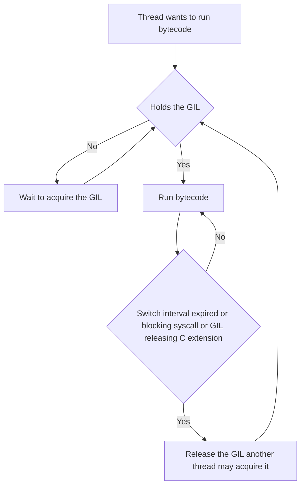
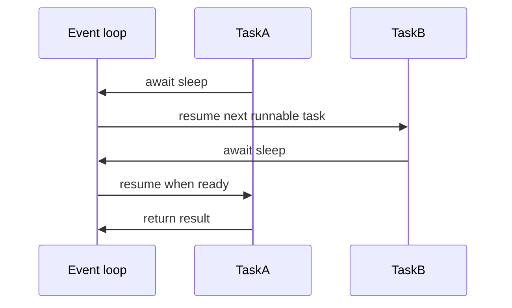

# Lecture 1 — Threads and Asyncio Side by Side

> The two single-process concurrency models. Both run in one OS process. Both share memory. One uses preemptive scheduling at the C level with the GIL serialising Python bytecode; the other uses cooperative scheduling at the Python level with no GIL contention because there is only one thread. The two models are not interchangeable, but they are *comparable* — and the comparison is the right place to start because it isolates the two design axes that matter for every concurrency decision: who schedules, and where the parallelism lives.

## The mental model

Run this in your head before we look at any code.

A **thread** is an OS-level execution context. The kernel preempts it; the kernel context-switches it; the kernel gives it a stack. In CPython on the stock build, every thread that wants to execute Python bytecode must hold the Global Interpreter Lock. The GIL is released — by the interpreter, automatically, about every five milliseconds (configurable via `sys.setswitchinterval`) — for cooperative bytecode-level switching, and the GIL is released — by the C extension or the interpreter, explicitly via `Py_BEGIN_ALLOW_THREADS` — for blocking syscalls. The consequence: threads in CPython let you wait for I/O concurrently, but they do not let you do CPU-bound Python work concurrently.

A **coroutine**, in the asyncio sense, is a Python object that can suspend itself at an `await` and yield control to a scheduler. The scheduler is the asyncio event loop. The event loop is a Python object running in a single thread. There is no preemption: a coroutine runs from one `await` to the next without interruption. The consequence: asyncio lets you express "I am waiting for a lot of I/O" with very low per-task overhead — every task is a few hundred bytes, not a several-megabyte thread stack — but if a coroutine forgets to `await`, no other coroutine can make progress until that coroutine returns.

These two models share one OS process, share one Python heap, share one GIL (on the stock build), and differ in *who decides when to context-switch*. Threads: the kernel and the GIL release schedule. Asyncio: the coroutine, voluntarily, at every `await`.

## The GIL: what it does and what it does not

This is the section most people skip. Do not skip it. Every concurrency decision in CPython is downstream of the GIL semantics.

The GIL is a mutex around the Python interpreter state. Only the thread holding the GIL can execute Python bytecode. The thread holding the GIL can — and routinely does — release it. The rules for when the GIL is released, in 3.13:

1. **Every `sys.setswitchinterval` (default 5 ms) of execution**, the interpreter releases the GIL and a different thread may acquire it. This is "the cooperative bytecode-level switch." A thread can be holding the GIL when this expires and be preempted (in CPython terms, "asked to release") at the next bytecode boundary.
2. **On every blocking syscall**, the C code wrapping the syscall releases the GIL before entering the kernel and re-acquires it after returning. This is the entire reason threads work for I/O. Every `read`, `write`, `recv`, `send`, `connect`, `accept`, `poll`, `select`, `epoll_wait`, `time.sleep`, `os.kill`, `os.waitpid`, `subprocess.Popen.wait` — every one of these releases the GIL.
3. **On entry to a C extension function that has been written to release the GIL**, the extension wraps the heavy work in `Py_BEGIN_ALLOW_THREADS` / `Py_END_ALLOW_THREADS`. NumPy releases the GIL on most ufuncs. `hashlib.sha256().update()` releases the GIL for buffers larger than 2,047 bytes. `zlib.compress` and `zlib.decompress` release the GIL. `lzma.compress` releases the GIL. The `_bz2` module releases the GIL. SQLite (via `_sqlite3`) releases the GIL for query execution. Cryptography library implementations (cryptography.io, pynacl) release the GIL.


*A thread cycles between holding the GIL and releasing it at switch intervals, blocking syscalls, or GIL-releasing C extensions.*

The rules for when the GIL is **not** released:

1. **Pure Python bytecode execution between switches**. Every `LOAD_FAST`, `BINARY_ADD`, `CALL`, `STORE_NAME` runs with the GIL held. No other Python thread can execute Python during this time.
2. **A C extension function that has not been written to release the GIL**. The C extension is responsible for explicitly releasing; if it does not, the GIL stays held. Most "small" C extensions do not bother — the per-call cost of releasing and re-acquiring the GIL is several hundred nanoseconds, which is more than the call itself.
3. **`bytes.decode`, `str.encode`, `re.match`, `json.loads`, `pickle.loads`** — the stdlib's "pure-CPU helpers" do not release the GIL, even though they are implemented in C. The reason is that the per-call cost would dominate.

This is the rule that catches everyone: **`json.loads` does not release the GIL**. A thread parsing 100 MB of JSON locks the interpreter for the entire parse. If you have two threads each parsing 50 MB, they take the same wall-clock time as one thread parsing 100 MB. There is no parallelism.

Now run that rule through your head against the rest of the stdlib and your own application. The set of "things that are C code and do not release the GIL" is much larger than people assume. The set of "things that are C code and do release the GIL" is the I/O-bound subset and the explicit-heavy-compute subset (NumPy, hashlib for large buffers, the compression modules).

The PEP 703 future: the free-threaded build (3.13's `--disable-gil` option, default off in 3.13 and 3.14, expected to be the default no earlier than 3.15) removes the GIL entirely. All the rules above stop applying. Threads scale on pure-Python CPU work. Lecture 3 covers this in detail.

## Threads in 2026

The modern API is `concurrent.futures.ThreadPoolExecutor`. The historical API is `threading.Thread`. Use the executor unless you have a specific reason not to.

```python
from concurrent.futures import ThreadPoolExecutor
from typing import Callable


def cpu_bound_work(n: int) -> int:
    total: int = 0
    for i in range(n):
        total += i * i
    return total


def io_bound_work(seconds: float) -> str:
    import time
    time.sleep(seconds)
    return f"slept {seconds}s"


def run_threaded(fn: Callable[[int], int], inputs: list[int], max_workers: int) -> list[int]:
    with ThreadPoolExecutor(max_workers=max_workers) as executor:
        return list(executor.map(fn, inputs))
```

The executor manages a pool of threads, the threads pull tasks off a shared `queue.Queue`, results come back as a `Future` (which is a handle, not a value, until the work completes). The `executor.map` shortcut is the common path; `executor.submit` + `as_completed` is the path when tasks have heterogeneous durations.

The cost model:

- **Thread creation**: 50–200 microseconds on Linux, 200–500 microseconds on Windows, dominated by stack allocation (8 MB virtual, ~64 KB resident initially).
- **Thread context switch (kernel-level)**: 1–10 microseconds.
- **GIL acquisition (acquire-release pair)**: about 200 nanoseconds on Linux, ~500 ns on Windows. Cheap, but you do it on every blocking syscall and every switch interval.
- **Memory per idle thread**: ~64 KB to ~2 MB resident depending on stack usage. The 8 MB virtual is harmless on 64-bit systems; the resident memory is what matters.

The right pool size depends on workload:

- **For pure I/O work** (HTTP requests, file reads): the pool size can be 50–500, limited by the remote service's connection limit or by your operating system's file descriptor cap. Going beyond ~500 threads on a single host is rare; that is asyncio's territory.
- **For C-extension-heavy CPU work that releases the GIL** (NumPy, hashlib, zlib): the pool size should be `os.cpu_count()` or `os.cpu_count() * 2`.
- **For pure-Python CPU work on the stock GIL'd build**: the pool size does not matter; threads will not parallelise the work. Use 1, or use multiprocessing instead.

The footguns:

1. **Threads inherit module state**. A thread that imports a module while another thread is using it gets an undefined state. The import system is supposed to be thread-safe (and largely is in 3.12+), but you should still do all your imports at the top of the main module, not inside thread workers.
2. **`threading.local()` is per-thread**. It is *not* per-task in a thread pool; the pool reuses threads, so the local state persists across tasks unless you reset it.
3. **`KeyboardInterrupt` only fires on the main thread**. If you `Ctrl+C` a threaded program, the worker threads continue until they would naturally yield. The executor handles this with a `cancel_futures=True` flag on `shutdown` (added 3.9).
4. **The thread pool does not propagate exceptions until you call `.result()` on the future**. A worker that raises silently fails. Always `.result()` your futures.

## Asyncio in 2026

The modern API is `asyncio.run`, `async def`, `await`, `asyncio.TaskGroup`, `asyncio.Semaphore`, `asyncio.timeout`. The historical API is `asyncio.get_event_loop`, `loop.run_until_complete`, generator-based coroutines, and `@asyncio.coroutine`. Do not use the historical API.

```python
import asyncio
from typing import Awaitable


async def io_bound_work(seconds: float) -> str:
    await asyncio.sleep(seconds)
    return f"slept {seconds}s"


async def fanout(work: list[Awaitable[str]]) -> list[str]:
    async with asyncio.TaskGroup() as tg:
        tasks: list[asyncio.Task[str]] = [tg.create_task(w) for w in work]
    return [t.result() for t in tasks]


def main() -> None:
    inputs: list[float] = [0.1, 0.2, 0.3, 0.4, 0.5]
    result: list[str] = asyncio.run(fanout([io_bound_work(s) for s in inputs]))
    print(result)
```

The event loop runs in a single OS thread. Coroutines are scheduled on the loop. Each `await` is a yield point: the coroutine suspends, the loop picks the next runnable task, and resumes it. The loop uses `epoll` (Linux), `kqueue` (macOS), or `IOCP` (Windows) under the hood to wait for I/O completion across thousands of file descriptors.


*Cooperative scheduling: a task only yields control at an await, never by preemption.*

The cost model:

- **Task creation**: about 5 microseconds (one allocation, a few field writes).
- **Task switch**: about 200 nanoseconds (no kernel involvement; pure Python-level scheduler).
- **Memory per idle task**: about 1 KB.
- **Per-task overhead in the loop**: an entry in a heap-ordered queue of pending callbacks.

The math is clear: a thread costs roughly 100x what a task costs to create and to switch. For workloads with 10,000+ in-flight tasks — the C10K problem — asyncio is the only mechanism that scales. For workloads with 10–100 in-flight tasks, threads are simpler and the cost difference does not matter.

The right primitives:

- **`asyncio.run(main())`** — the entry point. Creates a loop, runs `main()` to completion, closes the loop. Use this; do not roll your own loop management.
- **`async with asyncio.TaskGroup() as tg: tg.create_task(...)`** — the structured-concurrency primitive (3.11+, PEP 654). If any task raises, the group cancels all sibling tasks and raises an `ExceptionGroup` after they have cleaned up. This is the right default in 2026.
- **`await asyncio.gather(*tasks)`** — the older primitive. Returns a list of results. Does *not* cancel siblings on failure unless you pass `return_exceptions=False` and one raises. Prefer `TaskGroup` for new code.
- **`asyncio.Semaphore(n)`** — limits concurrency to N tasks. The right tool when you have 10,000 work items but the downstream service can only handle 50 in flight.
- **`async with asyncio.timeout(seconds)`** — wraps a block in a deadline. If the block does not complete in time, an `asyncio.TimeoutError` is raised. The 3.11+ replacement for `asyncio.wait_for`.
- **`asyncio.to_thread(fn, *args)`** — runs a blocking function in a thread pool managed by the loop. The escape hatch for "I have a blocking call I must make and there is no async equivalent."
- **`loop.run_in_executor(executor, fn, *args)`** — the lower-level form. Use `asyncio.to_thread` instead unless you need a custom executor.

The footguns:

1. **Forgetting to `await`**. Code like `asyncio.sleep(1)` (without `await`) returns a coroutine object that is never scheduled. Python emits a `RuntimeWarning: coroutine 'sleep' was never awaited` at garbage-collection time. Run with `PYTHONASYNCIODEBUG=1` to make this an immediate error.
2. **Blocking the event loop**. Any sync call inside a coroutine — `time.sleep`, `requests.get`, `open()` then `read()`, a CPU-bound loop — blocks the loop for the duration. With debug mode on, the loop logs a "slow callback" warning if a single callback takes more than 100 ms. Without debug mode, the only symptom is that other tasks stop making progress.
3. **Mixing event loops**. Each `asyncio.run` creates and closes a fresh loop. Objects created on one loop (e.g., a `Lock`) cannot be used on another. The 3.10+ deprecation of `asyncio.get_event_loop` outside a running loop is the resolution; do not call it outside a coroutine.
4. **Cancellation propagation**. `task.cancel()` schedules a `CancelledError` to be raised inside the task at its next `await`. If the task catches `CancelledError` and does not re-raise, cancellation is suppressed silently. Always re-raise `CancelledError` unless you have a very specific reason not to.
5. **`asyncio` does not parallelise CPU**. The event loop is one thread. A CPU-bound coroutine is identical in throughput to running the same code synchronously, plus per-task overhead. For CPU work, use `asyncio.to_thread` (which moves it to a thread pool) or — better — use threads or processes from the start.

## The benchmark you will run on Monday

You will time three workloads against three execution strategies. The workloads:

- **A: 1,000 iterations of computing the SHA-256 of a 1 MB buffer.** Releases the GIL (hashlib drops it for buffers above ~2 KB). Threads should scale.
- **B: 1,000 iterations of summing `range(100_000)` in pure Python.** Does not release the GIL. Threads should not scale.
- **C: 1,000 iterations of `time.sleep(0.001)`.** Blocking syscall; releases the GIL. Threads and asyncio should both scale.

The strategies: serial (one thread, no pool), `ThreadPoolExecutor(8)`, `asyncio.gather` (where applicable). You will write the benchmark in Exercise 1. The predicted results:

| Workload | Serial | Threads (8) | Asyncio |
|----------|-------:|------------:|--------:|
| A (SHA-256, GIL-releasing C extension) | 1.0x | ~7x | n/a (sync function, would block loop) |
| B (pure-Python CPU) | 1.0x | ~1.0x (no speedup) | n/a (would block loop) |
| C (`time.sleep` / `asyncio.sleep`) | 1.0x | ~8x | ~8x |

The point of the exercise is not the speedup numbers — they will vary by machine. The point is the *shape* of the table: where the cells have a number and where they say "n/a, would block." That shape is the decision tree in three rows.

## Further reading

- **PEP 3148** — `concurrent.futures`. <https://peps.python.org/pep-3148/>. Brian Quinlan, 2009.
- **PEP 3156** — asyncio (the original). <https://peps.python.org/pep-3156/>. Guido van Rossum, 2012.
- **PEP 492** — `async`/`await`. <https://peps.python.org/pep-0492/>. Yury Selivanov, 2015.
- **PEP 654** — `ExceptionGroup` and `except*`. <https://peps.python.org/pep-0654/>. Irit Katriel, 2022.
- **`threading` docs** — <https://docs.python.org/3/library/threading.html>.
- **`asyncio` docs** — <https://docs.python.org/3/library/asyncio.html>.
- **C-API GIL macros** — <https://docs.python.org/3/c-api/init.html#thread-state-and-the-global-interpreter-lock>.
- **David Beazley, "Inside the Python GIL"** — <https://www.dabeaz.com/python/UnderstandingGIL.pdf>. The clearest explanation of why the GIL exists.
- **Yury Selivanov, "Asyncio in Python 3.7 and Beyond"** — search YouTube; ~45 minutes.

## Appendix A: the small print on the switch interval

`sys.setswitchinterval(0.005)` is the default. The interpreter releases the GIL every 5 milliseconds and allows another thread to attempt to acquire it. Two things are worth knowing.

First, the switch happens at *bytecode boundaries*, not at arbitrary instruction boundaries. A single complex bytecode — for example, `BINARY_ADD` on two `dict` instances that triggers a `__add__` Python method on one of them, which calls a `__hash__` Python method, which calls a `__eq__` Python method — runs without yielding. Most bytecodes are short (a few hundred nanoseconds) and the GIL release happens at the next available boundary, but a pathological method chain can hold the GIL for milliseconds without ever yielding. This is rare but it is the source of "asyncio mysteriously paused" reports.

Second, the switch interval is a *minimum*, not a maximum. A thread can release the GIL voluntarily before the interval expires (by entering a blocking syscall, by explicitly calling `time.sleep(0)`, or by entering a C extension that drops the GIL). And a thread can hold the GIL longer than the interval if no other thread is asking for it. The interval is the upper bound on contention, not the lower bound on running time.

If you have a thread that holds the GIL too long on a stock build and you cannot fix the underlying long-running pure-Python operation, `sys.setswitchinterval(0.001)` is a workaround. It increases scheduler overhead but reduces the maximum delay before another thread runs. On the free-threaded build, this setting becomes irrelevant.

## Appendix B: what asyncio's `to_thread` actually does

The `asyncio.to_thread` helper was added in 3.9 and does the following:

1. It calls `loop.run_in_executor(None, fn, *args)` under the hood.
2. The `None` argument means "use the default executor." The default executor is a `ThreadPoolExecutor` with `max_workers=min(32, os.cpu_count() + 4)` (default since 3.8). You can override it with `loop.set_default_executor`.
3. `loop.run_in_executor` submits the function to the executor and returns a *Future*. The coroutine awaits the future.
4. When the worker thread finishes, it posts the result back to the event loop via `loop.call_soon_threadsafe`. The coroutine resumes.

The cost: one allocation for the future, one queue entry for the executor, one cross-thread post back. Several microseconds of overhead total. For work shorter than the overhead — say, `to_thread(lambda x: x + 1, 5)` — you are spending more on bookkeeping than on the work. The right threshold: any function whose body is shorter than 100 microseconds is faster as a direct call inside the coroutine than as a `to_thread` round-trip.

The other thing `to_thread` does is preserve the contextvars from the calling coroutine. Library code that sets per-request context (logging context, trace ID, tenant ID) will see that context propagate into the thread worker. This is the right default behaviour but it costs ~1 microsecond per call. For very-tight inner loops, `loop.run_in_executor` (which does *not* propagate context unless you wrap with `contextvars.copy_context().run`) is the lower-overhead alternative.

## Appendix C: when threads share *too much*

A subtle bug. Two threads pull tasks from the same `ThreadPoolExecutor`. Each task creates a `requests.Session()`. The two threads use their respective sessions concurrently. `requests.Session()` is not thread-safe; the session uses an underlying `urllib3.PoolManager` that *is* mostly thread-safe but the cookie jar and adapter state are not.

The symptom: intermittent test failures, occasional cookies leaking between sessions, very rare segfaults from `urllib3`'s internal state corruption. The cause: shared mutable state inside the "session" object that is not synchronised. The fix: do not share `Session` objects across threads; create one per thread (or, better, use `threading.local()` to scope it per thread).

This pattern is not specific to `requests`. Any library that allocates a "client" or "session" object with internal mutable state, where the documentation does not explicitly say "thread-safe," should be assumed to be unsafe to share. The default Python stance is "objects are not thread-safe unless documented otherwise." Database connections, HTTP clients, SQLAlchemy `Session`, all fall in this category.

The corollary: a `ThreadPoolExecutor` does *not* magically make your code thread-safe. It runs your code on multiple threads; thread-safety remains your responsibility. The pool just schedules; it does not isolate.
